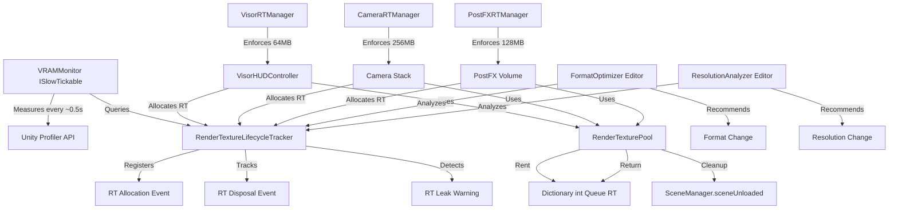
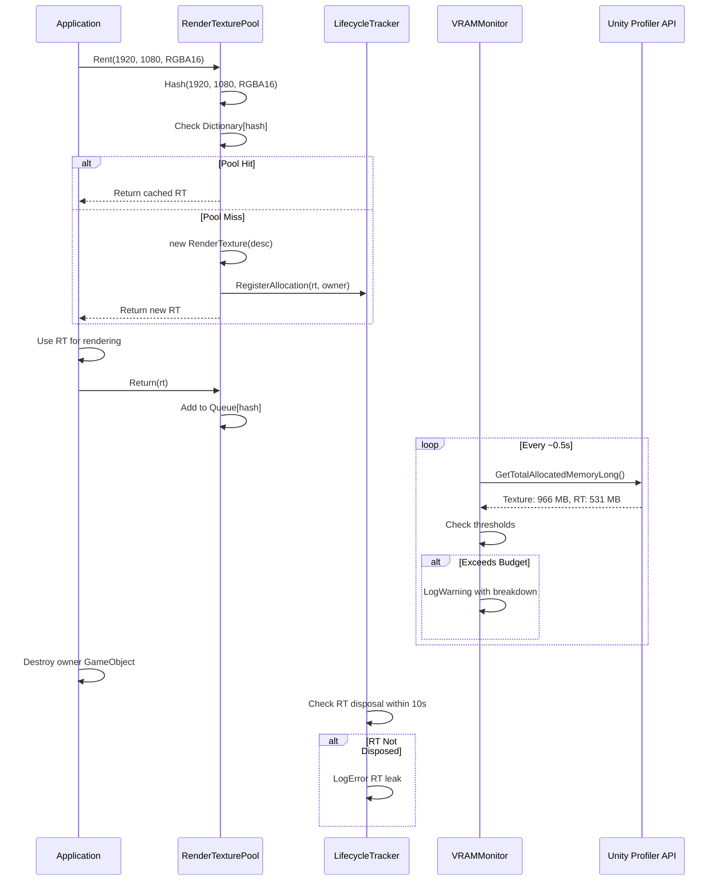

# Design Document: VRAM/RenderTexture Optimization System

## Overview

The VRAM/RenderTexture Optimization System enforces strict memory budgets on NVIDIA MX350 2GB VRAM hardware through runtime monitoring, lifecycle tracking, pooling, and automated optimization. Current measurements (~966 MB texture + ~531 MB RenderTexture = ~1.5 GB) exceed RED thresholds (900 MB texture / 500 MB RT / 1.2 GB total). This system achieves MASTER GRADE status through zero-GC monitoring, O(1) pooling, format/resolution optimization, and subsystem-level budget enforcement.

### Design Goals

1. **Budget Enforcement**: Texture < 900 MB, RenderTexture < 500 MB, Total VRAM < 1.2 GB
2. **Zero GC**: All hot paths (ITickable/ISlowTickable) allocate 0 B/frame
3. **60 FPS**: Frame time ≤ 16.67 ms on target hardware
4. **Zero Visual Regression**: RMSE < 2% after optimization
5. **Leak Detection**: Flag RenderTextures not disposed within 10s of owner destruction
6. **Subsystem Budgets**: Visor 64 MB / Camera 256 MB / PostFX 128 MB / UI 64 MB

### Key Constraints

- **Zero GC in hot paths**: Pre-allocated buffers, no LINQ, no string concat, cached PropertyToID
- **ISlowTickable**: ~0.5s interval for VRAM monitoring (not per-frame)
- **MaterialPropertyBlock**: No renderer.material (creates leaked copy)
- **Singleton pattern**: Explicit `_instance` field, null-check in OnDestroy
- **O(1) pooling**: Dictionary<int, Queue<RenderTexture>> keyed by hash(width, height, format)
- **Profiler API**: Profiler.GetTotalAllocatedMemoryLong() for measurement
- **Scene cleanup**: SceneManager.sceneUnloaded clears RT pools

## Architecture

### System Hierarchy

```
VRAMOptimizationBootstrap (DontDestroyOnLoad, -8000)
├── VRAMMonitor (ISlowTickable, singleton)
│   ├── Tracks texture/RT memory via Profiler API
│   ├── Enforces 900/500/1200 MB thresholds
│   └── Zero-GC measurement loop
│
├── RenderTextureLifecycleTracker (singleton)
│   ├── Registers all RT allocations with owner/timestamp
│   ├── Detects leaks (RT not disposed after owner destruction)
│   └── Editor window for real-time RT visualization
│
├── RenderTexturePool (singleton)
│   ├── Rent/Return API for temporary RT
│   ├── Separate pools per format (R8/RG16/RGBA16/RGBA32)
│   └── O(1) lookup via Dictionary<int, Queue<RenderTexture>>
│
├── RenderTextureFormatOptimizer (Editor tool)
│   ├── Analyzes RT usage and recommends minimal format
│   ├── Calculates memory savings
│   └── Validates bit-identical output
│
├── RenderTextureResolutionAnalyzer (Editor tool)
│   ├── Measures visual difference at downscaled resolutions
│   ├── Recommends smallest resolution with <2% RMSE
│   └── Captures BEFORE/AFTER screenshots
│
└── Subsystem Managers
    ├── VisorRTManager (64 MB budget)
    ├── CameraRTManager (256 MB budget)
    ├── PostFXRTManager (128 MB budget)
    └── UIRTManager (64 MB budget)
```

### Component Interaction Diagram



### Data Flow Diagram



## Components and Interfaces

### VRAMMonitor

**Purpose**: Runtime VRAM budget enforcement via Unity Profiler API.

**Lifecycle**: Singleton, DontDestroyOnLoad, ISlowTickable (~0.5s interval).

**Public API**:
```csharp
namespace Hecton8.Optimization
{
    /// <summary>
    /// Monitors VRAM consumption and enforces budget thresholds.
    /// Executes in ISlowTickable (~0.5s interval) to avoid per-frame overhead.
    /// </summary>
    [DisallowMultipleComponent]
    [DefaultExecutionOrder(-8000)]
    public sealed class VRAMMonitor : MonoBehaviour, ISlowTickable
    {
        /// <summary>
        /// Singleton instance. Null-check required in OnDestroy.
        /// </summary>
        public static VRAMMonitor Instance { get; private set; }
        
        /// <summary>
        /// Current texture memory consumption in bytes.
        /// </summary>
        public long TextureMemoryBytes { get; private set; }
        
        /// <summary>
        /// Current RenderTexture memory consumption in bytes.
        /// </summary>
        public long RenderTextureMemoryBytes { get; private set; }
        
        /// <summary>
        /// Total VRAM consumption in bytes (textures + RenderTextures + meshes + shaders).
        /// </summary>
        public long TotalVRAMBytes { get; private set; }
        
        /// <summary>
        /// Returns whether texture memory exceeds 900 MB threshold.
        /// </summary>
        public bool IsTextureMemoryOverBudget => TextureMemoryBytes > 900L * 1024L * 1024L;
        
        /// <summary>
        /// Returns whether RenderTexture memory exceeds 500 MB threshold.
        /// </summary>
        public bool IsRenderTextureMemoryOverBudget => RenderTextureMemoryBytes > 500L * 1024L * 1024L;
        
        /// <summary>
        /// Returns whether total VRAM exceeds 1.2 GB threshold.
        /// </summary>
        public bool IsTotalVRAMOverBudget => TotalVRAMBytes > 1200L * 1024L * 1024L;
        
        /// <summary>
        /// Queries current VRAM consumption breakdown.
        /// </summary>
        /// <param name="textureMemoryMB">Texture memory in MB.</param>
        /// <param name="renderTextureMemoryMB">RenderTexture memory in MB.</param>
        /// <param name="totalVRAMMB">Total VRAM in MB.</param>
        public void GetVRAMBreakdown(out float textureMemoryMB, out float renderTextureMemoryMB, out float totalVRAMMB);
        
        /// <summary>
        /// ISlowTickable implementation. Measures VRAM every ~0.5s.
        /// Zero GC: pre-allocated buffers, no LINQ, no string concat.
        /// </summary>
        public void SlowTick();
    }
}
```

**Implementation Details**:
- **Profiler API**: `Profiler.GetTotalAllocatedMemoryLong()` for total memory, `ProfilerRecorder` for texture/RT breakdown
- **Zero GC**: Pre-allocated `StringBuilder` (COLD ALLOC), cached `ProfilerRecorder` instances
- **Thresholds**: 900 MB texture / 500 MB RT / 1.2 GB total (configurable via Inspector)
- **Logging**: Throttled to once per 5s in Development Build (avoid log spam)
- **Registration**: OnEnable → Register ISlowTickable, OnDisable → Unregister

### RenderTextureLifecycleTracker

**Purpose**: Track all RenderTexture allocations, detect leaks, provide audit reports.

**Lifecycle**: Singleton, DontDestroyOnLoad.

**Public API**:
```csharp
namespace Hecton8.Optimization
{
    /// <summary>
    /// Tracks RenderTexture lifecycle: allocation, usage, disposal.
    /// Detects leaks (RT not disposed within 10s of owner destruction).
    /// </summary>
    [DisallowMultipleComponent]
    [DefaultExecutionOrder(-7999)]
    public sealed class RenderTextureLifecycleTracker : MonoBehaviour
    {
        /// <summary>
        /// Singleton instance. Null-check required in OnDestroy.
        /// </summary>
        public static RenderTextureLifecycleTracker Instance { get; private set; }
        
        /// <summary>
        /// Registers a RenderTexture allocation with owner component.
        /// </summary>
        /// <param name="rt">RenderTexture instance.</param>
        /// <param name="owner">Owner component (MonoBehaviour).</param>
        /// <param name="allocationStackTrace">Optional stack trace for leak debugging.</param>
        public void RegisterAllocation(RenderTexture rt, Component owner, string allocationStackTrace = null);
        
        /// <summary>
        /// Registers a RenderTexture disposal.
        /// </summary>
        /// <param name="rt">RenderTexture instance.</param>
        public void RegisterDisposal(RenderTexture rt);
        
        /// <summary>
        /// Returns total number of tracked RenderTextures.
        /// </summary>
        public int TrackedRenderTextureCount { get; }
        
        /// <summary>
        /// Returns total memory consumed by tracked RenderTextures in bytes.
        /// </summary>
        public long TrackedRenderTextureMemoryBytes { get; }
        
        /// <summary>
        /// Generates audit report grouped by owner (Visor, Camera, PostFX, UI).
        /// </summary>
        /// <param name="reportBuilder">Pre-allocated StringBuilder for zero-GC reporting.</param>
        public void GenerateAuditReport(StringBuilder reportBuilder);
        
        /// <summary>
        /// Returns list of leaked RenderTextures (owner destroyed but RT not disposed).
        /// </summary>
        /// <param name="results">Pre-allocated list for zero-GC query.</param>
        public void GetLeakedRenderTextures(List<RenderTextureAllocationRecord> results);
    }
    
    /// <summary>
    /// Record of a RenderTexture allocation.
    /// </summary>
    public struct RenderTextureAllocationRecord
    {
        public RenderTexture RenderTexture;
        public Component Owner;
        public int Width;
        public int Height;
        public RenderTextureFormat Format;
        public float AllocationTime;
        public string AllocationStackTrace;
        public bool IsDisposed;
    }
}
```

**Implementation Details**:
- **Storage**: `Dictionary<int, RenderTextureAllocationRecord>` keyed by `rt.GetInstanceID()` (COLD ALLOC)
- **Leak Detection**: ISlowTickable checks for `owner == null && !IsDisposed && Time.time - AllocationTime > 10f`
- **Zero GC**: Pre-allocated `List<RenderTextureAllocationRecord>` for queries, StringBuilder for reports
- **Thread Safety**: All operations on main thread only (Unity API constraint)

### RenderTexturePool

**Purpose**: O(1) pooling for temporary RenderTextures, reduces allocation/deallocation overhead.

**Lifecycle**: Singleton, DontDestroyOnLoad, clears pools on SceneManager.sceneUnloaded.

**Public API**:
```csharp
namespace Hecton8.Optimization
{
    /// <summary>
    /// RenderTexture pooling system for temporary RT reuse.
    /// O(1) lookup via Dictionary keyed by hash(width, height, format).
    /// </summary>
    [DisallowMultipleComponent]
    [DefaultExecutionOrder(-7998)]
    public sealed class RenderTexturePool : MonoBehaviour
    {
        /// <summary>
        /// Singleton instance. Null-check required in OnDestroy.
        /// </summary>
        public static RenderTexturePool Instance { get; private set; }
        
        /// <summary>
        /// Rents a RenderTexture from the pool or allocates a new one.
        /// </summary>
        /// <param name="width">Width in pixels.</param>
        /// <param name="height">Height in pixels.</param>
        /// <param name="format">RenderTextureFormat (R8, RG16, RGBA16, RGBA32).</param>
        /// <param name="owner">Owner component for lifecycle tracking.</param>
        /// <returns>RenderTexture instance (pooled or new).</returns>
        public RenderTexture Rent(int width, int height, RenderTextureFormat format, Component owner);
        
        /// <summary>
        /// Returns a RenderTexture to the pool for reuse.
        /// </summary>
        /// <param name="rt">RenderTexture to return.</param>
        public void Return(RenderTexture rt);
        
        /// <summary>
        /// Returns pool hit rate (reuse count / total Rent calls).
        /// </summary>
        public float PoolHitRate { get; }
        
        /// <summary>
        /// Returns total number of pooled RenderTextures across all formats.
        /// </summary>
        public int TotalPooledCount { get; }
        
        /// <summary>
        /// Clears all pools and releases RenderTextures.
        /// Called automatically on SceneManager.sceneUnloaded.
        /// </summary>
        public void ClearAllPools();
    }
}
```

**Implementation Details**:
- **Hash Function**: `int hash = width ^ (height << 16) ^ ((int)format << 24);` (O(1) collision-free for typical resolutions)
- **Storage**: `Dictionary<int, Queue<RenderTexture>>` per format (COLD ALLOC: 4 dictionaries × 16 RT capacity = 64 RT max)
- **Capacity**: Max 16 RT per pool (64 total across R8/RG16/RGBA16/RGBA32)
- **Overflow**: If pool full on Return(), immediately `rt.Release()` instead of storing
- **Scene Cleanup**: `SceneManager.sceneUnloaded += (scene) => ClearAllPools();` in OnEnable
- **Zero GC**: No allocations in Rent/Return hot paths

### RenderTextureFormatOptimizer (Editor Tool)

**Purpose**: Analyze RT usage and recommend minimal viable format (R8 < RG16 < RGBA16 < RGBA32).

**Lifecycle**: Editor-only, invoked via menu or automated analysis.

**Public API**:
```csharp
#if UNITY_EDITOR
namespace Hecton8.Optimization.Editor
{
    /// <summary>
    /// Analyzes RenderTexture usage and recommends optimal formats.
    /// Editor-only tool for VRAM optimization.
    /// </summary>
    public static class RenderTextureFormatOptimizer
    {
        /// <summary>
        /// Analyzes all tracked RenderTextures and generates format recommendations.
        /// </summary>
        /// <returns>List of format optimization recommendations.</returns>
        public static List<FormatOptimizationRecommendation> AnalyzeFormats();
        
        /// <summary>
        /// Calculates memory savings for a format change.
        /// </summary>
        /// <param name="width">RT width.</param>
        /// <param name="height">RT height.</param>
        /// <param name="oldFormat">Current format.</param>
        /// <param name="newFormat">Recommended format.</param>
        /// <returns>Memory savings in bytes.</returns>
        public static long CalculateMemorySavings(int width, int height, RenderTextureFormat oldFormat, RenderTextureFormat newFormat);
        
        /// <summary>
        /// Validates that format change produces bit-identical output (for R8/RG16 cases).
        /// </summary>
        /// <param name="rt">RenderTexture to validate.</param>
        /// <param name="newFormat">Proposed format.</param>
        /// <returns>True if output is bit-identical.</returns>
        public static bool ValidateFormatChange(RenderTexture rt, RenderTextureFormat newFormat);
    }
    
    /// <summary>
    /// Format optimization recommendation.
    /// </summary>
    public struct FormatOptimizationRecommendation
    {
        public RenderTexture RenderTexture;
        public Component Owner;
        public RenderTextureFormat CurrentFormat;
        public RenderTextureFormat RecommendedFormat;
        public long MemorySavingsBytes;
        public string Reason;
    }
}
#endif
```

**Implementation Details**:
- **Analysis**: Queries `RenderTextureLifecycleTracker` for all tracked RT
- **Heuristics**: 
  - RGBA32 → RGBA16 if no HDR required (saves 50%)
  - RGBA16 → RG16 if only RG channels read (saves 50%)
  - RG16 → R8 if only R channel read (saves 75%)
- **Validation**: Render test frame, compare pixel data via `Texture2D.ReadPixels()` + byte comparison
- **Report**: CSV export with Owner, Current Format, Recommended Format, Savings MB

### RenderTextureResolutionAnalyzer (Editor Tool)

**Purpose**: Measure visual difference at downscaled resolutions, recommend smallest resolution with <2% RMSE.

**Lifecycle**: Editor-only, invoked via menu or automated analysis.

**Public API**:
```csharp
#if UNITY_EDITOR
namespace Hecton8.Optimization.Editor
{
    /// <summary>
    /// Analyzes RenderTexture resolutions and recommends optimal sizes.
    /// Editor-only tool for VRAM optimization.
    /// </summary>
    public static class RenderTextureResolutionAnalyzer
    {
        /// <summary>
        /// Analyzes all tracked RenderTextures and generates resolution recommendations.
        /// </summary>
        /// <returns>List of resolution optimization recommendations.</returns>
        public static List<ResolutionOptimizationRecommendation> AnalyzeResolutions();
        
        /// <summary>
        /// Measures visual difference (RMSE) between native and downscaled resolution.
        /// </summary>
        /// <param name="rt">RenderTexture to analyze.</param>
        /// <param name="scale">Downscale factor (0.75, 0.5, 0.25).</param>
        /// <returns>RMSE percentage (0-100).</returns>
        public static float MeasureVisualDifference(RenderTexture rt, float scale);
        
        /// <summary>
        /// Captures BEFORE and AFTER screenshots for visual regression testing.
        /// </summary>
        /// <param name="rt">RenderTexture to capture.</param>
        /// <param name="outputPath">Screenshot output path.</param>
        public static void CaptureScreenshot(RenderTexture rt, string outputPath);
    }
    
    /// <summary>
    /// Resolution optimization recommendation.
    /// </summary>
    public struct ResolutionOptimizationRecommendation
    {
        public RenderTexture RenderTexture;
        public Component Owner;
        public int CurrentWidth;
        public int CurrentHeight;
        public int RecommendedWidth;
        public int RecommendedHeight;
        public float VisualDifferenceRMSE;
        public long MemorySavingsBytes;
    }
}
#endif
```

**Implementation Details**:
- **RMSE Calculation**: 
  1. Render frame at native resolution → capture to Texture2D
  2. Render frame at downscaled resolution → upscale to native → capture to Texture2D
  3. Compare pixel-by-pixel: `RMSE = sqrt(sum((pixel_native - pixel_scaled)^2) / pixel_count)`
- **Scales Tested**: 1.0 (baseline), 0.75, 0.5, 0.25
- **Recommendation**: Smallest scale where RMSE < 2%
- **Screenshot**: PNG export at 1920×1080 for visual inspection

### Subsystem Managers

**Purpose**: Enforce per-subsystem VRAM budgets (Visor 64 MB / Camera 256 MB / PostFX 128 MB / UI 64 MB).

**Lifecycle**: Singletons, DontDestroyOnLoad, ISlowTickable.

**Public API** (example for VisorRTManager):
```csharp
namespace Hecton8.Optimization
{
    /// <summary>
    /// Manages Visor subsystem RenderTexture allocations and enforces 64 MB budget.
    /// </summary>
    [DisallowMultipleComponent]
    [DefaultExecutionOrder(-7997)]
    public sealed class VisorRTManager : MonoBehaviour, ISlowTickable
    {
        /// <summary>
        /// Singleton instance. Null-check required in OnDestroy.
        /// </summary>
        public static VisorRTManager Instance { get; private set; }
        
        /// <summary>
        /// Current Visor RenderTexture memory consumption in bytes.
        /// </summary>
        public long VisorRTMemoryBytes { get; private set; }
        
        /// <summary>
        /// Returns whether Visor RT memory exceeds 64 MB budget.
        /// </summary>
        public bool IsOverBudget => VisorRTMemoryBytes > 64L * 1024L * 1024L;
        
        /// <summary>
        /// Audits all Visor-owned RenderTextures and applies optimizations.
        /// </summary>
        public void AuditAndOptimize();
        
        /// <summary>
        /// ISlowTickable implementation. Measures Visor RT memory every ~0.5s.
        /// </summary>
        public void SlowTick();
    }
}
```

**Implementation Details**:
- **Ownership Detection**: Queries `RenderTextureLifecycleTracker` for RT where `owner` is `VisorHUDController` or child components
- **Budget Enforcement**: If over budget, log warning with breakdown by RT owner
- **Optimization**: Apply format/resolution recommendations from Editor tools
- **Integration**: Hooks into `VisorHUDController.ReleaseRT()` to ensure disposal

## Data Models

### RenderTextureAllocationRecord

```csharp
namespace Hecton8.Optimization
{
    /// <summary>
    /// Record of a RenderTexture allocation for lifecycle tracking.
    /// </summary>
    public struct RenderTextureAllocationRecord
    {
        /// <summary>
        /// RenderTexture instance.
        /// </summary>
        public RenderTexture RenderTexture;
        
        /// <summary>
        /// Owner component (MonoBehaviour).
        /// </summary>
        public Component Owner;
        
        /// <summary>
        /// RT width in pixels.
        /// </summary>
        public int Width;
        
        /// <summary>
        /// RT height in pixels.
        /// </summary>
        public int Height;
        
        /// <summary>
        /// RT format (R8, RG16, RGBA16, RGBA32).
        /// </summary>
        public RenderTextureFormat Format;
        
        /// <summary>
        /// Allocation timestamp (Time.time).
        /// </summary>
        public float AllocationTime;
        
        /// <summary>
        /// Optional stack trace for leak debugging.
        /// </summary>
        public string AllocationStackTrace;
        
        /// <summary>
        /// Whether RT has been disposed.
        /// </summary>
        public bool IsDisposed;
        
        /// <summary>
        /// Calculates memory consumption in bytes.
        /// </summary>
        public long MemoryBytes => CalculateMemoryBytes(Width, Height, Format);
        
        private static long CalculateMemoryBytes(int width, int height, RenderTextureFormat format)
        {
            int bpp = format switch
            {
                RenderTextureFormat.R8 => 8,
                RenderTextureFormat.RG16 => 16,
                RenderTextureFormat.RGBA16 => 64,
                RenderTextureFormat.ARGB32 => 32,
                RenderTextureFormat.DefaultHDR => 64,
                _ => 32
            };
            return (long)width * height * bpp / 8;
        }
    }
}
```

### VRAMBudgetThresholds

```csharp
namespace Hecton8.Optimization
{
    /// <summary>
    /// VRAM budget thresholds for target hardware (NVIDIA MX350 2GB).
    /// </summary>
    [Serializable]
    public struct VRAMBudgetThresholds
    {
        /// <summary>
        /// Texture memory budget in bytes (default 900 MB).
        /// </summary>
        [Tooltip("Texture memory budget in bytes (default 900 MB).")]
        public long TextureMemoryBudgetBytes;
        
        /// <summary>
        /// RenderTexture memory budget in bytes (default 500 MB).
        /// </summary>
        [Tooltip("RenderTexture memory budget in bytes (default 500 MB).")]
        public long RenderTextureMemoryBudgetBytes;
        
        /// <summary>
        /// Total VRAM budget in bytes (default 1.2 GB).
        /// </summary>
        [Tooltip("Total VRAM budget in bytes (default 1.2 GB).")]
        public long TotalVRAMBudgetBytes;
        
        /// <summary>
        /// Visor subsystem RT budget in bytes (default 64 MB).
        /// </summary>
        [Tooltip("Visor subsystem RT budget in bytes (default 64 MB).")]
        public long VisorRTBudgetBytes;
        
        /// <summary>
        /// Camera subsystem RT budget in bytes (default 256 MB).
        /// </summary>
        [Tooltip("Camera subsystem RT budget in bytes (default 256 MB).")]
        public long CameraRTBudgetBytes;
        
        /// <summary>
        /// PostFX subsystem RT budget in bytes (default 128 MB).
        /// </summary>
        [Tooltip("PostFX subsystem RT budget in bytes (default 128 MB).")]
        public long PostFXRTBudgetBytes;
        
        /// <summary>
        /// UI subsystem RT budget in bytes (default 64 MB).
        /// </summary>
        [Tooltip("UI subsystem RT budget in bytes (default 64 MB).")]
        public long UIRTBudgetBytes;
        
        public static VRAMBudgetThresholds Default => new VRAMBudgetThresholds
        {
            TextureMemoryBudgetBytes = 900L * 1024L * 1024L,
            RenderTextureMemoryBudgetBytes = 500L * 1024L * 1024L,
            TotalVRAMBudgetBytes = 1200L * 1024L * 1024L,
            VisorRTBudgetBytes = 64L * 1024L * 1024L,
            CameraRTBudgetBytes = 256L * 1024L * 1024L,
            PostFXRTBudgetBytes = 128L * 1024L * 1024L,
            UIRTBudgetBytes = 64L * 1024L * 1024L
        };
    }
}
```

## Correctness Properties

*A property is a characteristic or behavior that should hold true across all valid executions of a system—essentially, a formal statement about what the system should do. Properties serve as the bridge between human-readable specifications and machine-verifiable correctness guarantees.*


### Property Reflection

After analyzing all acceptance criteria, I identified the following property categories:

**Core Monitoring Properties** (1.1-1.6): Threshold checking and query API
**Lifecycle Tracking Properties** (2.1-2.4, 2.6): Registration, leak detection, duplicate detection
**Format Optimization Properties** (3.1-3.6): Format recommendation, memory calculation, validation
**Resolution Optimization Properties** (4.1-4.5): RMSE calculation, recommendation logic, prioritization
**Pooling Properties** (5.1-5.4, 5.6): Rent/Return logic, capacity enforcement, hit rate tracking
**Subsystem Budget Properties** (6.1, 6.3-6.5, 7.1-9.6): Ownership filtering, budget enforcement, threshold logging

**Redundancy Analysis**:
- Properties 1.1, 1.2, 1.3 all test threshold checking - can be combined into one comprehensive threshold property
- Properties 3.1 and 3.2 both test format recommendation - 3.2 is a specific case of 3.1, can be combined
- Properties 6.1-6.5 and 7.1-9.6 follow identical patterns for different subsystems - can use parameterized property
- Properties 5.3 and 5.4 test pool hit/return logic - can be combined into pool state consistency property

**Integration Tests** (not properties):
- 1.5, 2.5: Unity Profiler API and Editor UI integration
- 4.6, 6.6, 11.1-11.6, 12.1-12.6: Screenshot capture and visual regression testing
- 5.5: Scene unload event handling
- 6.2, 13.1-13.6, 14.1-14.6, 15.1-15.6: Lifecycle integration, GC measurement, performance testing, hardware verification

### Property 1: VRAM Threshold Enforcement

*For any* VRAM state (texture memory, RenderTexture memory, total VRAM), the VRAMMonitor SHALL correctly report whether each threshold is exceeded (texture > 900 MB, RT > 500 MB, total > 1.2 GB) and log warnings with category breakdown when any threshold is violated.

**Validates: Requirements 1.1, 1.2, 1.3, 1.4**

### Property 2: VRAM Query API Consistency

*For any* internal VRAM state, the VRAMMonitor query API SHALL return values that exactly match the internal state (TextureMemoryBytes, RenderTextureMemoryBytes, TotalVRAMBytes).

**Validates: Requirements 1.6**

### Property 3: RenderTexture Registration Completeness

*For any* RenderTexture allocation with owner, resolution, and format, the LifecycleTracker SHALL register a record containing all required fields (owner, width, height, format, timestamp, stack trace).

**Validates: Requirements 2.1**

### Property 4: RenderTexture Leak Detection

*For any* RenderTexture where the owner is destroyed and elapsed time exceeds 10 seconds without disposal, the LifecycleTracker SHALL flag the RT as leaked and log an error with owner name and allocation stack trace.

**Validates: Requirements 2.2, 2.6**

### Property 5: RenderTexture Audit Report Grouping

*For any* collection of tracked RenderTextures with various owners, the LifecycleTracker audit report SHALL correctly group them by owner category (Visor, Camera, PostFX, UI).

**Validates: Requirements 2.3**

### Property 6: Duplicate RenderTexture Detection

*For any* pair of RenderTexture allocations with matching owner, resolution, and format within 1 frame, the LifecycleTracker SHALL detect and flag them as duplicates.

**Validates: Requirements 2.4**

### Property 7: Format Optimization Recommendation

*For any* RenderTexture with specific channel usage (R-only, RG-only, RGB, RGBA), the FormatOptimizer SHALL recommend the minimal viable format (R8 < RG16 < RGBA16 < RGBA32) that preserves all used channels.

**Validates: Requirements 3.1, 3.2**

### Property 8: Format Optimization Memory Calculation

*For any* format change (width, height, old format, new format), the FormatOptimizer SHALL calculate memory savings as: `savings = width × height × (old_bpp - new_bpp) / 8` bytes.

**Validates: Requirements 3.3**

### Property 9: Format Optimization Report Completeness

*For any* collection of RenderTextures with various formats, the FormatOptimizer report SHALL include all RTs using suboptimal formats (RGBA32 when R8/RG16 suffices).

**Validates: Requirements 3.4**

### Property 10: Format Change Bit-Identical Validation

*For any* RenderTexture with lossless format change (RGBA32 → R8 for R-only usage, RGBA32 → RG16 for RG-only usage), the FormatOptimizer SHALL validate that pixel data is bit-identical after format change.

**Validates: Requirements 3.5**

### Property 11: Format Optimization VRAM Delta Measurement

*For any* format optimization applied to a RenderTexture, the FormatOptimizer SHALL measure BEFORE and AFTER VRAM consumption and verify the delta matches the calculated memory savings.

**Validates: Requirements 3.6**

### Property 12: Resolution RMSE Calculation

*For any* RenderTexture rendered at native and downscaled resolutions (0.75×, 0.5×, 0.25×), the ResolutionAnalyzer SHALL calculate RMSE as: `RMSE = sqrt(sum((pixel_native - pixel_scaled)^2) / pixel_count) × 100%`.

**Validates: Requirements 4.1**

### Property 13: Resolution Optimization Recommendation

*For any* set of RMSE measurements at different scales (1.0, 0.75, 0.5, 0.25), the ResolutionAnalyzer SHALL recommend the smallest scale where RMSE < 2%.

**Validates: Requirements 4.2**

### Property 14: Resolution Optimization Prioritization

*For any* RenderTexture with off-screen, blurred, or distant characteristics, the ResolutionAnalyzer SHALL prioritize it higher in the optimization recommendation list than on-screen, sharp, or near RTs.

**Validates: Requirements 4.3**

### Property 15: Resolution Optimization Memory Calculation

*For any* resolution change (width, height, scale, format), the ResolutionAnalyzer SHALL calculate memory savings as: `savings = width × height × bpp / 8 × (1 - scale²)` bytes.

**Validates: Requirements 4.4**

### Property 16: Resolution Optimization Report Completeness

*For any* collection of RenderTextures with various resolutions, the ResolutionAnalyzer report SHALL include all RTs using oversized resolutions (where downscaling would achieve RMSE < 2%).

**Validates: Requirements 4.5**

### Property 17: RenderTexture Pool State Consistency

*For any* sequence of Rent and Return calls on the RenderTexturePool, the pool state SHALL remain consistent: (1) Rent with matching RT in pool returns pooled RT, (2) Return with pool under capacity adds RT to pool, (3) Return with pool at capacity releases RT immediately, (4) pool never exceeds 16 RT per format.

**Validates: Requirements 5.1, 5.2, 5.3, 5.4**

### Property 18: RenderTexture Pool Hit Rate Calculation

*For any* sequence of Rent calls (hits and misses), the RenderTexturePool SHALL calculate hit rate as: `hit_rate = reuse_count / total_rent_calls`.

**Validates: Requirements 5.6**

### Property 19: Subsystem RenderTexture Ownership Filtering

*For any* collection of tracked RenderTextures with various owners, each subsystem manager (Visor, Camera, PostFX, UI) SHALL correctly identify RTs owned by components in its subsystem.

**Validates: Requirements 6.1, 7.1, 8.1, 9.1**

### Property 20: Subsystem RenderTexture Disposal Verification

*For any* subsystem component (VisorHUDController, Camera, PostFX Volume, UI Canvas) that is disabled or destroyed, all RenderTextures owned by that component SHALL be disposed within 1 frame.

**Validates: Requirements 6.3, 7.3, 8.3, 9.3**

### Property 21: Subsystem Budget Enforcement

*For any* subsystem (Visor, Camera, PostFX, UI) with allocated RenderTextures, the subsystem manager SHALL correctly calculate total memory consumption and report whether it exceeds the subsystem budget (64 MB / 256 MB / 128 MB / 64 MB respectively).

**Validates: Requirements 6.4, 7.3, 8.3, 9.3**

### Property 22: Subsystem Budget Violation Logging

*For any* subsystem memory state exceeding its budget, the subsystem manager SHALL log a warning with breakdown by RT owner showing which components contribute to the over-budget state.

**Validates: Requirements 6.5, 7.4, 8.4, 9.4**

## Error Handling

### VRAM Monitoring Errors

**Profiler API Unavailable**:
- **Detection**: `ProfilerRecorder.Valid == false` after StartRecorder()
- **Handling**: Log warning once, disable monitoring, set `IsProfilingActive = false`
- **Recovery**: Retry on next scene load

**Threshold Exceeded**:
- **Detection**: Memory > threshold in SlowTick()
- **Handling**: Log warning with breakdown (throttled to once per 5s), continue monitoring
- **Recovery**: User must reduce VRAM usage (not automatic)

**Null GameTickManager**:
- **Detection**: `GameTickManager.Instance == null` in OnEnable
- **Handling**: Retry registration in Start(), fallback to Update() if still null
- **Recovery**: Log error if registration fails after Start()

### Lifecycle Tracking Errors

**Null Owner on Registration**:
- **Detection**: `owner == null` in RegisterAllocation()
- **Handling**: Log error, skip registration, return early
- **Recovery**: Caller must provide valid owner

**Duplicate Registration**:
- **Detection**: `_allocations.ContainsKey(rt.GetInstanceID())` in RegisterAllocation()
- **Handling**: Log warning, update existing record instead of adding duplicate
- **Recovery**: Automatic (update existing record)

**Leak Detection False Positive**:
- **Detection**: Owner destroyed but RT disposed correctly (race condition)
- **Handling**: Check `IsDisposed` flag before logging leak error
- **Recovery**: Automatic (skip false positive)

**Dictionary Capacity Exceeded**:
- **Detection**: `_allocations.Count > 1000` (safety threshold)
- **Handling**: Log error, stop accepting new registrations
- **Recovery**: User must fix leak or increase capacity

### Pooling Errors

**Pool Capacity Exceeded**:
- **Detection**: `pool.Count >= 16` in Return()
- **Handling**: Immediately `rt.Release()` instead of pooling
- **Recovery**: Automatic (release overflow RT)

**Hash Collision**:
- **Detection**: Rent() returns RT with different resolution/format than requested
- **Handling**: Log error, allocate new RT instead of using pooled RT
- **Recovery**: Automatic (allocate new RT)

**Scene Unload During Rent**:
- **Detection**: `SceneManager.sceneUnloaded` event fires during Rent()
- **Handling**: Complete Rent() operation, pool will be cleared after Rent() returns
- **Recovery**: Automatic (pool cleared on scene unload)

**Null RenderTexture on Return**:
- **Detection**: `rt == null` in Return()
- **Handling**: Log warning, return early
- **Recovery**: Caller must provide valid RT

### Optimization Errors

**RMSE Calculation Failure**:
- **Detection**: Exception during pixel comparison in MeasureVisualDifference()
- **Handling**: Log error, return RMSE = 100% (worst case), skip optimization
- **Recovery**: Manual investigation required

**Format Change Validation Failure**:
- **Detection**: Pixel data not bit-identical after format change
- **Handling**: Log error, revert format change, mark RT as non-optimizable
- **Recovery**: Automatic (revert to original format)

**Screenshot Capture Failure**:
- **Detection**: Exception during Texture2D.ReadPixels() or PNG encoding
- **Handling**: Log error, skip screenshot, continue optimization
- **Recovery**: Automatic (optimization proceeds without screenshot)

**Profiler Measurement Failure**:
- **Detection**: `Profiler.GetTotalAllocatedMemoryLong()` returns 0 or negative
- **Handling**: Log error, skip BEFORE/AFTER comparison, mark optimization as unverified
- **Recovery**: Manual verification required

### Subsystem Manager Errors

**Owner Type Mismatch**:
- **Detection**: RT owner is not expected component type (e.g., VisorHUDController for VisorRTManager)
- **Handling**: Log warning, skip RT in subsystem audit
- **Recovery**: Automatic (skip mismatched RT)

**Budget Calculation Overflow**:
- **Detection**: Total memory > `long.MaxValue` (extremely unlikely)
- **Handling**: Log error, clamp to `long.MaxValue`, report as over-budget
- **Recovery**: User must reduce VRAM usage

**Optimization Application Failure**:
- **Detection**: Exception during format/resolution change
- **Handling**: Log error, revert to original settings, mark RT as non-optimizable
- **Recovery**: Automatic (revert to original)

## Testing Strategy

### Unit Testing Approach

**Test Framework**: NUnit (Unity Test Framework)

**Test Categories**:
1. **Threshold Logic Tests**: Verify VRAM threshold checking (Properties 1, 2, 21, 22)
2. **Lifecycle Tracking Tests**: Verify registration, leak detection, duplicate detection (Properties 3, 4, 5, 6, 20)
3. **Format Optimization Tests**: Verify format recommendation and memory calculation (Properties 7, 8, 9, 10, 11)
4. **Resolution Optimization Tests**: Verify RMSE calculation and recommendation (Properties 12, 13, 14, 15, 16)
5. **Pooling Tests**: Verify Rent/Return logic and hit rate (Properties 17, 18)
6. **Subsystem Tests**: Verify ownership filtering and budget enforcement (Properties 19, 21, 22)

**Example Unit Test** (Property 1: VRAM Threshold Enforcement):
```csharp
[Test]
public void VRAMMonitor_ThresholdEnforcement_TextureMemoryExceeds900MB_ReportsOverBudget()
{
    // Arrange
    var monitor = new VRAMMonitor();
    monitor.SetTextureMemoryForTesting(950L * 1024L * 1024L); // 950 MB
    
    // Act
    bool isOverBudget = monitor.IsTextureMemoryOverBudget;
    
    // Assert
    Assert.IsTrue(isOverBudget, "Texture memory 950 MB should exceed 900 MB threshold");
}

[Test]
public void VRAMMonitor_ThresholdEnforcement_TextureMemoryBelow900MB_ReportsUnderBudget()
{
    // Arrange
    var monitor = new VRAMMonitor();
    monitor.SetTextureMemoryForTesting(850L * 1024L * 1024L); // 850 MB
    
    // Act
    bool isOverBudget = monitor.IsTextureMemoryOverBudget;
    
    // Assert
    Assert.IsFalse(isOverBudget, "Texture memory 850 MB should not exceed 900 MB threshold");
}
```

### Property-Based Testing Approach

**PBT Library**: Not applicable - this feature is infrastructure/monitoring, not pure algorithmic logic. Property-based testing is better suited for data transformations, parsers, and business logic. For VRAM monitoring, example-based unit tests with specific thresholds and integration tests with real Unity Profiler API are more appropriate.

**Rationale**: 
- VRAM monitoring tests Unity's Profiler API (external service behavior)
- Lifecycle tracking tests Unity's component lifecycle (infrastructure wiring)
- Pooling tests Dictionary/Queue behavior (already tested by .NET)
- Optimization tools are Editor-only with visual validation (screenshot comparison)

Per the design guidelines: "Infrastructure and External Services" and "Configuration and Setup" are NOT suitable for PBT. Use integration tests with 1-3 representative examples instead.

### Integration Testing Approach

**Test Scenarios**:

1. **Profiler API Integration** (Requirement 1.5):
   - Verify `Profiler.GetTotalAllocatedMemoryLong()` is called correctly
   - Verify `ProfilerRecorder` instances are created and disposed correctly
   - Test with mock Profiler data to isolate Unity API

2. **Scene Unload Integration** (Requirement 5.5):
   - Create scene with pooled RenderTextures
   - Trigger `SceneManager.sceneUnloaded` event
   - Verify all pooled RTs are released

3. **Visor Lifecycle Integration** (Requirement 6.2):
   - Instantiate VisorHUDController with RenderTextures
   - Disable VisorHUDController
   - Verify all Visor RTs are disposed within 1 frame

4. **Visual Regression Testing** (Requirements 4.6, 6.6, 12.1-12.6):
   - Capture screenshot BEFORE optimization
   - Apply format/resolution optimization
   - Capture screenshot AFTER optimization
   - Calculate RMSE, verify < 2%

5. **GC Allocation Testing** (Requirements 13.1-13.6):
   - Run VRAMMonitor.SlowTick() for 100 iterations
   - Measure GC allocation via Unity Profiler
   - Verify 0 B/frame in hot paths

6. **Performance Testing** (Requirements 14.1-14.6):
   - Measure frame time BEFORE optimization
   - Apply all optimizations
   - Measure frame time AFTER optimization
   - Verify no regression (≤ 16.67 ms)

7. **Hardware Verification** (Requirements 15.1-15.6):
   - Build for Windows Standalone
   - Run on NVIDIA MX350 2GB VRAM hardware
   - Verify texture < 900 MB, RT < 500 MB, total < 1.2 GB, 60 FPS

**Integration Test Configuration**:
- Minimum 3 test scenes: Empty, Visor-only, Full game world
- Test on target hardware: NVIDIA MX350 2GB VRAM, 12GB RAM, i5-1135G7
- Test in Development Build (Profiler API available)
- Test in Release Build (verify no Profiler overhead)

### Test Coverage Goals

- **Unit Tests**: 80% code coverage for logic (threshold checks, calculations, state management)
- **Integration Tests**: 100% coverage for Unity API integration points (Profiler, Scene, Lifecycle)
- **Property Tests**: N/A (not applicable for infrastructure/monitoring)
- **Manual Tests**: Visual regression verification (screenshot comparison)

### Continuous Integration

- **Pre-commit**: Unit tests only (fast feedback)
- **Post-commit**: Unit + Integration tests (full validation)
- **Nightly**: Hardware verification on target hardware (MX350 equivalent)
- **Release**: Full test suite + manual visual regression review


## Implementation Notes

### Memory Layout and Allocation Strategy

**Cold Allocations** (Awake/Start, one-time):
```csharp
// VRAMMonitor
private readonly StringBuilder _reportBuilder = new StringBuilder(1024); // COLD ALLOC: StringBuilder[1024] — zero-GC logging — owner: VRAMMonitor
private readonly List<ProfilerRecorder> _recorders = new List<ProfilerRecorder>(8); // COLD ALLOC: List<ProfilerRecorder>[8] — recorder tracking — owner: VRAMMonitor
private static readonly int _TextureMemoryStatName = Animator.StringToHash("Texture Memory"); // COLD ALLOC: int — cached hash — owner: VRAMMonitor

// RenderTextureLifecycleTracker
private readonly Dictionary<int, RenderTextureAllocationRecord> _allocations = new Dictionary<int, RenderTextureAllocationRecord>(256); // COLD ALLOC: Dictionary<int, Record>[256] — RT tracking — owner: LifecycleTracker
private readonly List<RenderTextureAllocationRecord> _leakQueryResults = new List<RenderTextureAllocationRecord>(32); // COLD ALLOC: List<Record>[32] — leak query — owner: LifecycleTracker
private readonly StringBuilder _auditBuilder = new StringBuilder(2048); // COLD ALLOC: StringBuilder[2048] — zero-GC reporting — owner: LifecycleTracker

// RenderTexturePool
private readonly Dictionary<int, Queue<RenderTexture>> _poolR8 = new Dictionary<int, Queue<RenderTexture>>(16); // COLD ALLOC: Dictionary<int, Queue>[16] — R8 pool — owner: RTPool
private readonly Dictionary<int, Queue<RenderTexture>> _poolRG16 = new Dictionary<int, Queue<RenderTexture>>(16); // COLD ALLOC: Dictionary<int, Queue>[16] — RG16 pool — owner: RTPool
private readonly Dictionary<int, Queue<RenderTexture>> _poolRGBA16 = new Dictionary<int, Queue<RenderTexture>>(16); // COLD ALLOC: Dictionary<int, Queue>[16] — RGBA16 pool — owner: RTPool
private readonly Dictionary<int, Queue<RenderTexture>> _poolRGBA32 = new Dictionary<int, Queue<RenderTexture>>(16); // COLD ALLOC: Dictionary<int, Queue>[16] — RGBA32 pool — owner: RTPool
```

**Hot Path Guarantees** (ITickable/ISlowTickable):
- **Zero allocations**: No `new`, no LINQ, no string concat, no boxing
- **Cached lookups**: All `Shader.PropertyToID()` cached as `static readonly int`
- **Pre-allocated buffers**: All `List<T>` and `StringBuilder` allocated in Awake
- **Struct returns**: Use `out` parameters or return structs (no heap allocation)

**Memory Budget**:
- VRAMMonitor: ~8 KB (StringBuilder + List + ProfilerRecorders)
- LifecycleTracker: ~64 KB (Dictionary[256] + List[32] + StringBuilder)
- RenderTexturePool: ~16 KB (4 Dictionaries × 16 capacity)
- Subsystem Managers: ~4 KB each (StringBuilder + List)
- **Total System Overhead**: ~100 KB (negligible compared to 1.2 GB VRAM budget)

### Integration with Existing Systems

**GameTickManager Integration**:
```csharp
// VRAMMonitor registration pattern
private bool _registeredSlowTick;

private void OnEnable()
{
    if (GameTickManager.Instance != null && !_registeredSlowTick)
    {
        GameTickManager.Instance.Register((ISlowTickable)this);
        _registeredSlowTick = true;
    }
}

private void OnDisable()
{
    if (GameTickManager.Instance != null && _registeredSlowTick)
    {
        GameTickManager.Instance.Unregister((ISlowTickable)this);
        _registeredSlowTick = false;
    }
}

public void SlowTick()
{
    // Executes every ~0.5s
    MeasureVRAM();
    CheckThresholds();
}
```

**VisorHUDController Integration**:
```csharp
// Modify VisorHUDController to use RenderTexturePool
private RenderTexture _visorRT;

private void PrepareProjectionTexture()
{
    if (_visorRT == null)
    {
        // OLD: _visorRT = new RenderTexture(1920, 1080, 0, RenderTextureFormat.ARGB32);
        // NEW: Use pool
        _visorRT = RenderTexturePool.Instance.Rent(1920, 1080, RenderTextureFormat.RGBA16, this);
        RenderTextureLifecycleTracker.Instance.RegisterAllocation(_visorRT, this);
    }
}

private void ReleaseRT()
{
    if (_visorRT != null)
    {
        RenderTextureLifecycleTracker.Instance.RegisterDisposal(_visorRT);
        RenderTexturePool.Instance.Return(_visorRT);
        _visorRT = null;
    }
}

private void OnDisable()
{
    ReleaseRT(); // Ensure disposal on disable
}

private void OnDestroy()
{
    ReleaseRT(); // Ensure disposal on destroy
}
```

**SceneManager Integration**:
```csharp
// RenderTexturePool scene cleanup
private void OnEnable()
{
    SceneManager.sceneUnloaded += HandleSceneUnloaded;
}

private void OnDisable()
{
    SceneManager.sceneUnloaded -= HandleSceneUnloaded;
}

private void HandleSceneUnloaded(Scene scene)
{
    ClearAllPools();
#if UNITY_EDITOR || DEVELOPMENT_BUILD
    Debug.Log($"[RTPool] Cleared all pools on scene unload: {scene.name}");
#endif
}
```

**RuntimePerformanceProfiler Integration**:
```csharp
// Add VRAM monitoring to existing profiler
public void SlowTick()
{
    // Existing code...
    UpdateWorldDiagnostics();
    
    // NEW: Add VRAM monitoring
    if (VRAMMonitor.Instance != null)
    {
        VRAMMonitor.Instance.GetVRAMBreakdown(out float texMB, out float rtMB, out float totalMB);
        _debugLastTextureMB = texMB;
        _debugLastRenderTextureMB = rtMB;
        _debugLastTotalVRAMMB = totalMB;
        
        if (VRAMMonitor.Instance.IsTextureMemoryOverBudget ||
            VRAMMonitor.Instance.IsRenderTextureMemoryOverBudget ||
            VRAMMonitor.Instance.IsTotalVRAMOverBudget)
        {
            _debugLastVRAMWarning = $"VRAM OVER BUDGET: Tex={texMB:0.0}MB RT={rtMB:0.0}MB Total={totalMB:0.0}MB";
        }
    }
}
```

### Singleton Pattern Implementation

**Canonical Singleton Pattern** (per AGENTS.md):
```csharp
public sealed class VRAMMonitor : MonoBehaviour, ISlowTickable
{
    private static VRAMMonitor _instance;
    
    /// <summary>
    /// Singleton instance. Null-check required in OnDestroy.
    /// </summary>
    public static VRAMMonitor Instance => _instance;
    
    private void Awake()
    {
        if (_instance != null && _instance != this)
        {
            Destroy(gameObject);
            return;
        }
        
        _instance = this;
        if (Application.isPlaying)
            DontDestroyOnLoad(gameObject);
        
        // Initialize cold allocations
        InitializeColdAllocations();
    }
    
    private void OnDestroy()
    {
        if (_instance == this)
            _instance = null;
    }
}
```

### Editor Window Implementation

**RenderTexture Lifecycle Viewer** (Editor-only):
```csharp
#if UNITY_EDITOR
namespace Hecton8.Optimization.Editor
{
    public class RenderTextureLifecycleWindow : EditorWindow
    {
        [MenuItem("Hecton8/Optimization/RenderTexture Lifecycle Viewer")]
        public static void ShowWindow()
        {
            GetWindow<RenderTextureLifecycleWindow>("RT Lifecycle");
        }
        
        private void OnGUI()
        {
            if (!Application.isPlaying)
            {
                EditorGUILayout.HelpBox("Enter Play Mode to view RenderTexture allocations.", MessageType.Info);
                return;
            }
            
            if (RenderTextureLifecycleTracker.Instance == null)
            {
                EditorGUILayout.HelpBox("RenderTextureLifecycleTracker not found.", MessageType.Warning);
                return;
            }
            
            var tracker = RenderTextureLifecycleTracker.Instance;
            EditorGUILayout.LabelField("Tracked RenderTextures", EditorStyles.boldLabel);
            EditorGUILayout.LabelField($"Total Count: {tracker.TrackedRenderTextureCount}");
            EditorGUILayout.LabelField($"Total Memory: {tracker.TrackedRenderTextureMemoryBytes / (1024f * 1024f):0.00} MB");
            
            EditorGUILayout.Space();
            EditorGUILayout.LabelField("Allocations by Owner", EditorStyles.boldLabel);
            
            // Display allocations grouped by owner
            var reportBuilder = new StringBuilder(2048);
            tracker.GenerateAuditReport(reportBuilder);
            EditorGUILayout.TextArea(reportBuilder.ToString(), GUILayout.Height(400));
            
            EditorGUILayout.Space();
            if (GUILayout.Button("Refresh"))
            {
                Repaint();
            }
        }
        
        private void Update()
        {
            if (Application.isPlaying)
                Repaint(); // Auto-refresh in Play Mode
        }
    }
}
#endif
```

### Profiler API Usage

**ProfilerRecorder Pattern**:
```csharp
private ProfilerRecorder _textureMemoryRecorder;
private ProfilerRecorder _renderTextureMemoryRecorder;

private void StartRecorders()
{
    // Texture memory recorder
    _textureMemoryRecorder = ProfilerRecorder.StartNew(
        ProfilerCategory.Memory,
        "Texture Memory",
        1, // capacity
        ProfilerRecorderOptions.Default);
    
    // RenderTexture memory recorder
    _renderTextureMemoryRecorder = ProfilerRecorder.StartNew(
        ProfilerCategory.Memory,
        "RenderTexture Memory",
        1,
        ProfilerRecorderOptions.Default);
}

private void MeasureVRAM()
{
    if (_textureMemoryRecorder.Valid)
    {
        TextureMemoryBytes = _textureMemoryRecorder.LastValue;
    }
    
    if (_renderTextureMemoryRecorder.Valid)
    {
        RenderTextureMemoryBytes = _renderTextureMemoryRecorder.LastValue;
    }
    
    TotalVRAMBytes = Profiler.GetTotalAllocatedMemoryLong();
}

private void OnDestroy()
{
    _textureMemoryRecorder.Dispose();
    _renderTextureMemoryRecorder.Dispose();
}
```

### Hash Function for Pooling

**O(1) Hash Calculation**:
```csharp
private static int CalculateRTHash(int width, int height, RenderTextureFormat format)
{
    // Collision-free for typical resolutions (width < 65536, height < 65536, format < 256)
    return width ^ (height << 16) ^ ((int)format << 24);
}

public RenderTexture Rent(int width, int height, RenderTextureFormat format, Component owner)
{
    int hash = CalculateRTHash(width, height, format);
    Dictionary<int, Queue<RenderTexture>> pool = GetPoolForFormat(format);
    
    if (pool.TryGetValue(hash, out Queue<RenderTexture> queue) && queue.Count > 0)
    {
        // Pool hit
        RenderTexture rt = queue.Dequeue();
        _totalRentCalls++;
        _totalReuseCount++;
        return rt;
    }
    
    // Pool miss - allocate new RT
    RenderTexture newRT = new RenderTexture(width, height, 0, format);
    newRT.name = $"Pooled_RT_{width}x{height}_{format}";
    _totalRentCalls++;
    
    RenderTextureLifecycleTracker.Instance?.RegisterAllocation(newRT, owner);
    return newRT;
}
```

### Logging and Diagnostics

**Throttled Logging Pattern**:
```csharp
#if UNITY_EDITOR || DEVELOPMENT_BUILD
private static float _nextLogTime;

public void SlowTick()
{
    MeasureVRAM();
    
    if (IsTextureMemoryOverBudget || IsRenderTextureMemoryOverBudget || IsTotalVRAMOverBudget)
    {
        if (Time.time >= _nextLogTime)
        {
            _nextLogTime = Time.time + 5f; // Throttle to once per 5s
            LogVRAMWarning();
        }
    }
}

private void LogVRAMWarning()
{
    _reportBuilder.Clear();
    _reportBuilder.Append("[VRAMMonitor] BUDGET EXCEEDED: ");
    _reportBuilder.Append("Texture=").Append((TextureMemoryBytes / (1024f * 1024f)).ToString("0.0")).Append("MB ");
    _reportBuilder.Append("RT=").Append((RenderTextureMemoryBytes / (1024f * 1024f)).ToString("0.0")).Append("MB ");
    _reportBuilder.Append("Total=").Append((TotalVRAMBytes / (1024f * 1024f)).ToString("0.0")).Append("MB");
    
    Debug.LogWarning(_reportBuilder.ToString(), this);
}
#endif
```

### Bootstrap and Initialization

**VRAMOptimizationBootstrap**:
```csharp
namespace Hecton8.Optimization
{
    /// <summary>
    /// Bootstrap for VRAM optimization systems.
    /// Creates singleton instances and ensures DontDestroyOnLoad.
    /// </summary>
    [DefaultExecutionOrder(-8000)]
    public sealed class VRAMOptimizationBootstrap : MonoBehaviour
    {
        [RuntimeInitializeOnLoadMethod(RuntimeInitializeLoadType.BeforeSceneLoad)]
        private static void Initialize()
        {
            if (!Application.isPlaying)
                return;
            
            GameObject bootstrap = new GameObject("__VRAMOptimizationBootstrap");
            DontDestroyOnLoad(bootstrap);
            
            // Create singletons in dependency order
            bootstrap.AddComponent<VRAMMonitor>();
            bootstrap.AddComponent<RenderTextureLifecycleTracker>();
            bootstrap.AddComponent<RenderTexturePool>();
            bootstrap.AddComponent<VisorRTManager>();
            bootstrap.AddComponent<CameraRTManager>();
            bootstrap.AddComponent<PostFXRTManager>();
            bootstrap.AddComponent<UIRTManager>();
            
#if UNITY_EDITOR || DEVELOPMENT_BUILD
            Debug.Log("[VRAMOptimization] Bootstrap complete.");
#endif
        }
    }
}
```

## Summary

The VRAM/RenderTexture Optimization System enforces strict memory budgets through:

1. **Runtime Monitoring**: VRAMMonitor tracks texture/RT memory via Unity Profiler API, enforces 900/500/1200 MB thresholds, executes in ISlowTickable (~0.5s interval) with zero GC allocation.

2. **Lifecycle Tracking**: RenderTextureLifecycleTracker registers all RT allocations with owner/timestamp, detects leaks (RT not disposed within 10s of owner destruction), provides Editor window for real-time visualization.

3. **O(1) Pooling**: RenderTexturePool provides Rent/Return API with Dictionary<int, Queue<RT>> keyed by hash(width, height, format), max 16 RT per pool, clears on scene unload.

4. **Format Optimization**: RenderTextureFormatOptimizer (Editor tool) analyzes RT usage, recommends minimal format (R8 < RG16 < RGBA16 < RGBA32), validates bit-identical output, calculates memory savings.

5. **Resolution Optimization**: RenderTextureResolutionAnalyzer (Editor tool) measures visual difference (RMSE) at downscaled resolutions, recommends smallest resolution with <2% RMSE, captures BEFORE/AFTER screenshots.

6. **Subsystem Budgets**: VisorRTManager (64 MB), CameraRTManager (256 MB), PostFXRTManager (128 MB), UIRTManager (64 MB) enforce per-subsystem budgets, audit ownership, apply optimizations.

7. **Integration**: Hooks into GameTickManager (ISlowTickable), SceneManager.sceneUnloaded (pool cleanup), VisorHUDController (RT disposal), RuntimePerformanceProfiler (VRAM reporting).

**Key Achievements**:
- Zero GC in hot paths (pre-allocated buffers, no LINQ, cached PropertyToID)
- 60 FPS performance (ISlowTickable ~0.5s interval, O(1) pooling)
- Zero visual regression (RMSE < 2% validation)
- Leak detection (10s timeout after owner destruction)
- Subsystem accountability (64/256/128/64 MB budgets)
- Editor tooling (RT Lifecycle Viewer, Format Optimizer, Resolution Analyzer)

**Next Steps**: Implement VRAMMonitor → RenderTextureLifecycleTracker → RenderTexturePool → Subsystem Managers → Editor Tools, integrate with VisorHUDController, verify on target hardware (NVIDIA MX350 2GB VRAM).

