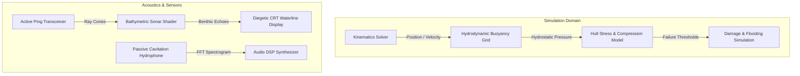

# 🌊 HECTON-8 — System Architecture Specification

> **NASA-Punk Deep Sea Submarine Simulation Architecture**  
> Developed by **Жирняк** & **Адольф Петушков**

---

## 🏗️ 1. Engine Layering & Data Flow

### 1.1 Performance & Memory Invariants
* **Burst Compilation:** All physics and raycast loops compiled with Unity Burst Compiler and NativeArrays (`Allocator.Persistent`).
* **Zero GC in Update:** Strict zero-heap-allocation per frame across cockpit telemetry and sensor processing.

---

### 👥 Engineering Syndicate
Developed and maintained by **Жирняк** & **Адольф Петушков**.
