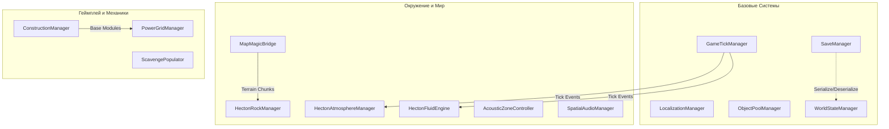

# Hecton8 Scripts Architecture

Этот документ описывает основные компоненты и менеджеры директории `_Project/Scripts`. Проект базируется на архитектуре синглтонов (Singletone Pattern) для глобальных менеджеров, каждый из которых управляет определенной подсистемой.

## Architecture Diagram

## Singletons (Глобальные менеджеры)

Ниже представлен список всех синглтонов и их зон ответственности:

### Базовые системы (Core Systems)
- **GameTickManager**: Глобальный таймер и обработчик тиков (обновлений). Вызывает интерфейсы `ITickable` вместо использования тяжелого Unity Update в каждом скрипте.
- **SaveManager**: Управление сохранениями (сериализация/десериализация данных игры, загрузка SaveData).
- **LocalizationManager**: Загрузка ресурсов локализации (JSON-файлов) и смена текущего языка (English/Russian).
- **ObjectPoolManager**: Управление пулами объектов (префабов), предотвращает аллокацию и уничтожение объектов (GC) заново.
- **WorldStateManager**: Отслеживает глобальные состояния мира (события, флаги, глобальное время).

### Окружение и Мир (Environment & World)
- **HectonAtmosphereManager**: Управление небом, планетами, освещением, временем суток и профилями атмосферы (NASA-Punk стиль).
- **HectonFluidEngine**: Симуляция водных массивов, вычисление плавучести для `BuoyancyObject` и течений на базе `CurrentManager`.
- **HectonRockManager**: Процедурный менеджер скал и пещер. Генерирует и управляет мешами.
- **MapMagicBridge**: Служит мостом между геймплеем и плагином MapMagic (управляет батчингом террейна).
- **AcousticZoneController**: Управление звуковыми зонами (реверберация при входе в базы, пещеры или под воду).
- **SpatialAudioManager**: Окружающее аудио, эмбиент саундскейпы и управление позиционном звуком.

### Геймплей и Механики (Gameplay & Mechanics)
- **ConstructionManager**: Менеджер строительства модулей базы, сборки (через Fabricator) и размещения (через BuilderTool).
- **PowerGridManager**: Глобальная маршрутизация энергии базы. Объединяет `PowerNode` по графу для распределения электричества.
- **ScavengePopulator**: Спавнит собираемые ресурсы, обломки и фрагменты технологий на поверхности и под водой (Procedural Scattering).
