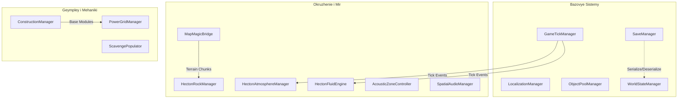

# Hecton8 Scripts Architecture

Etot dokument opisyvaet osnovnye komponenty i menedzhery direktorii `_Project/Scripts`. Proekt baziruetsya na arhitekture singltonov (Singletone Pattern) dlya globalnyh menedzherov, kazhdyy iz kotoryh upravlyaet opredelennoy podsistemoy.

## Architecture Diagram

## Singletons (Globalnye menedzhery)

Nizhe predstavlen spisok vseh singltonov i ih zon otvetstvennosti:

### Bazovye sistemy (Core Systems)
- **GameTickManager**: Globalnyy taymer i obrabotchik tikov (obnovleniy). Vyzyvaet interfeysy `ITickable` vmesto ispolzovaniya tyazhelogo Unity Update v kazhdom skripte.
- **SaveManager**: Upravlenie sohraneniyami (serializatsiya/deserializatsiya dannyh igry, zagruzka SaveData).
- **LocalizationManager**: Zagruzka resursov lokalizatsii (JSON-faylov) i smena tekuschego yazyka (English/Russian).
- **ObjectPoolManager**: Upravlenie pulami obektov (prefabov), predotvraschaet allokatsiyu i unichtozhenie obektov (GC) zanovo.
- **WorldStateManager**: Otslezhivaet globalnye sostoyaniya mira (sobytiya, flagi, globalnoe vremya).

### Okruzhenie i Mir (Environment & World)
- **HectonAtmosphereManager**: Upravlenie nebom, planetami, osvescheniem, vremenem sutok i profilyami atmosfery (NASA-Punk stil).
- **HectonFluidEngine**: Simulyatsiya vodnyh massivov, vychislenie plavuchesti dlya `BuoyancyObject` i techeniy na baze `CurrentManager`.
- **HectonRockManager**: Protsedurnyy menedzher skal i pescher. Generiruet i upravlyaet meshami.
- **MapMagicBridge**: Sluzhit mostom mezhdu geympleem i plaginom MapMagic (upravlyaet batchingom terreyna).
- **AcousticZoneController**: Upravlenie zvukovymi zonami (reverberatsiya pri vhode v bazy, peschery ili pod vodu).
- **SpatialAudioManager**: Okruzhayuschee audio, embient saundskeypy i upravlenie pozitsionnom zvukom.

### Geympley i Mehaniki (Gameplay & Mechanics)
- **ConstructionManager**: Menedzher stroitelstva moduley bazy, sborki (cherez Fabricator) i razmescheniya (cherez BuilderTool).
- **PowerGridManager**: Globalnaya marshrutizatsiya energii bazy. Obedinyaet `PowerNode` po grafu dlya raspredeleniya elektrichestva.
- **ScavengePopulator**: Spavnit sobiraemye resursy, oblomki i fragmenty tehnologiy na poverhnosti i pod vodoy (Procedural Scattering).
