# Полный список недоработок и план разработки — Project Submerge (HECTON-8)

Date: 2026-05-07
Status: PENDING VERIFICATION

<!-- DOC_GLOBAL_DOCS_REFRESH:R4_INTERIOR_BOUNDARY_START -->
## 2026-05-17 R4 Interior Actuality Boundary

This document is active only where it agrees with:

- `Docs/README.md`
- `Docs/DOC_GOVERNANCE.md`
- `Docs/ARCHITECTURE/HECTON8_DOCUMENTATION_ACTUALITY_LEDGER.md`
- current source files
- fresh verification logs and artifacts

No Unity import, Unity Console, Play Mode, profiler, GCMonitor, Memory Profiler, Frame Debugger, player build, save/load route, or visual-route proof is implied unless this document links a fresh evidence artifact. Historical counters and older version claims inside this file are subordinate to the current authority spine above.
<!-- DOC_GLOBAL_DOCS_REFRESH:R4_INTERIOR_BOUNDARY_END -->

## 2026-05-18 R11 Legacy Evidence Boundary

`GOTOV` / ready, ES3/Easy Save, `Zero GC`, system-complete, and implementation-done claims below are historical backlog claims only. Current status is `PENDING VERIFICATION` until current source scan, Unity import/Console, Play Mode route, profiler/GCMonitor, save/load, and artifact links exist. ES3/Easy Save references are legacy contamination unless a current stable authority explicitly approves that path.

Verification: PENDING VERIFICATION

# Полный список недоработок и план разработки

## Project Submerge (HECTON-8) | Глубокий анализ кода + README + все планы

<user_quoted_section>Версия 2.0 — после изучения реального кода (HectonSurvivalSystem.cs, SaveManager.cs, HectonBaseAI.cs, FaunaDirector.cs, PowerGridManager.cs, SceneBootstrap.cs, HectonVoxelEngine.cs, CaveGraphGenerator.cs, беклог.txt, спецификации.txt, диалог с Claude Opus 4.6). Многие «блокеры» из v1.0 уже реализованы на уровне кода — исправлено.</user_quoted_section>

<user_quoted_section>Источники:  (2).md, , , , , , , , , , , , , , </user_quoted_section>

## АРХИТЕКТУРА НЕДОРАБОТОК

```mermaid
graph TD
    A[HECTON-8 Недоработки] --> B[КРИТИЧЕСКИЕ БЛОКЕРЫ]
    A --> C[CORE GAMEPLAY]
    A --> D[WORLD & TERRAIN]
    A --> E[ВИЗУАЛ & АТМОСФЕРА]
    A --> F[ТЕХНИЧЕСКИЙ ДОЛГ]
    A --> G[КОНТЕНТ & ПРОГРЕССИЯ]

    B --> B1[Нет реального AI/Fauna]
    B --> B2[Нет Save System]
    B --> B3[GPUI Rock Shader не готов]
    B --> B4[Нет Additive Scene Loading]

    C --> C1[Survival System неполный]
    C --> C2[Inventory без instance-level данных]
    C --> C3[Нет транспорта]
    C --> C4[Нет Voxel Cave System]

    D --> D1[MapMagic 5-biome graph не готов]
    D --> D2[Нет ProximityColliderSystem live]
    D --> D3[Нет реального world fill]
    D --> D4[Нет Floating Origin]

    E --> E1[Scene View sky баг]
    E --> E2[Bioluminescence не реализована]
    E --> E3[Нет LOD dithering]

    F --> F1[83 runtime файла с editor coupling]
    F --> F2[Нет asmdef split]
    F --> F3[Reload 130+ сек]

    G --> G1[44 placeholder biome]
    G --> G2[Нет реального лута в мире]
    G --> G3[Нет NPC/Barter]
```



## РАЗДЕЛ 1: РЕАЛЬНЫЙ СТАТУС КЛЮЧЕВЫХ СИСТЕМ (после изучения кода)

<user_quoted_section>Многое из того, что казалось «не реализованным», уже существует в коде. Ниже — честная оценка.</user_quoted_section>

### ✅ УЖЕ РЕАЛИЗОВАНО (лучше, чем казалось)

| Система | Файл | Реальный статус |
| --- | --- | --- |
| **Save System** | `SaveManager.cs` | Полноценный async save/load через ES3, ISaveable registry, delta-snapshot, versioning (`SaveData.CurrentVersion`), async Awaitable API — **ГОТОВ** |
| **Survival System** | `HectonSurvivalSystem.cs` | O2/Energy/Integrity/Pressure/Depth — все реализованы. `ApplyPressureDamage` работает. `TakeDamage` API есть. Zero-GC. ISaveable — **ГОТОВ** |
| **Scene Bootstrap** | `SceneBootstrap.cs` | Полный async pipeline: singletons → pool warmup → world gen → save/load → world-ready → player spawn → OnGameReady — **ГОТОВ** |
| **AI Base** | `HectonBaseAI.cs` | FSM (Idle/Wander/Escape/Aggressive), obstacle avoidance (7 rays), buoyancy, pooling, health, zero-GC — **ГОТОВ** |
| **Fauna Director** | `FaunaDirector.cs` | Biome-aware spawning, culling, horde spawn, predator pressure — **ГОТОВ** |
| **Power Grid** | `PowerGridManager.cs` | BFS connectivity, merge/split grids, zero-GC, ISlowTickable — **ГОТОВ** |
| **Voxel Engine** | `HectonVoxelEngine.cs` | SDF caves v4.0, Burst jobs, MC extraction, vertex colors, spawn points — **ГОТОВ** |
| **Cave Graph** | `CaveGraphGenerator.cs` | Deterministic rooms/tunnels/entrances, 5 room types, 3 tunnel types — **ГОТОВ** |
| **ProximityCollider** | `спецификации.txt` | Burst job, hysteresis 40/45m, 0 GC, 10K points — **ГОТОВ в коде**, нужна live сцена |
| **Inventory Stacks** | `ДИАЛОГ С КЛОД ОПУС 4.6.txt` | Pass 1-3 реализованы: стеки, DROP, USE, SORT, durability bars, HUDNotification — **ГОТОВ** |

## РАЗДЕЛ 2: КРИТИЧЕСКИЕ БЛОКЕРЫ (реальные, после анализа кода)

### 🔴 БЛОКЕР-1: Voxel Cave System не подключена к MapMagic

**Статус:** `HectonVoxelEngine.cs` и `CaveGraphGenerator.cs` — полностью реализованы и работают. Но они изолированы от MapMagic.

**Что отсутствует:**

- Интеграция: MapMagic dents → триггер генерации voxel cave
- Seam art masking (переход terrain → cave mesh)
- Spawn point → gameplay content wiring (лут, враги внутри пещер)
- Cave biome assignment (какой `CavePreset` для какого биома)

**Почему блокер:** Пещеры — ключевой gameplay space для добычи ресурсов, укрытий, лора.

### 🔴 БЛОКЕР-2: GPUI Rock Shader не готов для инстансинга

**Статус:** Явно задокументировано в file:MAPMAGIC_WORLD_STACK_PLAN.md как "known, localized, honest blocker".

**Что нужно:**

- Shader Graph `SG_Rock_Triplanar` — добавить `GPU Instancer Setup` node вручную в Shader Graph
- Активировать `Rock_Runtime` root в сцене
- Добавить `HectonRockManager` и `GPUInstancerPrefabManager` в `[MANAGERS]`

**Последствие:** Без этого мир визуально пустой — нет скал, нет mid/far field density.

### 🔴 БЛОКЕР-3: Нет Floating Origin

**Статус:** Не реализован. Прямо упомянут в README (2).md §Stones как критический риск.

**Проблема:** Карта 15×15 км = floating-point precision errors на расстоянии >5 км от origin. Дрожание объектов, неточная физика, артефакты рендеринга.

**Что нужно:**

- `FloatingOriginSystem` — при удалении игрока от (0,0,0) на N метров: сдвиг всего мира обратно к origin
- Кинематическая телепортация (упомянута в README §Stones)
- Интеграция с MapMagic (terrain offset), Crest (ocean offset), всеми physics objects

### 🔴 БЛОКЕР-4: Нет реального AI поведения (только FSM скелет)

**Статус:** `HectonBaseAI.cs` — отличный FSM скелет. `FaunaDirector.cs` — spawning готов. Но:

**Что отсутствует:**

- Candice AI behavior trees интеграция (пакет есть, не подключён)
- Реакция на шум (нет `NoiseSystem`)
- Реакция на освещение (нет `LightDetectionSystem`)
- Leviathan types (мега-существа из README)
- NavMesh для underwater navigation (A* Pathfinding есть, не настроен для underwater)
- GPU Boids интеграция (`BoidSimulation.compute` + `BoidFishInstanced.shader` существуют — нужна сцена)
- Drone NPC для barter

### 🔴 БЛОКЕР-5: Additive Scene Loading — архитектура есть, сцены нет

**Статус:** `SceneBootstrap.cs` полностью готов. Но:

**Что отсутствует:**

- Сцена `00_BOOTSTRAP` (только `02_HECTON_WORLD` существует)
- Сцена `01_MAIN_MENU` (MainMenuController есть, сцена не настроена)
- `XX_SANDBOX` сцена для изолированного тестирования
- Реальный `GameManager` DontDestroyOnLoad singleton
- Глобальный `AudioMixer` через Bootstrap
- Checkpoint-based zone loading/unloading

### 🔴 БЛОКЕР-6: Save System — код готов, интеграция неполная

**Статус:** `SaveManager.cs` — production-grade. `HectonSurvivalSystem` — ISaveable. Но:

**Что отсутствует:**

- `ResourceNode` depletion state — не сохраняется (нет ISaveable на ResourceNode)
- `WorldStateManager` — существует, но `ClearAll()` вызывается только при New Game
- `ConstructionManager` — ISaveable не реализован (только `ClearAllModules()`)
- `BeaconNetworkSystem` — save/load есть, но не проверено в полном цикле
- Save Station UI → `SaveManager.SaveGameAsync()` — не подключено
- Версионирование схемы (`SaveData.CurrentVersion`) — есть, но migration logic отсутствует
- Delta saves — не реализованы (сохраняется весь `SaveData` целиком)

## РАЗДЕЛ 3: CORE GAMEPLAY — ДЕТАЛЬНЫЙ АНАЛИЗ НЕДОРАБОТОК

### 🟠 CORE-1: Survival System — давление есть, температура/радиация нет

**Реальный статус кода:** `HectonSurvivalSystem.cs` — `ApplyPressureDamage()` работает. `pressure = 1f + depth * 0.1f`. `SafeDepth` из `SurvivalStats`.

**Что реально отсутствует:**

- **Температура:** нет поля `temperature` в системе, нет drain/damage от температуры
- **Радиация:** нет поля `radiation`, нет источников радиации в мире
- **Suit upgrade mechanics:** рецепты `Emergency O2 Canister` есть, но `MaxOxygen` нельзя апгрейдить через `OverrideStats()` — нет UI/flow для этого
- **Crush Depth perimeter:** описан в README §Crush Depth как зона -7000m с мгновенной смертью — не реализована
- **Разгерметизация:** нет `BreachEvent` при столкновении с острыми объектами
- **Визуальные эффекты:** нет screen effects при критическом O2/давлении

### 🟠 CORE-2: Inventory — стеки реализованы, instance-level нет

**Реальный статус:** Диалог с Claude Opus 4.6 показывает Pass 1-3 реализованы: стеки (`_stackCounts[]`), DROP, USE (consumables), SORT, durability bars.

**Что реально отсутствует:**

- `InventoryItemInstance` — per-item durability tracking (не только в ToolMetadata)
- Drag & drop перестановка в сетке (Pass A из диалога — не реализован)
- Category filter tabs (Pass B — не реализован)
- Per-instance upgrades (нельзя апгрейдить конкретный инструмент)
- Stack splitting (нельзя разделить стак на два)

### 🟠 CORE-3: Construction — Power Grid готов, habitat gameplay нет

**Реальный статус:** `PowerGridManager.cs` — production-grade BFS, merge/split. `PowerNode`, `PowerGrid` — готовы.

**Что реально отсутствует:**

- Что делают построенные модули? Нет `HabitatModule` с реальными эффектами (O2 refill, pressure seal, storage)
- Deconstruct-return path: `LaserCutter` может деконструировать, но возврат ресурсов не реализован
- Pressure sealing: построенная база не создаёт зону с нормальным давлением
- Snap system: `ModuleSocket` есть, но snap-to-grid gameplay не отполирован
- Power consumption: `PowerNode` есть, но инструменты/системы не потребляют из grid

### 🟠 CORE-4: Transport — не начато

**Что нужно:**

- `GarpunScooter` — подводный скутер: Rigidbody + HectonFluidEngine + PlayerController override
- `CrabWalker` — IK walker: A* Pathfinding + Unity IK (пакеты есть)
- Vehicle enter/exit interaction через `IInteractable`
- Vehicle buoyancy через `BuoyancyObject`
- Vehicle save state (позиция, топливо)

### 🟠 CORE-5: Barter System — BarterRuntimeSmokeTester есть, логики нет

**Реальный статус:** `BarterRuntimeSmokeTester.cs` существует — значит система планировалась. Но реального `BarterSystem` нет.

**Что нужно:**

- `BarterSystem` singleton с drone inventory
- `DroneNPC` prefab с `IInteractable`
- Exchange tab в PDA (Hecton-OS)
- Pricing model (resource value table)
- Drone spawn/despawn через `FaunaDirector`

### 🟠 CORE-6: GPU Boids — compute shader есть, сцены нет

**Реальный статус:** `BoidSimulation.compute` + `BoidFishInstanced.shader` существуют в `_Project/Scripts`.

**Что нужно:**

- `HectonBoidController.cs` — уже существует! Нужна live сцена
- Boid prefabs с `BoidFishInstanced` shader
- Интеграция с `FaunaDirector` (биом-aware spawning косяков)
- Collision avoidance с terrain (BiomeSamplerCache)

### 🟠 CORE-7: Cable Physics — не начато

**Что нужно:**

- Verlet integration для кабелей (упомянуто в README §Stones)
- `CableComponent` с N сегментами
- Интеграция с `PowerNode` (визуальные кабели между модулями)
- Collision с terrain

## РАЗДЕЛ 4: WORLD & TERRAIN (процедурная генерация)

### 🟡 WORLD-1: MapMagic 5-biome enterprise graph не готов

**Статус:** README (2).md содержит детальный таск на рефакторинг MM2 графа (раздел "MAPMAGIC TASK"), но он не выполнен.

**Что нужно:**

- Distorted gradient для 5 биомов
- Spline rifts
- Biome selectors
- Конкретные node deletions/additions/values из README

**Текущее состояние:** Работает "small runtime palette" из 6-8 биомов, 108-biome matrix существует только как data layer.

### 🟡 WORLD-2: ProximityColliderSystem не live

**Статус:** Задокументировано в file:MAPMAGIC_WORLD_STACK_PLAN.md как "Honest Current Tail".

**Что нужно:**

- Live `ProximityColliderSystem` в сцене
- Collider-budget control подключён к реальной physics budget системе
- Near-field physics split (только близкие объекты получают full colliders)

### 🟡 WORLD-3: Нет реального world fill

**Статус:** World zones/content sockets/population rules — data layer готов. Реального контента нет.

**Что нужно:**

- Salvage pockets с реальными prefabs
- Service scars
- Power routes
- Relay canyons
- Biolum pockets
- Abyss edges
- Colony ruins (hybrid scatter/manual)

### 🟡 WORLD-4: Terrain — 44 placeholder biome из 108

**Статус:** Задокументировано в file:BIOME_MATRIX_108_PLAN.md.

**Что нужно:**

- Детализация 44 placeholder биомов
- Связь matrix biomes с zone plans
- MapMagic masks для каждой family
- Atmosphere overrides per biome
- Encounter rhythm per biome

### 🟡 WORLD-5: Нет Chunk Streaming (полноценного)

**Статус:** `WorldSliceDirector` работает для authored zones. Реального tile streaming нет.

**Что нужно:**

- Активная загрузка/выгрузка зон по чекпоинтам
- Scene streaming с LOD
- Отключение компонентов вне зоны видимости
- Tile size 1000m (описан в README)

## РАЗДЕЛ 5: ВИЗУАЛ & АТМОСФЕРА

### 🟡 VIS-1: Scene View sky баг не устранён

**Статус:** Задокументировано в file:SCENE_SKY_NOTES.md. Частично исправлено, остаточный дефект.

**Что осталось:**

- Облака/кастомный sky в Scene View не совпадают с Game view
- Нужна проверка live-полей `HectonUnderwaterVisuals` и `HectonAtmosphereManager`

### 🟡 VIS-2: Bioluminescence не реализована

**Статус:** Полная спецификация в README (2).md (раздел "Bioluminescence Rules").

**Что нужно:**

- Shader-based glow (HDR emission + Bloom)
- Async pulsing (Time + ObjectPos sine)
- GPU particles
- 1% real lights
- Fog culling integration
- `Biolum Paste` как ресурс уже есть, но визуал не реализован

### 🟡 VIS-3: LOD dithering не настроен

**Статус:** Упомянут в README как отдельный риск ("LOD dithering").

**Что нужно:**

- Настройка LOD cross-fade dithering для всех major asset групп
- Amplify Impostors интеграция для дальних объектов

### 🟡 VIS-4: Celestial mechanics не завершены

**Статус:** `HectonCelestialEngine.cs` существует, упомянуты "Aegir phases" и "Tidal lock drift".

**Что нужно:**

- Плавное наплывание Aegir (газовый гигант на небе)
- Tidal lock drift
- Eclipse mechanics (упомянуты в sky shader параметрах)

### 🟡 VIS-5: Underwater visuals неполные

**Статус:** `HectonUnderwaterVisuals.cs` существует, но:

- Volumetric fog underwater не настроен для всех глубин
- Caustics отсутствуют
- Particle systems для marine snow не реализованы

## РАЗДЕЛ 6: ТЕХНИЧЕСКИЙ ДОЛГ — ДЕТАЛЬНЫЙ АНАЛИЗ

### 🔵 TECH-0: Reload 130+ секунд — главная боль разработки

**Реальный статус:** `UNITY_RELOAD_FINDINGS.md` — `FinalizeReload` avg 125671ms. Wave 1 cleanup применён. Но:

- 83 runtime файла с editor coupling (из 207 runtime файлов = 40%!)
- Топ нарушители: `HectonUnderwaterVisuals` (23), `HectonVoxelEngine` (15), `SkySystemFollowCamera` (13)
- Нет `_Project` asmdef split — весь код компилируется в один assembly
- Vendor hotspots: Bakery, GPU Instancer, A* Pathfinding, MapMagic, Amplify Impostors

**Цель:** <30 сек reload через asmdef split + продолжение vendor cleanup

### 🔵 TECH-1: 83 runtime файла с editor coupling — нет asmdef split

**Статус:** Задокументировано в file:UNITY_PROJECT_SPLIT_REPORT.md.

**Топ нарушителей:**

- `HectonUnderwaterVisuals.cs` — 23 coupling signals
- `HectonVoxelEngine.cs` — 15
- `SkySystemFollowCamera.cs` — 13
- `BaseModule.cs` — 10
- `ProximityColliderSystem.cs` — 10

**Что нужно:**

- Сначала очистить editor coupling в топ-нарушителях
- Затем создать `_Project` asmdef split (runtime + editor assemblies)
- Цель: ускорить reload с 130+ сек до <30 сек

### 🔵 TECH-2: Нет XML документации

**Статус:** Явно упомянуто в file:task.md как незакрытый пункт: "Add comprehensive XML documentation".

**Что нужно:**

- XML doc для всех public API в `_Project/Scripts`
- Особенно: InputManager, PlayerInventory, PlayerToolManager, HectonSurvivalSystem

### 🔵 TECH-3: Нет CI pipeline

**Статус:** `.github/` директория существует, но содержимое неизвестно.

**Что нужно согласно README:**

- CI на компиляцию
- Asset health check workflow
- Автоматический генератор TODO в `task.md`

### 🔵 TECH-4: Нет профайлинг-метрик как достижимой цели

**Статус:** Упомянуто в file:HADES_HECTON8_tasks.md как незакрытый пункт.

**Что нужно:**

- Profiling benchmarks: FPS, memory, GC, draw calls
- Целевые метрики: 30 FPS на MX350, ≤2GB VRAM
- Автоматические тесты производительности

### 🔵 TECH-5: MCP console observability ненадёжна

**Статус:** Упомянуто в нескольких файлах как "tooling-observability tail".

**Проблема:** MCP не всегда возвращает live component snapshots в play mode, что затрудняет верификацию.

### 🔵 TECH-6: Нет Localization

**Статус:** `LocalizationManager.cs` существует (упомянут в split report), но система не развёрнута.

## РАЗДЕЛ 7: КОНТЕНТ & ПРОГРЕССИЯ

### 🟢 CONTENT-1: Инструменты — только scaffold, нет реальных visuals

**Статус:** Все 12 инструментов имеют placeholder cube visuals.

**Что нужно:**

- 3D модели для всех 12 held prefabs
- Анимации (equip/use/holster)
- Audio refs (звуки использования)
- VFX (лазер, гарпун, пропульсия)

### 🟢 CONTENT-2: Нет реального лута в открытом мире

**Статус:** `Resource_FieldSources` существует как authored placeholder. Реального scatter нет.

**Что нужно:**

- Реальные prefabs для всех 20 raw resources в мире
- Sealed caches (открываются LaserCutter)
- Biological harvest nodes (для Knife)
- Rare deep deposits

### 🟢 CONTENT-3: Нет NPC / Drone barter

**Статус:** Упомянут в README как "drone barter" и "Exchange/barter system".

**Что нужно:**

- Drone NPC prefabs
- Barter logic
- Exchange tab в PDA

### 🟢 CONTENT-4: Нет звукового дизайна

**Статус:** `SpatialAudioManager.cs` существует, `MasterAudio` интегрирован. Реального контента нет.

**Что нужно:**

- Ambient underwater soundscape
- Tool sounds
- Survival alerts (low O2, pressure warning)
- Footstep audio (PlayerFootstepAudio.cs существует)
- Bioluminescence pulse sounds

### 🟢 CONTENT-5: Нет Main Menu полноценного

**Статус:** `MainMenuController.cs` существует, но сцена `01_MAIN_MENU` не описана как готовая.

**Что нужно:**

- Полноценный Main Menu с Continue/New Game/Settings/Quit
- Loading screen
- Интеграция с Save System

### 🟢 CONTENT-6: Нет Hecton-OS AR tabs полноценных

**Статус:** README описывает 6 вкладок: Cargo, Blueprints, Diagnostics, Network, Spectrum, Exchange. Реализованы: Inventory, Loadout, DataLog, Controls.

**Что отсутствует:**

- **Network tab** — beacon network visualization
- **Spectrum tab** — environmental scanner data
- **Exchange tab** — barter interface
- **Diagnostics** — частично есть в DataLog

## РАЗДЕЛ 8: ПОЛНЫЙ ПЛАН РАЗРАБОТКИ (ОБНОВЛЁННЫЙ)

### Приоритизация по фазам

```mermaid
graph TD
    P0[ФАЗА 0: Стабилизация] --> P1[ФАЗА 1: Core Loop MVP]
    P1 --> P2[ФАЗА 2: World & Content]
    P2 --> P3[ФАЗА 3: Polish & AI]
    P3 --> P4[ФАЗА 4: Performance & Release]
```



### 📋 ФАЗА 0: Стабилизация (технический фундамент)

| # | Задача | Реальный статус | Приоритет |
| --- | --- | --- | --- |
| 0.1 | Floating Origin implementation | Не начато | 🔴 КРИТИЧНО |
| 0.2 | GPUI Rock Shader — добавить GPU Instancer Setup node | Shader есть, node нет | 🔴 КРИТИЧНО |
| 0.3 | Сцены 00_BOOTSTRAP, 01_MAIN_MENU, XX_SANDBOX | SceneBootstrap.cs готов | 🔴 КРИТИЧНО |
| 0.4 | ResourceNode ISaveable + WorldStateManager интеграция | Код есть, ISaveable нет | 🟠 ВЫСОКИЙ |
| 0.5 | ConstructionManager ISaveable | Код есть, ISaveable нет | 🟠 ВЫСОКИЙ |
| 0.6 | ProximityColliderSystem live в сцене | Код готов, сцена нет | 🟠 ВЫСОКИЙ |
| 0.7 | Save Station UI → SaveManager.SaveGameAsync() подключение | UI есть, wiring нет | 🟠 ВЫСОКИЙ |
| 0.8 | asmdef split (очистка топ-10 editor coupling) | Wave 1 done, нужен split | 🟠 ВЫСОКИЙ |

### 📋 ФАЗА 1: Core Loop MVP

| # | Задача | Реальный статус | Приоритет |
| --- | --- | --- | --- |
| 1.1 | Survival: Temperature + Radiation параметры | Pressure есть, temp/rad нет | 🟠 ВЫСОКИЙ |
| 1.2 | Crush Depth perimeter (-7000m instant death zone) | Не реализовано | 🟠 ВЫСОКИЙ |
| 1.3 | Inventory drag & drop + category filter tabs | Стеки есть, drag нет | 🟠 ВЫСОКИЙ |
| 1.4 | Voxel Cave → MapMagic интеграция (dents + seams) | Оба готовы, не связаны | 🟠 ВЫСОКИЙ |
| 1.5 | HabitatModule gameplay (O2 refill, pressure seal, storage) | PowerGrid готов, эффектов нет | 🟠 ВЫСОКИЙ |
| 1.6 | Construction deconstruct-return path | LaserCutter есть, return нет | 🟡 СРЕДНИЙ |
| 1.7 | Sealed caches prefabs (LaserCutter interaction) | Инструмент готов, объектов нет | 🟡 СРЕДНИЙ |
| 1.8 | Biological harvest nodes (Knife interaction) | Инструмент готов, объектов нет | 🟡 СРЕДНИЙ |
| 1.9 | BarterSystem + DroneNPC + Exchange PDA tab | BarterSmokeTester есть | 🟡 СРЕДНИЙ |
| 1.10 | GPU Boids live сцена (HectonBoidController) | Compute shader + controller есть | 🟡 СРЕДНИЙ |

### 📋 ФАЗА 2: World & Content

| # | Задача | Реальный статус | Приоритет |
| --- | --- | --- | --- |
| 2.1 | GPUI Rock instancing live (после shader fix) | Shader fix → activate | 🟠 ВЫСОКИЙ |
| 2.2 | MapMagic 5-biome enterprise graph refactor | Текущий граф работает | 🟠 ВЫСОКИЙ |
| 2.3 | Hybrid density: near/mid/far world fill с реальными prefabs | WorldSliceDirector готов | 🟠 ВЫСОКИЙ |
| 2.4 | Реальные prefabs для 20 raw resources в мире | Data есть, prefabs нет | 🟠 ВЫСОКИЙ |
| 2.5 | `HectonBiolumMaster.shader` — подключить к объектам | Shader существует! | 🟡 СРЕДНИЙ |
| 2.6 | 44 placeholder biome детализация | 64 из 108 готовы | 🟡 СРЕДНИЙ |
| 2.7 | Colony ruins (hybrid scatter/manual) | WorldContentSocket готов | 🟡 СРЕДНИЙ |
| 2.8 | Marine snow particle system | Не начато | 🟡 СРЕДНИЙ |
| 2.9 | Caustics underwater shader | Не начато | 🟡 СРЕДНИЙ |
| 2.10 | Chunk streaming (tile-based, 1000m tiles) | WorldSliceDirector частично | 🟡 СРЕДНИЙ |
| 2.11 | Celestial mechanics: Aegir phases + tidal lock | HectonCelestialEngine есть | 🟢 НИЗКИЙ |
| 2.12 | Cable physics (Verlet) для power grid визуала | Не начато | 🟢 НИЗКИЙ |

### 📋 ФАЗА 3: AI & Polish

| # | Задача | Реальный статус | Приоритет |
| --- | --- | --- | --- |
| 3.1 | Candice AI behavior trees интеграция | HectonBaseAI FSM готов | 🟠 ВЫСОКИЙ |
| 3.2 | NoiseSystem + LightDetectionSystem для AI реакций | Не начато | 🟠 ВЫСОКИЙ |
| 3.3 | Leviathan types (мега-существа) | Не начато | 🟡 СРЕДНИЙ |
| 3.4 | Garpun scooter транспорт | Не начато | 🟡 СРЕДНИЙ |
| 3.5 | Crab walker с IK | Не начато | 🟢 НИЗКИЙ |
| 3.6 | Tool VFX (лазер, гарпун, пропульсия) | Placeholder visuals | 🟡 СРЕДНИЙ |
| 3.7 | Tool animations (equip/use/holster) | Не начато | 🟡 СРЕДНИЙ |
| 3.8 | Ambient underwater soundscape | SpatialAudioManager готов | 🟡 СРЕДНИЙ |
| 3.9 | Tool sounds | Не начато | 🟡 СРЕДНИЙ |
| 3.10 | Survival alerts audio (low O2, pressure) | Не начато | 🟡 СРЕДНИЙ |
| 3.11 | LOD dithering + Amplify Impostors настройка | Не настроено | 🟡 СРЕДНИЙ |
| 3.12 | Scene View sky баг финальное исправление | Частично исправлено | 🟡 СРЕДНИЙ |
| 3.13 | Main Menu полноценный (01_MAIN_MENU сцена) | MainMenuController есть | 🟡 СРЕДНИЙ |
| 3.14 | Localization развёртывание (English.json + Russian.json) | Файлы существуют! | 🟢 НИЗКИЙ |

### 📋 ФАЗА 4: Performance & Release Prep

| # | Задача | Файл-источник | Приоритет |
| --- | --- | --- | --- |
| 4.1 | asmdef split (_Project runtime + editor) | UNITY_PROJECT_SPLIT_REPORT.md | 🟠 ВЫСОКИЙ |
| 4.2 | Profiling benchmarks (FPS/GC/drawcalls) | HADES_HECTON8_tasks.md | 🟠 ВЫСОКИЙ |
| 4.3 | VRAM budget checks + texture atlas | README (2).md §Performance | 🟠 ВЫСОКИЙ |
| 4.4 | Job System + Burst для AI/noise/physics grids | README (2).md §Performance | 🟡 СРЕДНИЙ |
| 4.5 | CI pipeline (компиляция + asset health) | HADES_HECTON8_tasks.md | 🟡 СРЕДНИЙ |
| 4.6 | XML документация всего public API | task.md | 🟡 СРЕДНИЙ |
| 4.7 | Localization system развёртывание | UNITY_PROJECT_SPLIT_REPORT.md | 🟢 НИЗКИЙ |
| 4.8 | Quality profiles (Abyss/Surface/Orbit) | README (2).md §Technical | 🟡 СРЕДНИЙ |
| 4.9 | Texture compression audit (max 2048×2048) | README (2).md §Technical | 🟡 СРЕДНИЙ |
| 4.10 | Overdraw limits audit | README (2).md §Stones | 🟡 СРЕДНИЙ |

## СВОДНАЯ ТАБЛИЦА НЕДОРАБОТОК (v2.0 — после анализа кода)

| Категория | Критических | Высоких | Средних | Низких | Итого |
| --- | --- | --- | --- | --- | --- |
| Блокеры | 6 | — | — | — | **6** |
| Core Gameplay | — | 5 | 5 | — | **10** |
| World & Terrain | — | 4 | 8 | 2 | **14** |
| Визуал | — | 1 | 4 | 1 | **6** |
| Технический долг | — | 3 | 3 | 1 | **7** |
| Контент | — | — | 5 | 3 | **8** |
| **ИТОГО** | **6** | **13** | **25** | **7** | **51** |

<user_quoted_section>Важно: Количество задач выросло не потому что стало хуже — а потому что анализ кода выявил скрытые возможности (biolum shader уже есть, boid compute уже есть, localization файлы уже есть) и уточнил реальные gaps.</user_quoted_section>

## КЛЮЧЕВЫЕ ПРИНЦИПЫ (из README (2).md — нельзя нарушать)

<user_quoted_section>Эти правила должны соблюдаться при реализации КАЖДОЙ задачи:</user_quoted_section>

1. **Zero GC** в Update/FixedUpdate/LateUpdate — никаких LINQ, FindObjectOfType, GetComponent в горячих циклах
2. **VRAM ≤ 2GB** — текстуры max 2048×2048 для terrain/walls, 1024/512 для props
3. **30+ FPS на MX350** — целевая платформа для всех задач
4. **Prefab-centric workflow** — никакой правки сцены напрямую, только Prefab Mode/Variants
5. **Data-driven** — ScriptableObjects вместо хардкода
6. **No tessellation** — только Normal/Parallax в MicroSplat
7. **Additive Scene Loading** — никаких монолитных сцен
8. **Git LFS** — все бинарные ассеты через LFS

## ТЕКУЩЕЕ СОСТОЯНИЕ СИСТЕМ (честная оценка v2.0)

```mermaid
graph TD
    subgraph ГОТОВО_КОД
        A1[Input System ✅]
        A2[HUD V4 ✅]
        A3[PDA Shell + Tabs ✅]
        A4[12 Tools scaffold ✅]
        A5[Fabricator + Recipes ✅]
        A6[Resource Economy data ✅]
        A7[World Stack architecture ✅]
        A8[108 Biome Matrix data ✅]
        A9[Buoyancy/Current ✅]
        A10[Beacon Network ✅]
        A11[SaveManager async ✅]
        A12[HectonBaseAI FSM ✅]
        A13[FaunaDirector ✅]
        A14[PowerGridManager ✅]
        A15[VoxelEngine + CaveGraph ✅]
        A16[SceneBootstrap async ✅]
        A17[Inventory Stacks/USE/DROP ✅]
        A18[BoidSimulation.compute ✅]
        A19[HectonBiolumMaster.shader ✅]
        A20[Localization EN+RU ✅]
    end

    subgraph НУЖНА_СЦЕНА_ИЛИ_WIRING
        B1[ProximityColliderSystem 🔶]
        B2[GPU Boids live 🔶]
        B3[Biolum shader на объектах 🔶]
        B4[Save Station wiring 🔶]
        B5[ResourceNode ISaveable 🔶]
        B6[GPUI Rock shader fix 🔶]
    end

    subgraph НЕ_НАЧАТО
        C1[Floating Origin ❌]
        C2[Transport ❌]
        C3[Barter/DroneNPC ❌]
        C4[Temperature/Radiation ❌]
        C5[Real World Fill prefabs ❌]
        C6[Cave→MapMagic seams ❌]
        C7[Sound Design ❌]
        C8[HabitatModule effects ❌]
    end
```

## СКРЫТЫЕ ВОЗМОЖНОСТИ (найдены в коде)

<user_quoted_section>Эти вещи уже существуют в проекте, но не активированы или не подключены:</user_quoted_section>

| Файл | Что есть | Что нужно сделать |
| --- | --- | --- |
| `HectonBiolumMaster.shader` | Готовый biolum shader | Применить к объектам, настроить HDR emission + Bloom |
| `BoidSimulation.compute` + `BoidFishInstanced.shader` | GPU boids pipeline | Создать prefabs, добавить в сцену через HectonBoidController |
| `HectonBoidController.cs` | Boid manager | Добавить в [MANAGERS], настроить биом-aware spawning |
| `English.json` + `Russian.json` | Локализация | Заполнить ключи, подключить LocalizationManager к UI |
| `BarterRuntimeSmokeTester.cs` | Barter test harness | Реализовать BarterSystem, подключить |
| `AcousticZoneController.cs` | Acoustic zones | Разместить в сцене, настроить underwater reverb |
| `LandingImpactVFX.cs` | Landing VFX | Подключить к PlayerMovement |
| `CameraJuiceProcessor.cs` | Camera juice (bobbing, shake, FOV) | Подключить к PlayerMovement (из беклога) |
| `PlayerThrusterAudio.cs` | Thruster audio | Подключить к движению |
| `PlayerFootstepAudio.cs` | Footstep audio | Настроить surface detection |
