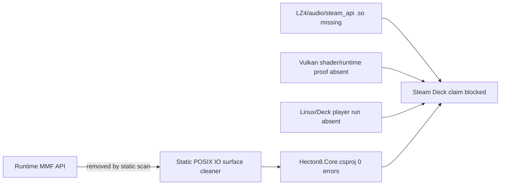

<!-- DOC_GLOBAL_DOCS_REFRESH:R4_INTERIOR_BOUNDARY_START -->
## 2026-05-18 R22 Static Actuality Boundary

This document is active only where it agrees with `Docs/README.md`, `Docs/DOC_GOVERNANCE.md`, `Docs/ARCHITECTURE/HECTON8_DOCUMENTATION_ACTUALITY_LEDGER.md`, current source files, and fresh verification artifacts.

No Unity import, Unity Console, Play Mode, profiler, GCMonitor, Memory Profiler, Frame Debugger, player build, save/load route, platform run, campaign telemetry, or visual-route proof is implied unless this document links a fresh evidence artifact. Historical counters and older `PASS` / `VERIFIED` labels inside this file are subordinate to the current authority spine above.
<!-- DOC_GLOBAL_DOCS_REFRESH:R4_INTERIOR_BOUNDARY_END -->
# Steam Deck POSIX MMF Purge Continuation

Date: 2026-05-11
Status: `PENDING VERIFICATION`
Scope: ECHELON 1 Platform Abstraction / Core & Memory Infrastructure

This report supersedes the MMF portion of `Docs/Reports/2026-05-11_STEAM_DECK_POSIX_PREFLIGHT.md`. The older generated preflight report is still useful for shader/path/native warnings, but its MMF blocker rows are stale after this continuation. A Unity batch rerun was started and then killed after hanging before scanner completion; therefore this report is static/dotnet evidence, not Unity-generated proof.

## Evidence

| Check | Result |
|---|---|
| Runtime MMF API scan | No hits for `System.IO.MemoryMappedFiles`, `MemoryMappedFile`, `MemoryMappedViewAccessor`, `CreateFromFile`, `AcquirePointer`, or `ReleasePointer` under `Assets/_Project/Scripts` outside Editor. |
| Core compile | `dotnet build Hecton8.Core.csproj -clp:ErrorsOnly` succeeded: 0 errors, 0 warnings. |
| Full Assembly-CSharp compile | Timed out after 184 seconds; no successful full-project result claimed. |
| Unity preflight rerun | Started with `SteamDeckPosixPreflightScanner.RunBatchAudit`, but Unity stayed running before scanner output; process was stopped. Previous generated report remains stale. |

## What Changed

| File | Change |
|---|---|
| `Assets/_Project/Scripts/SaveBinaryStorage.cs` | Removed runtime MMF read windows, read-only mappings, and sector override mapping. Replacement uses `NativeArray<byte>` snapshots/windows and sequential `FileStream` writes through fixed 64 KB scratch buffers. |
| `Assets/_Project/Scripts/Core/DodReplayRecorder.cs` | Removed development replay MMF writer. Replacement writes circular replay snapshots to a pre-sized file through a fixed 64 KB scratch buffer on the existing writer thread. |
| `Assets/_Project/Scripts/CrashTelemetryBuffer.cs` | Removed live/crash telemetry MMF views and `kernel32.dll` file metadata probe. Replacement writes fixed binary records through `FileStream` and reusable byte buffers. |
| `Assets/_Project/Scripts/Narrative/LoreMmfEncyclopedia.cs` | Removed payload MMF view. Replacement uses read-only `FileStream`, fixed index snapshot, and largest-entry scratch buffer. Public type names are unchanged for compatibility. |
| `Assets/_Project/Scripts/Gameplay/DataArchaeologyRuntime.cs` | Sidecar persistence is fixed binary `FileStream` IO, not MMF. Serialized legacy field names remain to avoid data loss. |
| `Assets/_Project/Scripts/Input/UserOptionsPersistence.cs` | User options file is fixed binary `FileStream` IO, not MMF. |
| `Assets/_Project/Scripts/SaveBinaryStorageNativeArrayExtensions.cs` | Converted to an empty compatibility stub because the old extension only existed for `MemoryMappedViewAccessor`. |

## Remaining Blockers

| Severity | Area | Finding | Fix Class |
|---|---|---|---|
| BLOCKER | Native compression | `liblz4.dll` exists; no `liblz4.so` or `.dylib` evidence was found. | `NATIVE` |
| BLOCKER | Native audio | `HectonAudioKernel.dll` exists; no Linux/macOS native binary evidence was found. | `NATIVE` |
| BLOCKER | Steamworks Deck runtime | No `libsteam_api.so` evidence found. | `NATIVE/STEAM` |
| PENDING | Device proof | No Linux player launch, Steam Deck launch, Vulkan capture, GCMonitor, or suspend/resume proof. | `PROOF` |

## Blocker Graph

## Regression Model

- CPU: normal gameplay hot-frame cost is unchanged. Save/replay/telemetry IO is cold/background and now uses sequential file chunks instead of mapped pointer copies.
- GC: large save/replay buffers are native (`NativeArray<byte>`) or cold fixed byte arrays, not per-read managed allocations.
- Memory: `SaveBinaryStorage` read-only full-file snapshots now reserve native memory equal to file length while mapping is open. This is more explicit than mmap and must be profiled on Steam Deck shared memory.
- Correctness: byte layout, headers, checksums, and public caller contracts were preserved. Existing save/replay formats still need Linux/Deck replay and backup-promotion tests.
- Failure modes: slower cold save load/write on Windows, native memory pressure during large save reads, stale generated preflight until Unity batch can rerun cleanly.

## Unity Hub Answer

Install in Hub when you are ready to build targets:

- Android Build Support with OpenJDK and Android SDK & NDK Tools for standalone Android VR headsets.
- Mac Build Support (Mono) for macOS compile/export checks from this Windows editor; final signing/notarization still needs macOS/Xcode pipeline.
- Linux Dedicated Server Build Support only if we need headless QA/server builds; desktop Linux support is already installed.
- Web/UWP/iOS/tvOS/visionOS only when those targets become active proof targets. They do not fix native `.so`/SteamInput/Vulkan issues.

Do not expect Unity Hub to fix missing `liblz4.so`, `HectonAudioKernel.so`, `libsteam_api.so`, Vulkan shader runtime behavior, Steam Deck controls, or VR comfort/configuration.
