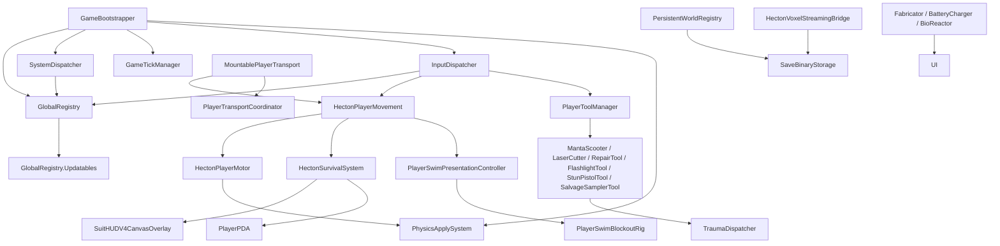

# HECTON-8 Global Architecture Map

Generated: 2026-04-23
Status: PENDING VERIFICATION

Mandates followed:
- `ARCH_Global_Registry_ServiceLocator_DI_Init.txt`
- `ARCH_Project_Bootstrap_Sequence_Init_Safety.txt`
- `GLOBAL_REGISTRY_DI.md`
- `OPT_Zero_GC_Policy_AllocFree_Mandate.txt`
- `DBG_Telemetry_Crash_Reporting_PostMortem.txt`
- `AGENTS.md`

Swap-With-Last O(1) removal confirmed in `RegistryBucket<T>.Unregister()`: decrement live count, copy tail into removed slot, clear old tail reference.

## Table Of Contents
1. Scope
2. Audit Summary
3. Dispatcher Canonicalization Delta
4. Dependency Graph
5. Interface Audit
6. Interface Orphans
7. Category Index [CORE]
8. Category Index [GAMEPLAY]
9. Category Index [AI]
10. Category Index [VFX]
11. Category Index [UI]

## Scope

- Full audit target: `Assets/_Project/Scripts/**/*.cs`
- Current script inventory: `808` first-party `.cs` files
- Category mapping is heuristic but deterministic: folder ownership first, then filename patterns, then CORE fallback.

## Audit Summary

- ITickable implementers detected: `150`
- IDamageReceiver implementers detected: `2`
- GlobalRegistry-orphan implementers detected: `146`
- Category counts: CORE=`546`, GAMEPLAY=`121`, AI=`27`, VFX=`17`, UI=`97`
- Live runtime remains mixed: `GameTickManager` is still the dominant tick owner, but targeted player-layer scripts now also register through `GlobalRegistry.RegisterUpdatable(...)`.

## Dispatcher Canonicalization Delta

- Removed duplicate `LateUpdate()` playback from `Gameplay/PlayerSwimPresentationController.cs` and `Gameplay/PlayerSwimBlockoutRig.cs`.
- Player-layer `IUpdatable` adoption added for:
  - `Assets/_Project/Scripts/PlayerToolManager.cs`
  - `Assets/_Project/Scripts/Gameplay/MantaScooter.cs`
  - `Assets/_Project/Scripts/Gameplay/MountablePlayerTransport.cs`
  - `Assets/_Project/Scripts/Gameplay/PlayerSwimPresentationController.cs`
  - `Assets/_Project/Scripts/Gameplay/PlayerSwimBlockoutRig.cs`
- `MountablePlayerTransport` still uses `GameTickManager` for `IFixedTickable` only. Variable tick now routes through the dispatcher bucket.

## Dependency Graph

## Interface Audit

### ITickable Implementers
- `Assets/_Project/Scripts/AcousticZoneController.cs` (`AcousticZoneController`, `1888` lines)
- `Assets/_Project/Scripts/AmbientWaterMotionManager.cs` (`AmbientWaterMotionManager`, `297` lines)
- `Assets/_Project/Scripts/AsyncLoadHelper.cs` (`AsyncLoadHelper`, `190` lines)
- `Assets/_Project/Scripts/Atmosphere/HectonSurfaceWeatherDirector.cs` (`HectonSurfaceWeatherDirector`, `1708` lines)
- `Assets/_Project/Scripts/Audio/DeepPsychosisController.cs` (`DeepPsychosisController`, `212` lines)
- `Assets/_Project/Scripts/Audio/HectonMusicDirector.cs` (`HectonMusicDirector`, `2014` lines)
- `Assets/_Project/Scripts/Audio/PlayerCriticalProceduralAudioRenderer.cs` (`PlayerCriticalProceduralAudioRenderer`, `1417` lines)
- `Assets/_Project/Scripts/BeaconRuntime.cs` (`BeaconRuntime`, `137` lines)
- `Assets/_Project/Scripts/CaveBioRootsGenerator.cs` (`CaveBioRootsGenerator`, `351` lines)
- `Assets/_Project/Scripts/Construction/MaintenanceStationModule.cs` (`MaintenanceStationModule`, `430` lines)
- `Assets/_Project/Scripts/Construction/RepairDroneEntity.cs` (`RepairDroneEntity`, `229` lines)
- `Assets/_Project/Scripts/Construction/VehicleDockingModule.cs` (`VehicleDockingModule`, `273` lines)
- `Assets/_Project/Scripts/Core/InputDispatcher.cs` (`InputDispatcher`, `336` lines)
- `Assets/_Project/Scripts/CrashTelemetryBuffer.cs` (`CrashTelemetryBuffer`, `635` lines)
- `Assets/_Project/Scripts/Economy/ResourceRecyclerModule.cs` (`ResourceRecyclerModule`, `414` lines)
- `Assets/_Project/Scripts/EntityChangeDetector.cs` (`EntityChangeManager`, `336` lines)
- `Assets/_Project/Scripts/Environment/GlobalWeatherDirector.cs` (`GlobalWeatherDirector`, `547` lines)
- `Assets/_Project/Scripts/Fabricator.cs` (`Fabricator`, `852` lines)
- `Assets/_Project/Scripts/Fauna/FaunaBrain.cs` (`FaunaBrain`, `603` lines)
- `Assets/_Project/Scripts/Gameplay/BaseAirlock.cs` (`BaseAirlock`, `353` lines)
- `Assets/_Project/Scripts/Gameplay/BatteryCharger.cs` (`BatteryCharger`, `613` lines)
- `Assets/_Project/Scripts/Gameplay/BioReactor.cs` (`BioReactor`, `673` lines)
- `Assets/_Project/Scripts/Gameplay/DeployableBeacon.cs` (`DeployableBeacon`, `419` lines)
- `Assets/_Project/Scripts/Gameplay/DeployableFlare.cs` (`DeployableFlare`, `447` lines)
- `Assets/_Project/Scripts/Gameplay/EnvironmentalHazard.cs` (`EnvironmentalHazard`, `372` lines)
- `Assets/_Project/Scripts/Gameplay/FloraProjectile.cs` (`FloraProjectile`, `216` lines)
- `Assets/_Project/Scripts/Gameplay/GravTrap.cs` (`GravTrap`, `295` lines)
- `Assets/_Project/Scripts/Gameplay/HarvestablePlant.cs` (`HarvestablePlant`, `390` lines)
- `Assets/_Project/Scripts/Gameplay/HazardZoneManager.cs` (`HazardZoneManager`, `663` lines)
- `Assets/_Project/Scripts/Gameplay/HectonHazardSource.cs` (`HectonHazardSource`, `127` lines)
- `Assets/_Project/Scripts/Gameplay/HectonPlayerCameraRig.cs` (`HectonPlayerCameraRig`, `84` lines)
- `Assets/_Project/Scripts/Gameplay/HectonPlayerHealth.cs` (`HectonPlayerHealth`, `182` lines)
- `Assets/_Project/Scripts/Gameplay/ItemHighlight.cs` (`ItemHighlight`, `258` lines)
- `Assets/_Project/Scripts/Gameplay/MantaScooter.cs` (`MantaScooter`, `1414` lines)
- `Assets/_Project/Scripts/Gameplay/MessageTerminal.cs` (`MessageTerminal`, `514` lines)
- `Assets/_Project/Scripts/Gameplay/MountablePlayerTransport.cs` (`MountablePlayerTransport`, `986` lines)
- `Assets/_Project/Scripts/Gameplay/OxygenBubble.cs` (`OxygenBubble`, `293` lines)
- `Assets/_Project/Scripts/Gameplay/OxygenPlant.cs` (`OxygenPlant`, `204` lines)
- `Assets/_Project/Scripts/Gameplay/PlayerActionController.cs` (`PlayerActionController`, `371` lines)
- `Assets/_Project/Scripts/Gameplay/PlayerNoiseEmitter.cs` (`PlayerNoiseEmitter`, `158` lines)
- `Assets/_Project/Scripts/Gameplay/PlayerSwimBlockoutRig.cs` (`PlayerSwimBlockoutRig`, `653` lines)
- `Assets/_Project/Scripts/Gameplay/PlayerSwimPresentationController.cs` (`PlayerSwimPresentationController`, `2380` lines)
- `Assets/_Project/Scripts/Gameplay/SargassumCutResponder.cs` (`SargassumCutResponder`, `167` lines)
- `Assets/_Project/Scripts/Gameplay/SealedDoor.cs` (`SealedDoor`, `440` lines)
- `Assets/_Project/Scripts/Gameplay/SolarPanel.cs` (`SolarPanel`, `348` lines)
- `Assets/_Project/Scripts/Gameplay/TransportChargingStation.cs` (`TransportChargingStation`, `237` lines)
- `Assets/_Project/Scripts/Gameplay/TraumaDispatcher.cs` (`TraumaDispatcher`, `377` lines)
- `Assets/_Project/Scripts/HectonAtmosphereManager.cs` (`HectonAtmosphereManager`, `894` lines)
- `Assets/_Project/Scripts/HectonBoidController.cs` (`HectonBoidController`, `904` lines)
- `Assets/_Project/Scripts/HectonCelestialEngine.cs` (`HectonCelestialEngine`, `2593` lines)
- `Assets/_Project/Scripts/HectonFabricatorUI.cs` (`HectonFabricatorUI`, `1365` lines)
- `Assets/_Project/Scripts/HectonFloatingOrigin.cs` (`HectonFloatingOrigin`, `422` lines)
- `Assets/_Project/Scripts/HectonInventoryUI.cs` (`HectonInventoryUI`, `607` lines)
- `Assets/_Project/Scripts/HectonItem.cs` (`HectonItem`, `354` lines)
- `Assets/_Project/Scripts/HectonPlayerMovement.cs` (`HectonPlayerMovement`, `7116` lines)
- `Assets/_Project/Scripts/HectonScanMarkerSystem.cs` (`HectonScanMarkerSystem`, `319` lines)
- `Assets/_Project/Scripts/HectonSuitHUD_v4.cs` (`HectonSuitHUD_v4`, `925` lines)
- `Assets/_Project/Scripts/HectonSuitHUDExtensions.cs` (`HectonSuitHUDExtensions`, `716` lines)
- `Assets/_Project/Scripts/HectonSurvivalSystem.cs` (`HectonSurvivalSystem`, `2166` lines)
- `Assets/_Project/Scripts/HectonUnderwaterVisuals.cs` (`HectonUnderwaterVisuals`, `4494` lines)
- `Assets/_Project/Scripts/HectonWorldGenerator.cs` (`HectonWorldGenerator`, `1491` lines)
- `Assets/_Project/Scripts/HUDNotification.cs` (`HUDNotification`, `352` lines)
- `Assets/_Project/Scripts/HUDQuickBar.cs` (`HUDQuickBar`, `492` lines)
- `Assets/_Project/Scripts/Interaction/PhysicalInteractionHandler.cs` (`PhysicalInteractionHandler`, `492` lines)
- `Assets/_Project/Scripts/Interaction/PlayerInteraction.cs` (`PlayerInteraction`, `410` lines)
- `Assets/_Project/Scripts/InteractionHighlighter.cs` (`InteractionHighlighter`, `418` lines)
- `Assets/_Project/Scripts/LandingImpactVFX.cs` (`LandingImpactVFX`, `513` lines)
- `Assets/_Project/Scripts/MainMenuController.cs` (`MainMenuController`, `1052` lines)
- `Assets/_Project/Scripts/ObjectPoolManager.cs` (`DespawnTimer`, `715` lines)
- `Assets/_Project/Scripts/ObserverRelativeCelestialBody.cs` (`ObserverRelativeCelestialBody`, `496` lines)
- `Assets/_Project/Scripts/Optimization/AssetLifecycleGovernor.cs` (`AssetLifecycleGovernor`, `522` lines)
- `Assets/_Project/Scripts/Optimization/AssetLoadDispatcher.cs` (`AssetLoadDispatcher`, `268` lines)
- `Assets/_Project/Scripts/Optimization/VRAMPressureMonitor.cs` (`VRAMPressureMonitor`, `180` lines)
- `Assets/_Project/Scripts/PDA/PDAMarkerHUDElement.cs` (`PDAMarkerHUDElement`, `270` lines)
- `Assets/_Project/Scripts/PDA/PlayerExplorationTracker.cs` (`PlayerExplorationTracker`, `270` lines)
- `Assets/_Project/Scripts/PerformanceMonitor.cs` (`PerformanceMonitor`, `366` lines)
- `Assets/_Project/Scripts/PlayerFlashlight.cs` (`PlayerFlashlight`, `842` lines)
- `Assets/_Project/Scripts/PlayerPDA.cs` (`PlayerPDA`, `995` lines)
- `Assets/_Project/Scripts/PlayerThrusterAudio.cs` (`PlayerThrusterAudio`, `288` lines)
- `Assets/_Project/Scripts/PlayerToolManager.cs` (`PlayerToolManager`, `987` lines)
- `Assets/_Project/Scripts/Progression/PlayerAchievementRegistry.cs` (`PlayerAchievementRegistry`, `302` lines)
- `Assets/_Project/Scripts/ProximityColliderSystem.cs` (`ProximityColliderSystem`, `667` lines)
- `Assets/_Project/Scripts/RuntimePerformanceProfiler.cs` (`RuntimePerformanceProfiler`, `2014` lines)
- `Assets/_Project/Scripts/StunPistolTool.cs` (`StunTargetRuntime`, `541` lines)
- `Assets/_Project/Scripts/ThermalGeyser.cs` (`ThermalGeyser`, `237` lines)
- `Assets/_Project/Scripts/Tools/PauseSystemVerifier.cs` (`PauseSystemVerifier`, `249` lines)
- `Assets/_Project/Scripts/Tools/PerformanceBudgetController.cs` (`PerformanceBudgetController`, `417` lines)
- `Assets/_Project/Scripts/Tools/PerformanceMonitor.cs` (`PerformanceMonitor`, `296` lines)
- `Assets/_Project/Scripts/UI/AcousticEcholocationTranslator.cs` (`AcousticEcholocationTranslator`, `1018` lines)
- `Assets/_Project/Scripts/UI/ActionProgressHUD.cs` (`ActionProgressHUD`, `251` lines)
- `Assets/_Project/Scripts/UI/ARWaypointOverlay.cs` (`ARWaypointOverlay`, `570` lines)
- `Assets/_Project/Scripts/UI/AudioWaveformAnimator.cs` (`AudioWaveformAnimator`, `206` lines)
- `Assets/_Project/Scripts/UI/BeaconHUDElement.cs` (`BeaconHUDElement`, `314` lines)
- `Assets/_Project/Scripts/UI/BuilderStatusOverlay.cs` (`BuilderStatusOverlay`, `507` lines)
- `Assets/_Project/Scripts/UI/FontStreamingManager.cs` (`FontStreamingManager`, `413` lines)
- `Assets/_Project/Scripts/UI/HectonOSBootManager.cs` (`HectonOSBootManager`, `478` lines)
- `Assets/_Project/Scripts/UI/InteractionUI.cs` (`InteractionUI`, `469` lines)
- `Assets/_Project/Scripts/UI/LoadingScreenController.cs` (`LoadingScreenController`, `302` lines)
- `Assets/_Project/Scripts/UI/LoadingTipsDisplay.cs` (`LoadingTipsDisplay`, `222` lines)
- `Assets/_Project/Scripts/UI/LocalizedTextMadnessFx.cs` (`LocalizedTextMadnessFx`, `174` lines)
- `Assets/_Project/Scripts/UI/PauseMenuController.cs` (`PauseMenuController`, `1284` lines)
- `Assets/_Project/Scripts/UI/PDAAtlasSignalTab.cs` (`PDAAtlasSignalTab`, `606` lines)
- `Assets/_Project/Scripts/UI/PDAConstructionTab.cs` (`PDAConstructionTab`, `1378` lines)
- `Assets/_Project/Scripts/UI/PDADataLogTab.cs` (`PDADataLogTab`, `1149` lines)
- `Assets/_Project/Scripts/UI/PDADeathMemoryDump.cs` (`PDADeathMemoryDump`, `384` lines)
- `Assets/_Project/Scripts/UI/PDAIntrusionManager.cs` (`PDAIntrusionManager`, `426` lines)
- `Assets/_Project/Scripts/UI/PDAShellChrome.cs` (`PDAShellChrome`, `852` lines)
- `Assets/_Project/Scripts/UI/RelayHUDElement.cs` (`RelayHUDElement`, `262` lines)
- `Assets/_Project/Scripts/UI/SaveSlotHoverPreview.cs` (`SaveSlotHoverPreview`, `430` lines)
- `Assets/_Project/Scripts/UI/SettingsComparisonView.cs` (`SettingsComparisonView`, `202` lines)
- `Assets/_Project/Scripts/UI/SettingsLivePreview.cs` (`SettingsLivePreview`, `216` lines)
- `Assets/_Project/Scripts/UI/SettingsPanelAnimator.cs` (`SettingsPanelAnimator`, `351` lines)
- `Assets/_Project/Scripts/UI/SonarHoloCompass.cs` (`SonarHoloCompass`, `328` lines)
- `Assets/_Project/Scripts/UI/SubnauticaSystemsDebugUI.cs` (`SubnauticaSystemsDebugUI`, `828` lines)
- `Assets/_Project/Scripts/UI/SubtitleManager.cs` (`SubtitleManager`, `564` lines)
- `Assets/_Project/Scripts/UI/SuitHUDV4CanvasOverlay.cs` (`SuitHUDV4CanvasOverlay`, `2594` lines)
- `Assets/_Project/Scripts/UI/SurvivalHUDController.cs` (`SurvivalHUDController`, `199` lines)
- `Assets/_Project/Scripts/UI/UIFadeTransition.cs` (`UIFadeTransition`, `143` lines)
- `Assets/_Project/Scripts/UI/UIScreenShake.cs` (`UIScreenShake`, `126` lines)
- `Assets/_Project/Scripts/UI/UITooltip.cs` (`UITooltip`, `236` lines)
- `Assets/_Project/Scripts/VFX/CameraJuiceSystem.cs` (`CameraJuiceSystem`, `939` lines)
- `Assets/_Project/Scripts/VFX/HectonMarineSnowRenderer.cs` (`HectonMarineSnowRenderer`, `469` lines)
- `Assets/_Project/Scripts/Visor/CausticsProjectorManager.cs` (`CausticsProjectorManager`, `183` lines)
- `Assets/_Project/Scripts/Visor/PlayerStressVFX.cs` (`PlayerStressVFX`, `324` lines)
- `Assets/_Project/Scripts/Visor/SpectrumSystem.cs` (`SpectrumSystem`, `743` lines)
- `Assets/_Project/Scripts/Visor/SuitHUDPresentationController.cs` (`SuitHUDPresentationController`, `529` lines)
- `Assets/_Project/Scripts/Visor/SuitHUDScreenCompositor.cs` (`SuitHUDScreenCompositor`, `375` lines)
- `Assets/_Project/Scripts/Visor/VisorHUDController.cs` (`VisorHUDController`, `1225` lines)
- `Assets/_Project/Scripts/World/AbyssalFluidDecalManager.cs` (`AbyssalFluidDecalManager`, `364` lines)
- `Assets/_Project/Scripts/World/AbyssalThermalManager.cs` (`AbyssalThermalManager`, `1457` lines)
- `Assets/_Project/Scripts/World/Biolum/HectonBiolumManager.cs` (`HectonBiolumManager`, `470` lines)
- `Assets/_Project/Scripts/World/Biolum/HectonBiolumZone.cs` (`HectonBiolumZone`, `322` lines)
- `Assets/_Project/Scripts/World/DynamicResolutionScaler.cs` (`DynamicResolutionScaler`, `521` lines)
- `Assets/_Project/Scripts/World/FloraInteractionManager.cs` (`FloraInteractionManager`, `1223` lines)
- `Assets/_Project/Scripts/World/HectonDistantLandmarkRenderer.cs` (`HectonDistantLandmarkRenderer`, `368` lines)
- `Assets/_Project/Scripts/World/HectonHLODRenderer.cs` (`HectonHLODRenderer`, `310` lines)
- `Assets/_Project/Scripts/World/HectonIndirectVegetationRenderer.cs` (`HectonIndirectVegetationRenderer`, `1414` lines)
- `Assets/_Project/Scripts/World/HectonMapMagicVegetationBridge.cs` (`HectonMapMagicVegetationBridge`, `11161` lines)
- `Assets/_Project/Scripts/World/HectonVoxelStreamingBridge.cs` (`HectonVoxelStreamingBridge`, `395` lines)
- `Assets/_Project/Scripts/World/ImpostorSystem.cs` (`ImpostorSystem`, `729` lines)
- `Assets/_Project/Scripts/World/LODSystemManager.cs` (`LODSystemManager`, `686` lines)
- `Assets/_Project/Scripts/World/PersistentWorldRegistry.cs` (`PersistentWorldRegistry`, `572` lines)
- `Assets/_Project/Scripts/World/SargassumCollapseChunk.cs` (`SargassumCollapseChunk`, `644` lines)
- `Assets/_Project/Scripts/World/SargassumCrestDampingController.cs` (`SargassumCrestDampingController`, `407` lines)
- `Assets/_Project/Scripts/World/SargassumCutManager.cs` (`SargassumCutManager`, `769` lines)
- `Assets/_Project/Scripts/World/SargassumDebrisParticleSystem.cs` (`SargassumDebrisParticleSystem`, `404` lines)
- `Assets/_Project/Scripts/World/SargassumGlobalDragManager.cs` (`SargassumGlobalDragManager`, `2408` lines)
- `Assets/_Project/Scripts/World/SargassumMicroFaunaBoids.cs` (`SargassumMicroFaunaBoids`, `2616` lines)
- `Assets/_Project/Scripts/WorldGenerativeGeologyVoxelBridgeDirector.cs` (`WorldGenerativeGeologyVoxelBridgeDirector`, `1290` lines)
- `Assets/_Project/Scripts/WorldProceduralScatterDirector.cs` (`WorldProceduralScatterDirector`, `10334` lines)

### IDamageReceiver Implementers
- `Assets/_Project/Scripts/Gameplay/HabitatIntegrityManager.cs` (`HabitatIntegrityManager`, `666` lines)
- `Assets/_Project/Scripts/Gameplay/TraumaDispatcher.cs` (`TraumaDispatcher`, `377` lines)

## Interface Orphans

Definition used for this audit: implements `ITickable` or `IDamageReceiver` but contains no `GlobalRegistry.RegisterUpdatable(...)`, `GlobalRegistry.Updatables.Register(...)`, or `SystemDispatcher.Register(...)` call in the same file.

### Highest-Priority Refactor Targets
- [`IDamageReceiver`] `Assets/_Project/Scripts/Gameplay/HabitatIntegrityManager.cs` (`HabitatIntegrityManager`, `666` lines)
- [`IDamageReceiver`] `Assets/_Project/Scripts/Gameplay/TraumaDispatcher.cs` (`TraumaDispatcher`, `377` lines)
- [`ITickable`] `Assets/_Project/Scripts/World/HectonMapMagicVegetationBridge.cs` (`HectonMapMagicVegetationBridge`, `11161` lines)
- [`ITickable`] `Assets/_Project/Scripts/WorldProceduralScatterDirector.cs` (`WorldProceduralScatterDirector`, `10334` lines)
- [`ITickable`] `Assets/_Project/Scripts/HectonPlayerMovement.cs` (`HectonPlayerMovement`, `7116` lines)
- [`ITickable`] `Assets/_Project/Scripts/HectonUnderwaterVisuals.cs` (`HectonUnderwaterVisuals`, `4494` lines)
- [`ITickable`] `Assets/_Project/Scripts/World/SargassumMicroFaunaBoids.cs` (`SargassumMicroFaunaBoids`, `2616` lines)
- [`ITickable`] `Assets/_Project/Scripts/UI/SuitHUDV4CanvasOverlay.cs` (`SuitHUDV4CanvasOverlay`, `2594` lines)
- [`ITickable`] `Assets/_Project/Scripts/HectonCelestialEngine.cs` (`HectonCelestialEngine`, `2593` lines)
- [`ITickable`] `Assets/_Project/Scripts/World/SargassumGlobalDragManager.cs` (`SargassumGlobalDragManager`, `2408` lines)
- [`ITickable`] `Assets/_Project/Scripts/HectonSurvivalSystem.cs` (`HectonSurvivalSystem`, `2166` lines)
- [`ITickable`] `Assets/_Project/Scripts/Audio/HectonMusicDirector.cs` (`HectonMusicDirector`, `2014` lines)
- [`ITickable`] `Assets/_Project/Scripts/RuntimePerformanceProfiler.cs` (`RuntimePerformanceProfiler`, `2014` lines)
- [`ITickable`] `Assets/_Project/Scripts/AcousticZoneController.cs` (`AcousticZoneController`, `1888` lines)
- [`ITickable`] `Assets/_Project/Scripts/Atmosphere/HectonSurfaceWeatherDirector.cs` (`HectonSurfaceWeatherDirector`, `1708` lines)
- [`ITickable`] `Assets/_Project/Scripts/HectonWorldGenerator.cs` (`HectonWorldGenerator`, `1491` lines)
- [`ITickable`] `Assets/_Project/Scripts/World/AbyssalThermalManager.cs` (`AbyssalThermalManager`, `1457` lines)
- [`ITickable`] `Assets/_Project/Scripts/Audio/PlayerCriticalProceduralAudioRenderer.cs` (`PlayerCriticalProceduralAudioRenderer`, `1417` lines)
- [`ITickable`] `Assets/_Project/Scripts/World/HectonIndirectVegetationRenderer.cs` (`HectonIndirectVegetationRenderer`, `1414` lines)
- [`ITickable`] `Assets/_Project/Scripts/UI/PDAConstructionTab.cs` (`PDAConstructionTab`, `1378` lines)
- [`ITickable`] `Assets/_Project/Scripts/HectonFabricatorUI.cs` (`HectonFabricatorUI`, `1365` lines)
- [`ITickable`] `Assets/_Project/Scripts/WorldGenerativeGeologyVoxelBridgeDirector.cs` (`WorldGenerativeGeologyVoxelBridgeDirector`, `1290` lines)
- [`ITickable`] `Assets/_Project/Scripts/UI/PauseMenuController.cs` (`PauseMenuController`, `1284` lines)
- [`ITickable`] `Assets/_Project/Scripts/Visor/VisorHUDController.cs` (`VisorHUDController`, `1225` lines)
- [`ITickable`] `Assets/_Project/Scripts/World/FloraInteractionManager.cs` (`FloraInteractionManager`, `1223` lines)

### Full Orphan List
- [`IDamageReceiver`] `Assets/_Project/Scripts/Gameplay/HabitatIntegrityManager.cs` (`HabitatIntegrityManager`, `666` lines)
- [`IDamageReceiver`] `Assets/_Project/Scripts/Gameplay/TraumaDispatcher.cs` (`TraumaDispatcher`, `377` lines)
- [`ITickable`] `Assets/_Project/Scripts/World/HectonMapMagicVegetationBridge.cs` (`HectonMapMagicVegetationBridge`, `11161` lines)
- [`ITickable`] `Assets/_Project/Scripts/WorldProceduralScatterDirector.cs` (`WorldProceduralScatterDirector`, `10334` lines)
- [`ITickable`] `Assets/_Project/Scripts/HectonPlayerMovement.cs` (`HectonPlayerMovement`, `7116` lines)
- [`ITickable`] `Assets/_Project/Scripts/HectonUnderwaterVisuals.cs` (`HectonUnderwaterVisuals`, `4494` lines)
- [`ITickable`] `Assets/_Project/Scripts/World/SargassumMicroFaunaBoids.cs` (`SargassumMicroFaunaBoids`, `2616` lines)
- [`ITickable`] `Assets/_Project/Scripts/UI/SuitHUDV4CanvasOverlay.cs` (`SuitHUDV4CanvasOverlay`, `2594` lines)
- [`ITickable`] `Assets/_Project/Scripts/HectonCelestialEngine.cs` (`HectonCelestialEngine`, `2593` lines)
- [`ITickable`] `Assets/_Project/Scripts/World/SargassumGlobalDragManager.cs` (`SargassumGlobalDragManager`, `2408` lines)
- [`ITickable`] `Assets/_Project/Scripts/HectonSurvivalSystem.cs` (`HectonSurvivalSystem`, `2166` lines)
- [`ITickable`] `Assets/_Project/Scripts/Audio/HectonMusicDirector.cs` (`HectonMusicDirector`, `2014` lines)
- [`ITickable`] `Assets/_Project/Scripts/RuntimePerformanceProfiler.cs` (`RuntimePerformanceProfiler`, `2014` lines)
- [`ITickable`] `Assets/_Project/Scripts/AcousticZoneController.cs` (`AcousticZoneController`, `1888` lines)
- [`ITickable`] `Assets/_Project/Scripts/Atmosphere/HectonSurfaceWeatherDirector.cs` (`HectonSurfaceWeatherDirector`, `1708` lines)
- [`ITickable`] `Assets/_Project/Scripts/HectonWorldGenerator.cs` (`HectonWorldGenerator`, `1491` lines)
- [`ITickable`] `Assets/_Project/Scripts/World/AbyssalThermalManager.cs` (`AbyssalThermalManager`, `1457` lines)
- [`ITickable`] `Assets/_Project/Scripts/Audio/PlayerCriticalProceduralAudioRenderer.cs` (`PlayerCriticalProceduralAudioRenderer`, `1417` lines)
- [`ITickable`] `Assets/_Project/Scripts/World/HectonIndirectVegetationRenderer.cs` (`HectonIndirectVegetationRenderer`, `1414` lines)
- [`ITickable`] `Assets/_Project/Scripts/UI/PDAConstructionTab.cs` (`PDAConstructionTab`, `1378` lines)
- [`ITickable`] `Assets/_Project/Scripts/HectonFabricatorUI.cs` (`HectonFabricatorUI`, `1365` lines)
- [`ITickable`] `Assets/_Project/Scripts/WorldGenerativeGeologyVoxelBridgeDirector.cs` (`WorldGenerativeGeologyVoxelBridgeDirector`, `1290` lines)
- [`ITickable`] `Assets/_Project/Scripts/UI/PauseMenuController.cs` (`PauseMenuController`, `1284` lines)
- [`ITickable`] `Assets/_Project/Scripts/Visor/VisorHUDController.cs` (`VisorHUDController`, `1225` lines)
- [`ITickable`] `Assets/_Project/Scripts/World/FloraInteractionManager.cs` (`FloraInteractionManager`, `1223` lines)
- [`ITickable`] `Assets/_Project/Scripts/UI/PDADataLogTab.cs` (`PDADataLogTab`, `1149` lines)
- [`ITickable`] `Assets/_Project/Scripts/MainMenuController.cs` (`MainMenuController`, `1052` lines)
- [`ITickable`] `Assets/_Project/Scripts/UI/AcousticEcholocationTranslator.cs` (`AcousticEcholocationTranslator`, `1018` lines)
- [`ITickable`] `Assets/_Project/Scripts/PlayerPDA.cs` (`PlayerPDA`, `995` lines)
- [`ITickable`] `Assets/_Project/Scripts/VFX/CameraJuiceSystem.cs` (`CameraJuiceSystem`, `939` lines)
- [`ITickable`] `Assets/_Project/Scripts/HectonSuitHUD_v4.cs` (`HectonSuitHUD_v4`, `925` lines)
- [`ITickable`] `Assets/_Project/Scripts/HectonBoidController.cs` (`HectonBoidController`, `904` lines)
- [`ITickable`] `Assets/_Project/Scripts/HectonAtmosphereManager.cs` (`HectonAtmosphereManager`, `894` lines)
- [`ITickable`] `Assets/_Project/Scripts/Fabricator.cs` (`Fabricator`, `852` lines)
- [`ITickable`] `Assets/_Project/Scripts/UI/PDAShellChrome.cs` (`PDAShellChrome`, `852` lines)
- [`ITickable`] `Assets/_Project/Scripts/PlayerFlashlight.cs` (`PlayerFlashlight`, `842` lines)
- [`ITickable`] `Assets/_Project/Scripts/UI/SubnauticaSystemsDebugUI.cs` (`SubnauticaSystemsDebugUI`, `828` lines)
- [`ITickable`] `Assets/_Project/Scripts/World/SargassumCutManager.cs` (`SargassumCutManager`, `769` lines)
- [`ITickable`] `Assets/_Project/Scripts/Visor/SpectrumSystem.cs` (`SpectrumSystem`, `743` lines)
- [`ITickable`] `Assets/_Project/Scripts/World/ImpostorSystem.cs` (`ImpostorSystem`, `729` lines)
- [`ITickable`] `Assets/_Project/Scripts/HectonSuitHUDExtensions.cs` (`HectonSuitHUDExtensions`, `716` lines)
- [`ITickable`] `Assets/_Project/Scripts/ObjectPoolManager.cs` (`DespawnTimer`, `715` lines)
- [`ITickable`] `Assets/_Project/Scripts/World/LODSystemManager.cs` (`LODSystemManager`, `686` lines)
- [`ITickable`] `Assets/_Project/Scripts/Gameplay/BioReactor.cs` (`BioReactor`, `673` lines)
- [`ITickable`] `Assets/_Project/Scripts/ProximityColliderSystem.cs` (`ProximityColliderSystem`, `667` lines)
- [`ITickable`] `Assets/_Project/Scripts/Gameplay/HazardZoneManager.cs` (`HazardZoneManager`, `663` lines)
- [`ITickable`] `Assets/_Project/Scripts/World/SargassumCollapseChunk.cs` (`SargassumCollapseChunk`, `644` lines)
- [`ITickable`] `Assets/_Project/Scripts/CrashTelemetryBuffer.cs` (`CrashTelemetryBuffer`, `635` lines)
- [`ITickable`] `Assets/_Project/Scripts/Gameplay/BatteryCharger.cs` (`BatteryCharger`, `613` lines)
- [`ITickable`] `Assets/_Project/Scripts/HectonInventoryUI.cs` (`HectonInventoryUI`, `607` lines)
- [`ITickable`] `Assets/_Project/Scripts/UI/PDAAtlasSignalTab.cs` (`PDAAtlasSignalTab`, `606` lines)
- [`ITickable`] `Assets/_Project/Scripts/World/PersistentWorldRegistry.cs` (`PersistentWorldRegistry`, `572` lines)
- [`ITickable`] `Assets/_Project/Scripts/UI/ARWaypointOverlay.cs` (`ARWaypointOverlay`, `570` lines)
- [`ITickable`] `Assets/_Project/Scripts/UI/SubtitleManager.cs` (`SubtitleManager`, `564` lines)
- [`ITickable`] `Assets/_Project/Scripts/Environment/GlobalWeatherDirector.cs` (`GlobalWeatherDirector`, `547` lines)
- [`ITickable`] `Assets/_Project/Scripts/StunPistolTool.cs` (`StunTargetRuntime`, `541` lines)
- [`ITickable`] `Assets/_Project/Scripts/Visor/SuitHUDPresentationController.cs` (`SuitHUDPresentationController`, `529` lines)
- [`ITickable`] `Assets/_Project/Scripts/Optimization/AssetLifecycleGovernor.cs` (`AssetLifecycleGovernor`, `522` lines)
- [`ITickable`] `Assets/_Project/Scripts/World/DynamicResolutionScaler.cs` (`DynamicResolutionScaler`, `521` lines)
- [`ITickable`] `Assets/_Project/Scripts/Gameplay/MessageTerminal.cs` (`MessageTerminal`, `514` lines)
- [`ITickable`] `Assets/_Project/Scripts/LandingImpactVFX.cs` (`LandingImpactVFX`, `513` lines)
- [`ITickable`] `Assets/_Project/Scripts/UI/BuilderStatusOverlay.cs` (`BuilderStatusOverlay`, `507` lines)
- [`ITickable`] `Assets/_Project/Scripts/ObserverRelativeCelestialBody.cs` (`ObserverRelativeCelestialBody`, `496` lines)
- [`ITickable`] `Assets/_Project/Scripts/HUDQuickBar.cs` (`HUDQuickBar`, `492` lines)
- [`ITickable`] `Assets/_Project/Scripts/Interaction/PhysicalInteractionHandler.cs` (`PhysicalInteractionHandler`, `492` lines)
- [`ITickable`] `Assets/_Project/Scripts/UI/HectonOSBootManager.cs` (`HectonOSBootManager`, `478` lines)
- [`ITickable`] `Assets/_Project/Scripts/World/Biolum/HectonBiolumManager.cs` (`HectonBiolumManager`, `470` lines)
- [`ITickable`] `Assets/_Project/Scripts/UI/InteractionUI.cs` (`InteractionUI`, `469` lines)
- [`ITickable`] `Assets/_Project/Scripts/VFX/HectonMarineSnowRenderer.cs` (`HectonMarineSnowRenderer`, `469` lines)
- [`ITickable`] `Assets/_Project/Scripts/Gameplay/DeployableFlare.cs` (`DeployableFlare`, `447` lines)
- [`ITickable`] `Assets/_Project/Scripts/Gameplay/SealedDoor.cs` (`SealedDoor`, `440` lines)
- [`ITickable`] `Assets/_Project/Scripts/Construction/MaintenanceStationModule.cs` (`MaintenanceStationModule`, `430` lines)
- [`ITickable`] `Assets/_Project/Scripts/UI/SaveSlotHoverPreview.cs` (`SaveSlotHoverPreview`, `430` lines)
- [`ITickable`] `Assets/_Project/Scripts/UI/PDAIntrusionManager.cs` (`PDAIntrusionManager`, `426` lines)
- [`ITickable`] `Assets/_Project/Scripts/HectonFloatingOrigin.cs` (`HectonFloatingOrigin`, `422` lines)
- [`ITickable`] `Assets/_Project/Scripts/Gameplay/DeployableBeacon.cs` (`DeployableBeacon`, `419` lines)
- [`ITickable`] `Assets/_Project/Scripts/InteractionHighlighter.cs` (`InteractionHighlighter`, `418` lines)
- [`ITickable`] `Assets/_Project/Scripts/Tools/PerformanceBudgetController.cs` (`PerformanceBudgetController`, `417` lines)
- [`ITickable`] `Assets/_Project/Scripts/Economy/ResourceRecyclerModule.cs` (`ResourceRecyclerModule`, `414` lines)
- [`ITickable`] `Assets/_Project/Scripts/UI/FontStreamingManager.cs` (`FontStreamingManager`, `413` lines)
- [`ITickable`] `Assets/_Project/Scripts/Interaction/PlayerInteraction.cs` (`PlayerInteraction`, `410` lines)
- [`ITickable`] `Assets/_Project/Scripts/World/SargassumCrestDampingController.cs` (`SargassumCrestDampingController`, `407` lines)
- [`ITickable`] `Assets/_Project/Scripts/World/SargassumDebrisParticleSystem.cs` (`SargassumDebrisParticleSystem`, `404` lines)
- [`ITickable`] `Assets/_Project/Scripts/World/HectonVoxelStreamingBridge.cs` (`HectonVoxelStreamingBridge`, `395` lines)
- [`ITickable`] `Assets/_Project/Scripts/Gameplay/HarvestablePlant.cs` (`HarvestablePlant`, `390` lines)
- [`ITickable`] `Assets/_Project/Scripts/UI/PDADeathMemoryDump.cs` (`PDADeathMemoryDump`, `384` lines)
- [`ITickable`] `Assets/_Project/Scripts/Gameplay/TraumaDispatcher.cs` (`TraumaDispatcher`, `377` lines)
- [`ITickable`] `Assets/_Project/Scripts/Visor/SuitHUDScreenCompositor.cs` (`SuitHUDScreenCompositor`, `375` lines)
- [`ITickable`] `Assets/_Project/Scripts/Gameplay/EnvironmentalHazard.cs` (`EnvironmentalHazard`, `372` lines)
- [`ITickable`] `Assets/_Project/Scripts/Gameplay/PlayerActionController.cs` (`PlayerActionController`, `371` lines)
- [`ITickable`] `Assets/_Project/Scripts/World/HectonDistantLandmarkRenderer.cs` (`HectonDistantLandmarkRenderer`, `368` lines)
- [`ITickable`] `Assets/_Project/Scripts/PerformanceMonitor.cs` (`PerformanceMonitor`, `366` lines)
- [`ITickable`] `Assets/_Project/Scripts/World/AbyssalFluidDecalManager.cs` (`AbyssalFluidDecalManager`, `364` lines)
- [`ITickable`] `Assets/_Project/Scripts/HectonItem.cs` (`HectonItem`, `354` lines)
- [`ITickable`] `Assets/_Project/Scripts/Gameplay/BaseAirlock.cs` (`BaseAirlock`, `353` lines)
- [`ITickable`] `Assets/_Project/Scripts/HUDNotification.cs` (`HUDNotification`, `352` lines)
- [`ITickable`] `Assets/_Project/Scripts/CaveBioRootsGenerator.cs` (`CaveBioRootsGenerator`, `351` lines)
- [`ITickable`] `Assets/_Project/Scripts/UI/SettingsPanelAnimator.cs` (`SettingsPanelAnimator`, `351` lines)
- [`ITickable`] `Assets/_Project/Scripts/Gameplay/SolarPanel.cs` (`SolarPanel`, `348` lines)
- [`ITickable`] `Assets/_Project/Scripts/Core/InputDispatcher.cs` (`InputDispatcher`, `336` lines)
- [`ITickable`] `Assets/_Project/Scripts/EntityChangeDetector.cs` (`EntityChangeManager`, `336` lines)
- [`ITickable`] `Assets/_Project/Scripts/UI/SonarHoloCompass.cs` (`SonarHoloCompass`, `328` lines)
- [`ITickable`] `Assets/_Project/Scripts/Visor/PlayerStressVFX.cs` (`PlayerStressVFX`, `324` lines)
- [`ITickable`] `Assets/_Project/Scripts/World/Biolum/HectonBiolumZone.cs` (`HectonBiolumZone`, `322` lines)
- [`ITickable`] `Assets/_Project/Scripts/HectonScanMarkerSystem.cs` (`HectonScanMarkerSystem`, `319` lines)
- [`ITickable`] `Assets/_Project/Scripts/UI/BeaconHUDElement.cs` (`BeaconHUDElement`, `314` lines)
- [`ITickable`] `Assets/_Project/Scripts/World/HectonHLODRenderer.cs` (`HectonHLODRenderer`, `310` lines)
- [`ITickable`] `Assets/_Project/Scripts/Progression/PlayerAchievementRegistry.cs` (`PlayerAchievementRegistry`, `302` lines)
- [`ITickable`] `Assets/_Project/Scripts/UI/LoadingScreenController.cs` (`LoadingScreenController`, `302` lines)
- [`ITickable`] `Assets/_Project/Scripts/AmbientWaterMotionManager.cs` (`AmbientWaterMotionManager`, `297` lines)
- [`ITickable`] `Assets/_Project/Scripts/Tools/PerformanceMonitor.cs` (`PerformanceMonitor`, `296` lines)
- [`ITickable`] `Assets/_Project/Scripts/Gameplay/GravTrap.cs` (`GravTrap`, `295` lines)
- [`ITickable`] `Assets/_Project/Scripts/Gameplay/OxygenBubble.cs` (`OxygenBubble`, `293` lines)
- [`ITickable`] `Assets/_Project/Scripts/PlayerThrusterAudio.cs` (`PlayerThrusterAudio`, `288` lines)
- [`ITickable`] `Assets/_Project/Scripts/Construction/VehicleDockingModule.cs` (`VehicleDockingModule`, `273` lines)
- [`ITickable`] `Assets/_Project/Scripts/PDA/PDAMarkerHUDElement.cs` (`PDAMarkerHUDElement`, `270` lines)
- [`ITickable`] `Assets/_Project/Scripts/PDA/PlayerExplorationTracker.cs` (`PlayerExplorationTracker`, `270` lines)
- [`ITickable`] `Assets/_Project/Scripts/Optimization/AssetLoadDispatcher.cs` (`AssetLoadDispatcher`, `268` lines)
- [`ITickable`] `Assets/_Project/Scripts/UI/RelayHUDElement.cs` (`RelayHUDElement`, `262` lines)
- [`ITickable`] `Assets/_Project/Scripts/Gameplay/ItemHighlight.cs` (`ItemHighlight`, `258` lines)
- [`ITickable`] `Assets/_Project/Scripts/UI/ActionProgressHUD.cs` (`ActionProgressHUD`, `251` lines)
- [`ITickable`] `Assets/_Project/Scripts/Tools/PauseSystemVerifier.cs` (`PauseSystemVerifier`, `249` lines)
- [`ITickable`] `Assets/_Project/Scripts/Gameplay/TransportChargingStation.cs` (`TransportChargingStation`, `237` lines)
- [`ITickable`] `Assets/_Project/Scripts/ThermalGeyser.cs` (`ThermalGeyser`, `237` lines)
- [`ITickable`] `Assets/_Project/Scripts/UI/UITooltip.cs` (`UITooltip`, `236` lines)
- [`ITickable`] `Assets/_Project/Scripts/Construction/RepairDroneEntity.cs` (`RepairDroneEntity`, `229` lines)
- [`ITickable`] `Assets/_Project/Scripts/UI/LoadingTipsDisplay.cs` (`LoadingTipsDisplay`, `222` lines)
- [`ITickable`] `Assets/_Project/Scripts/Gameplay/FloraProjectile.cs` (`FloraProjectile`, `216` lines)
- [`ITickable`] `Assets/_Project/Scripts/UI/SettingsLivePreview.cs` (`SettingsLivePreview`, `216` lines)
- [`ITickable`] `Assets/_Project/Scripts/Audio/DeepPsychosisController.cs` (`DeepPsychosisController`, `212` lines)
- [`ITickable`] `Assets/_Project/Scripts/UI/AudioWaveformAnimator.cs` (`AudioWaveformAnimator`, `206` lines)
- [`ITickable`] `Assets/_Project/Scripts/Gameplay/OxygenPlant.cs` (`OxygenPlant`, `204` lines)
- [`ITickable`] `Assets/_Project/Scripts/UI/SettingsComparisonView.cs` (`SettingsComparisonView`, `202` lines)
- [`ITickable`] `Assets/_Project/Scripts/UI/SurvivalHUDController.cs` (`SurvivalHUDController`, `199` lines)
- [`ITickable`] `Assets/_Project/Scripts/AsyncLoadHelper.cs` (`AsyncLoadHelper`, `190` lines)
- [`ITickable`] `Assets/_Project/Scripts/Visor/CausticsProjectorManager.cs` (`CausticsProjectorManager`, `183` lines)
- [`ITickable`] `Assets/_Project/Scripts/Gameplay/HectonPlayerHealth.cs` (`HectonPlayerHealth`, `182` lines)
- [`ITickable`] `Assets/_Project/Scripts/Optimization/VRAMPressureMonitor.cs` (`VRAMPressureMonitor`, `180` lines)
- [`ITickable`] `Assets/_Project/Scripts/UI/LocalizedTextMadnessFx.cs` (`LocalizedTextMadnessFx`, `174` lines)
- [`ITickable`] `Assets/_Project/Scripts/Gameplay/SargassumCutResponder.cs` (`SargassumCutResponder`, `167` lines)
- [`ITickable`] `Assets/_Project/Scripts/Gameplay/PlayerNoiseEmitter.cs` (`PlayerNoiseEmitter`, `158` lines)
- [`ITickable`] `Assets/_Project/Scripts/UI/UIFadeTransition.cs` (`UIFadeTransition`, `143` lines)
- [`ITickable`] `Assets/_Project/Scripts/BeaconRuntime.cs` (`BeaconRuntime`, `137` lines)
- [`ITickable`] `Assets/_Project/Scripts/Gameplay/HectonHazardSource.cs` (`HectonHazardSource`, `127` lines)
- [`ITickable`] `Assets/_Project/Scripts/UI/UIScreenShake.cs` (`UIScreenShake`, `126` lines)
- [`ITickable`] `Assets/_Project/Scripts/Gameplay/HectonPlayerCameraRig.cs` (`HectonPlayerCameraRig`, `84` lines)

## Category Index [CORE]

- `Assets/_Project/Scripts/AcousticZoneController.cs`
- `Assets/_Project/Scripts/AmbientWaterMotion.cs`
- `Assets/_Project/Scripts/AmbientWaterMotionManager.cs`
- `Assets/_Project/Scripts/AmbientWaterMotionProfile.cs`
- `Assets/_Project/Scripts/AsyncLoadHelper.cs`
- `Assets/_Project/Scripts/AtlasSignal/Atlas6DirectiveSystem.cs`
- `Assets/_Project/Scripts/AtlasSignal/AtlasSignalDecoder.cs`
- `Assets/_Project/Scripts/AtlasSignal/AtlasSignalEvents.cs`
- `Assets/_Project/Scripts/AtlasSignal/AtlasSignalSystem.cs`
- `Assets/_Project/Scripts/AtmosphereProfile.cs`
- `Assets/_Project/Scripts/Audio/AtmosphericAudioRuntimeInstaller.cs`
- `Assets/_Project/Scripts/Audio/DeepPsychosisController.cs`
- `Assets/_Project/Scripts/Audio/HectonMusicBiomeProfile.cs`
- `Assets/_Project/Scripts/Audio/HectonMusicClip.cs`
- `Assets/_Project/Scripts/Audio/HectonMusicDirector.cs`
- `Assets/_Project/Scripts/Audio/HectonMusicDirectorAnchor.cs`
- `Assets/_Project/Scripts/Audio/HectonMusicDirectorConfig.cs`
- `Assets/_Project/Scripts/Audio/NativeAudioFrameRingBuffer.cs`
- `Assets/_Project/Scripts/Audio/PlayerCriticalProceduralAudioRenderer.cs`
- `Assets/_Project/Scripts/Audio/ProceduralAudioEvents.cs`
- `Assets/_Project/Scripts/AudioLog/AudioLogData.cs`
- `Assets/_Project/Scripts/AudioLog/AudioLogEvents.cs`
- `Assets/_Project/Scripts/AudioLog/AudioLogPickup.cs`
- `Assets/_Project/Scripts/AudioLog/AudioLogSystem.cs`
- `Assets/_Project/Scripts/BarterRuntimeSmokeTester.cs`
- `Assets/_Project/Scripts/BaseModule.cs`
- `Assets/_Project/Scripts/BeaconDeployerTool.cs`
- `Assets/_Project/Scripts/BeaconNetworkSystem.cs`
- `Assets/_Project/Scripts/BeaconRuntime.cs`
- `Assets/_Project/Scripts/BiomeDiscoveryBitMask.cs`
- `Assets/_Project/Scripts/BiomeMatrixDirector.cs`
- `Assets/_Project/Scripts/BiomeSamplerCache.cs`
- `Assets/_Project/Scripts/Bootstrap/BootstrapController.cs`
- `Assets/_Project/Scripts/Bootstrap/BootstrapRouteEnforcer.cs`
- `Assets/_Project/Scripts/Bootstrap/GameBootstrapper.cs`
- `Assets/_Project/Scripts/Bootstrap/HectonLoreSystemsRoot.cs`
- `Assets/_Project/Scripts/Bootstrap/SceneGuard.cs`
- `Assets/_Project/Scripts/Bootstrap/SceneInstantiationGate.cs`
- `Assets/_Project/Scripts/BuildableData.cs`
- `Assets/_Project/Scripts/BuilderRuntimeSmokeTester.cs`
- `Assets/_Project/Scripts/BuilderTool.cs`
- `Assets/_Project/Scripts/BuildTools/BuildPlaytestEntry.cs`
- `Assets/_Project/Scripts/BuoyancyObject.cs`
- `Assets/_Project/Scripts/BuoyancyProfile.cs`
- `Assets/_Project/Scripts/CaveBioRootsGenerator.cs`
- `Assets/_Project/Scripts/CaveDressingConfig.cs`
- `Assets/_Project/Scripts/CaveGlowingTissueRuntimeBuilder.cs`
- `Assets/_Project/Scripts/CaveGraphGenerator.cs`
- `Assets/_Project/Scripts/CaveRuntimeBoundsUtility.cs`
- `Assets/_Project/Scripts/CaveSedimentShelfRuntimeBuilder.cs`
- `Assets/_Project/Scripts/CaveServiceRemnantRuntimeBuilder.cs`
- `Assets/_Project/Scripts/CaveTypes.cs`
- `Assets/_Project/Scripts/CaveWallGrowthRuntimeBuilder.cs`
- `Assets/_Project/Scripts/Compatibility/LegacyStubs/DefaultFlowFieldProfile.cs`
- `Assets/_Project/Scripts/Compatibility/LegacyStubs/PlayerController.cs`
- `Assets/_Project/Scripts/Compatibility/LegacyStubs/PlayerInteraction.cs`
- `Assets/_Project/Scripts/Compatibility/LegacyStubs/PolybrushMesh.cs`
- `Assets/_Project/Scripts/Compatibility/LegacyStubs/UnderwaterSkySync.cs`
- `Assets/_Project/Scripts/ComponentCache.cs`
- `Assets/_Project/Scripts/ConstructionManager.cs`
- `Assets/_Project/Scripts/Core/BootstrapContracts/BootstrapState.cs`
- `Assets/_Project/Scripts/Core/Data/InventoryCost.cs`
- `Assets/_Project/Scripts/Core/GameStartContext.cs`
- `Assets/_Project/Scripts/Core/GlobalRegistry.cs`
- `Assets/_Project/Scripts/Core/GlobalRegistryContracts.cs`
- `Assets/_Project/Scripts/Core/InputDispatcher.cs`
- `Assets/_Project/Scripts/Core/PlayerInputState.cs`
- `Assets/_Project/Scripts/Core/RegistryBucket.cs`
- `Assets/_Project/Scripts/Core/SceneRuntimeService.cs`
- `Assets/_Project/Scripts/Core/SystemDispatcher.cs`
- `Assets/_Project/Scripts/CraftingEvents.cs`
- `Assets/_Project/Scripts/CrashTelemetryBuffer.cs`
- `Assets/_Project/Scripts/Crest4KinematicsAdapter.cs`
- `Assets/_Project/Scripts/Crest5KinematicsAdapter.cs`
- `Assets/_Project/Scripts/CurrentManager.cs`
- `Assets/_Project/Scripts/CurrentVolume.cs`
- `Assets/_Project/Scripts/Data/BiomeContentPackContract.cs`
- `Assets/_Project/Scripts/DemoDoor.cs`
- `Assets/_Project/Scripts/DemoFirstPersonController.cs`
- `Assets/_Project/Scripts/Dev/EditorPlayModeDiagnostics.cs`
- `Assets/_Project/Scripts/Dev/MantaAcousticRuntimeVerifier.cs`
- `Assets/_Project/Scripts/Dev/PhysicalInteractionRuntimeVerifier.cs`
- `Assets/_Project/Scripts/Dev/ShellVerificationRuntimeSmokeTester.cs`
- `Assets/_Project/Scripts/Dev/WeakToolsRuntimeSmokeTester.cs`
- `Assets/_Project/Scripts/Economy/EconomyRuntimeInstaller.cs`
- `Assets/_Project/Scripts/Economy/RecyclingRegistry.cs`
- `Assets/_Project/Scripts/Economy/ResourceRecyclerModule.cs`
- `Assets/_Project/Scripts/Economy/ResourceScarcityDirector.cs`
- `Assets/_Project/Scripts/Economy/ResourceStack.cs`
- `Assets/_Project/Scripts/Economy/ScrapManager.cs`
- `Assets/_Project/Scripts/Ecosystem/EcosystemHealthDirector.cs`
- `Assets/_Project/Scripts/Ecosystem/EcosystemRuntimeInstaller.cs`
- `Assets/_Project/Scripts/Ecosystem/MigrationDirector.cs`
- `Assets/_Project/Scripts/Editor/BarterBootstrapAuthoring.cs`
- `Assets/_Project/Scripts/Editor/BarterCatalogValidator.cs`
- `Assets/_Project/Scripts/Editor/BiomeMatrixBootstrapAuthoring.cs`
- `Assets/_Project/Scripts/Editor/BiomeRegistryEditor.cs`
- `Assets/_Project/Scripts/Editor/BootstrapArchitectureValidator.cs`
- `Assets/_Project/Scripts/Editor/ConstructionBootstrapAuthoring.cs`
- `Assets/_Project/Scripts/Editor/ConstructionCatalogValidator.cs`
- `Assets/_Project/Scripts/Editor/CrestMigrationBatch.cs`
- `Assets/_Project/Scripts/Editor/CrestMigrationTool.cs`
- `Assets/_Project/Scripts/Editor/CrestParityRunner.cs`
- `Assets/_Project/Scripts/Editor/FabricationBootstrapAuthoring.cs`
- `Assets/_Project/Scripts/Editor/FieldOperationsValidator.cs`
- `Assets/_Project/Scripts/Editor/HectonLoreSceneSetupEditor.cs`
- `Assets/_Project/Scripts/Editor/HectonLoreSystemsRootEditor.cs`
- `Assets/_Project/Scripts/Editor/HectonRockRuntimeBootstrapAuthoring.cs`
- `Assets/_Project/Scripts/Editor/ItemShaderSetupUtility.cs`
- `Assets/_Project/Scripts/Editor/KinematicGhostDebugger.cs`
- `Assets/_Project/Scripts/Editor/LegacyStubs/BrushSettings.cs`
- `Assets/_Project/Scripts/Editor/LegacyStubs/ColorPalette.cs`
- `Assets/_Project/Scripts/Editor/LegacyStubs/PrefabPalette.cs`
- `Assets/_Project/Scripts/Editor/LegacyStubs/Readme.cs`
- `Assets/_Project/Scripts/Editor/LocalizationCjkCoverageValidator.cs`
- `Assets/_Project/Scripts/Editor/LocalizationCjkFontBootstrap.cs`
- `Assets/_Project/Scripts/Editor/LODStatisticsWindow.cs`
- `Assets/_Project/Scripts/Editor/LODValidationWindow.cs`
- `Assets/_Project/Scripts/Editor/LoreContentGenerator.cs`
- `Assets/_Project/Scripts/Editor/LoreSystemsBootstrapUtility.cs`
- `Assets/_Project/Scripts/Editor/MainMenuSettingsPanelAuthoring.cs`
- `Assets/_Project/Scripts/Editor/MainMenuValidator.cs`
- `Assets/_Project/Scripts/Editor/MapMagicWorldValidator.cs`
- `Assets/_Project/Scripts/Editor/MissingScriptProbe.cs`
- `Assets/_Project/Scripts/Editor/ModdingSDK/ModBuilderWindow.cs`
- `Assets/_Project/Scripts/Editor/NarrativeDiscoveryAutoFillEditor.cs`
- `Assets/_Project/Scripts/Editor/NarrativeGameplayReferenceValidator.cs`
- `Assets/_Project/Scripts/Editor/OcclusionCullingValidator.cs`
- `Assets/_Project/Scripts/Editor/PerformanceHotPathValidator.cs`
- `Assets/_Project/Scripts/Editor/PrefabMaintenanceTool.cs`
- `Assets/_Project/Scripts/Editor/RelayRouteAuthoringUtility.cs`
- `Assets/_Project/Scripts/Editor/ResourceCraftingBootstrapAuthoring.cs`
- `Assets/_Project/Scripts/Editor/ResourceWorldBootstrapAuthoring.cs`
- `Assets/_Project/Scripts/Editor/SargassumGenerator.cs`
- `Assets/_Project/Scripts/Editor/ScanIntelValidator.cs`
- `Assets/_Project/Scripts/Editor/ScatterRuntimeReloadTeardown.cs`
- `Assets/_Project/Scripts/Editor/SceneViewSkyboxEnforcer.cs`
- `Assets/_Project/Scripts/Editor/ShellVerificationPlayModeCompileGate.cs`
- `Assets/_Project/Scripts/Editor/SystemDiagnosticsBoard.cs`
- `Assets/_Project/Scripts/Editor/ToolLoadoutPresetAuthoring.cs`
- `Assets/_Project/Scripts/Editor/ToolStackValidator.cs`
- `Assets/_Project/Scripts/Editor/ToolWorldAuthoringValidator.cs`
- `Assets/_Project/Scripts/Editor/VRAMVitalsAuditReport.cs`
- `Assets/_Project/Scripts/Editor/WorldChunkStreamingAuthoring.cs`
- `Assets/_Project/Scripts/Editor/WorldPopulationValidator.cs`
- `Assets/_Project/Scripts/Editor/WorldProceduralCoralMeshBuilder.cs`
- `Assets/_Project/Scripts/Editor/WorldProceduralFamilyContractValidator.cs`
- `Assets/_Project/Scripts/Editor/WorldProceduralFinalVariantAuthoring.cs`
- `Assets/_Project/Scripts/Editor/WorldProceduralFloraBakedStarterGenerator.cs`
- `Assets/_Project/Scripts/Editor/WorldProceduralFloraFinalBudgetCatalog.cs`
- `Assets/_Project/Scripts/Editor/WorldProceduralFloraFinalStatusReport.cs`
- `Assets/_Project/Scripts/Editor/WorldProceduralFloraFinalVariantAuthoring.cs`
- `Assets/_Project/Scripts/Editor/WorldProceduralFloraFinalVariantValidator.cs`
- `Assets/_Project/Scripts/Editor/WorldProceduralFloraMaterialAuthoring.cs`
- `Assets/_Project/Scripts/Editor/WorldProceduralFloraProxyShapeBuilder.cs`
- `Assets/_Project/Scripts/Editor/WorldProceduralFloraTextureAuthoring.cs`
- `Assets/_Project/Scripts/Editor/WorldProceduralGeologyFinalAuthoring.cs`
- `Assets/_Project/Scripts/Editor/WorldProceduralGeologyFinalValidator.cs`
- `Assets/_Project/Scripts/Editor/WorldProceduralGeologyProfileAuthoring.cs`
- `Assets/_Project/Scripts/Editor/WorldProceduralGeologyStatusReport.cs`
- `Assets/_Project/Scripts/Editor/WorldProceduralInteriorColonyFinalAuthoring.cs`
- `Assets/_Project/Scripts/Editor/WorldProceduralMatrixBiomeContentReport.cs`
- `Assets/_Project/Scripts/Editor/WorldProceduralMatrixBiomeMemoryReport.cs`
- `Assets/_Project/Scripts/Editor/WorldProceduralOrganicMiscContract.cs`
- `Assets/_Project/Scripts/Editor/WorldProceduralOrganicMiscFinalAuthoring.cs`
- `Assets/_Project/Scripts/Editor/WorldProceduralOrganicMiscFinalValidator.cs`
- `Assets/_Project/Scripts/Editor/WorldProceduralOrganicMiscStatusReport.cs`
- `Assets/_Project/Scripts/Editor/WorldProceduralPatternBalanceReport.cs`
- `Assets/_Project/Scripts/Editor/WorldProceduralPlaceholderAuthoring.cs`
- `Assets/_Project/Scripts/Editor/WorldProceduralProxyAuthoring.cs`
- `Assets/_Project/Scripts/Editor/WorldProceduralProxySceneBuilder.cs`
- `Assets/_Project/Scripts/Editor/WorldProceduralScatterPreviewBuilder.cs`
- `Assets/_Project/Scripts/Editor/WorldProceduralSeaweedMeshBuilder.cs`
- `Assets/_Project/Scripts/Editor/WorldProceduralStructuralContract.cs`
- `Assets/_Project/Scripts/Editor/WorldProceduralStructuralFinalValidator.cs`
- `Assets/_Project/Scripts/Editor/WorldProceduralStructuralStatusReport.cs`
- `Assets/_Project/Scripts/Editor/WorldProceduralSupportContract.cs`
- `Assets/_Project/Scripts/Editor/WorldProceduralSupportFinalAuthoring.cs`
- `Assets/_Project/Scripts/Editor/WorldProceduralSupportFinalValidator.cs`
- `Assets/_Project/Scripts/Editor/WorldProceduralSupportStatusReport.cs`
- `Assets/_Project/Scripts/Editor/WorldRuntimeBootstrapAuthoring.cs`
- `Assets/_Project/Scripts/Editor/WorldSceneCleanupValidator.cs`
- `Assets/_Project/Scripts/Editor/WorldStreamingWiringValidator.cs`
- `Assets/_Project/Scripts/Editor/ZeroGCComplianceScanner.cs`
- `Assets/_Project/Scripts/EntityChangeDetector.cs`
- `Assets/_Project/Scripts/Environment/GlobalWeatherDirector.cs`
- `Assets/_Project/Scripts/EnvironmentalAnalyzerTool.cs`
- `Assets/_Project/Scripts/EnvironmentState.cs`
- `Assets/_Project/Scripts/FabricationRuntimeSmokeTester.cs`
- `Assets/_Project/Scripts/Fabricator.cs`
- `Assets/_Project/Scripts/FastCandidateMap.cs`
- `Assets/_Project/Scripts/FieldLoadoutAdvisor.cs`
- `Assets/_Project/Scripts/FieldOperationLogSystem.cs`
- `Assets/_Project/Scripts/FieldTargetDescriptor.cs`
- `Assets/_Project/Scripts/FieldTargetSemantics.cs`
- `Assets/_Project/Scripts/FieldToolRuntimeSmokeTester.cs`
- `Assets/_Project/Scripts/FlashlightTool.cs`
- `Assets/_Project/Scripts/FlowFieldProfile.cs`
- `Assets/_Project/Scripts/GameTickManager.cs`
- `Assets/_Project/Scripts/HarpoonLauncherTool.cs`
- `Assets/_Project/Scripts/HectonAtmosphereManager.cs`
- `Assets/_Project/Scripts/HectonBiomeFamilyProfile.cs`
- `Assets/_Project/Scripts/HectonBiomeLandmarkPlanProfile.cs`
- `Assets/_Project/Scripts/HectonBiomeMatrixCatalog.cs`
- `Assets/_Project/Scripts/HectonBiomeMatrixProfile.cs`
- `Assets/_Project/Scripts/HectonBiomePlayProfile.cs`
- `Assets/_Project/Scripts/HectonBiomeProfile.cs`
- `Assets/_Project/Scripts/HectonBiomeRegistry.cs`
- `Assets/_Project/Scripts/HectonBiomeResourceChannelProfile.cs`
- `Assets/_Project/Scripts/HectonBiomeResourcePlanProfile.cs`
- `Assets/_Project/Scripts/HectonBiomeSpatialPatternProfile.cs`
- `Assets/_Project/Scripts/HectonCelestialEngine.cs`
- `Assets/_Project/Scripts/HectonDirectorAI.cs`
- `Assets/_Project/Scripts/HectonDiscoveryManager.cs`
- `Assets/_Project/Scripts/HectonFloatingOrigin.cs`
- `Assets/_Project/Scripts/HectonFluidEngine.cs`
- `Assets/_Project/Scripts/HectonItem.cs`
- `Assets/_Project/Scripts/HectonNarrativeDirector.cs`
- `Assets/_Project/Scripts/HectonOceanPalette.cs`
- `Assets/_Project/Scripts/HectonOceanRegistry.cs`
- `Assets/_Project/Scripts/HectonPlayerMovement.cs`
- `Assets/_Project/Scripts/HectonPlayerSpawner.cs`
- `Assets/_Project/Scripts/HectonRockManager.cs`
- `Assets/_Project/Scripts/HectonRockOutput.cs`
- `Assets/_Project/Scripts/HectonScatterOutput.cs`
- `Assets/_Project/Scripts/HectonSocketHelper.cs`
- `Assets/_Project/Scripts/HectonSurfaceTool.cs`
- `Assets/_Project/Scripts/HectonSurvivalSystem.cs`
- `Assets/_Project/Scripts/HectonVoxelEngine.cs`
- `Assets/_Project/Scripts/HectonVoxelVolume.cs`
- `Assets/_Project/Scripts/HectonWorldGenerator.cs`
- `Assets/_Project/Scripts/IBuildPlacementRule.cs`
- `Assets/_Project/Scripts/ICuttable.cs`
- `Assets/_Project/Scripts/IFabricator.cs`
- `Assets/_Project/Scripts/IHectonOceanKinematics.cs`
- `Assets/_Project/Scripts/Input/InputManager.cs`
- `Assets/_Project/Scripts/Input/RebindingManager.cs`
- `Assets/_Project/Scripts/Input/UserOptionsPersistence.cs`
- `Assets/_Project/Scripts/InteractionHighlighter.cs`
- `Assets/_Project/Scripts/InventoryEvents.cs`
- `Assets/_Project/Scripts/InventoryGrid.cs`
- `Assets/_Project/Scripts/IOriginShiftListener.cs`
- `Assets/_Project/Scripts/IPoolable.cs`
- `Assets/_Project/Scripts/IPowerComponent.cs`
- `Assets/_Project/Scripts/ISaveable.cs`
- `Assets/_Project/Scripts/ItemCatalog.cs`
- `Assets/_Project/Scripts/ItemData.cs`
- `Assets/_Project/Scripts/ITickable.cs`
- `Assets/_Project/Scripts/KnifeTool.cs`
- `Assets/_Project/Scripts/LaserCutter.cs`
- `Assets/_Project/Scripts/LightDetectionSystem.cs`
- `Assets/_Project/Scripts/LocalizationKeys.cs`
- `Assets/_Project/Scripts/LocalizationManager.cs`
- `Assets/_Project/Scripts/LocalizedAudioClipSet.cs`
- `Assets/_Project/Scripts/LocalizedInlineIconResolver.cs`
- `Assets/_Project/Scripts/LocalizedMeasurementFormatter.cs`
- `Assets/_Project/Scripts/LocalizedSpriteRenderer.cs`
- `Assets/_Project/Scripts/LocalizedTextReference.cs`
- `Assets/_Project/Scripts/LocalizedWorldSign.cs`
- `Assets/_Project/Scripts/LocNumericBuffer.cs`
- `Assets/_Project/Scripts/LocRegistry.cs`
- `Assets/_Project/Scripts/MainMenuController.cs`
- `Assets/_Project/Scripts/MapMagicBridge.cs`
- `Assets/_Project/Scripts/Meta/DifficultyModifierData.cs`
- `Assets/_Project/Scripts/Meta/DynamicDifficultyDirector.cs`
- `Assets/_Project/Scripts/Meta/GlobalProfileData.cs`
- `Assets/_Project/Scripts/Meta/GlobalProfileManager.cs`
- `Assets/_Project/Scripts/Meta/MetaBuffInjector.cs`
- `Assets/_Project/Scripts/Meta/MetaProfileUtility.cs`
- `Assets/_Project/Scripts/Meta/MetaRuntimeInstaller.cs`
- `Assets/_Project/Scripts/Meta/MetaUpgradeRegistry.cs`
- `Assets/_Project/Scripts/Meta/RunModifierController.cs`
- `Assets/_Project/Scripts/ModalWindow.cs`
- `Assets/_Project/Scripts/ModdingAPI/HectonAPI.cs`
- `Assets/_Project/Scripts/ModdingAPI/HectonEventBus.cs`
- `Assets/_Project/Scripts/ModdingAPI/HectonGameEvents.cs`
- `Assets/_Project/Scripts/ModdingAPI/IHectonMod.cs`
- `Assets/_Project/Scripts/ModdingAPI/ModAssetManager.cs`
- `Assets/_Project/Scripts/ModdingAPI/ModLoader.cs`
- `Assets/_Project/Scripts/ModdingAPI/ModLocalizationBridge.cs`
- `Assets/_Project/Scripts/ModdingAPI/ModMenuModEntryView.cs`
- `Assets/_Project/Scripts/ModdingAPI/ModMenuSettingSliderView.cs`
- `Assets/_Project/Scripts/ModdingAPI/ModMenuSettingToggleView.cs`
- `Assets/_Project/Scripts/ModdingAPI/ModMenuUIController.cs`
- `Assets/_Project/Scripts/ModdingAPI/ModMetadata.cs`
- `Assets/_Project/Scripts/ModdingAPI/ModRuntimeInfo.cs`
- `Assets/_Project/Scripts/ModdingAPI/ModRuntimeState.cs`
- `Assets/_Project/Scripts/ModdingAPI/ModSettingsRegistry.cs`
- `Assets/_Project/Scripts/ModdingAPI/ModWorldPersistenceManager.cs`
- `Assets/_Project/Scripts/ModuleCatalog.cs`
- `Assets/_Project/Scripts/ModuleMarker.cs`
- `Assets/_Project/Scripts/ModuleSocket.cs`
- `Assets/_Project/Scripts/ModuleStatusEvents.cs`
- `Assets/_Project/Scripts/Narrative/ColonistLoreRegistry.cs`
- `Assets/_Project/Scripts/Narrative/CorporateOrderSystem.cs`
- `Assets/_Project/Scripts/Narrative/DeepReachCorporationData.cs`
- `Assets/_Project/Scripts/Narrative/LoreDatabaseManager.cs`
- `Assets/_Project/Scripts/Narrative/NarrativeRuntimeInstaller.cs`
- `Assets/_Project/Scripts/Narrative/ProceduralLoreDirector.cs`
- `Assets/_Project/Scripts/NarrativeDiscovery.cs`
- `Assets/_Project/Scripts/NarrativeEvents.cs`
- `Assets/_Project/Scripts/Networking/HectonNetworkManager.cs`
- `Assets/_Project/Scripts/NoiseSystem.cs`
- `Assets/_Project/Scripts/ObjectPoolDiagnostics.cs`
- `Assets/_Project/Scripts/ObjectPoolManager.cs`
- `Assets/_Project/Scripts/ObserverRelativeCelestialBody.cs`
- `Assets/_Project/Scripts/Optimization/AssetLifecycleGovernor.cs`
- `Assets/_Project/Scripts/Optimization/AssetLoadDispatcher.cs`
- `Assets/_Project/Scripts/Optimization/AssetRecord.cs`
- `Assets/_Project/Scripts/Optimization/CameraRTManager.cs`
- `Assets/_Project/Scripts/Optimization/Editor/FormatOptimizationRecommendation.cs`
- `Assets/_Project/Scripts/Optimization/Editor/RenderTextureFormatOptimizer.cs`
- `Assets/_Project/Scripts/Optimization/Editor/RenderTextureLifecycleWindow.cs`
- `Assets/_Project/Scripts/Optimization/Editor/RenderTextureOptimizationWindow.cs`
- `Assets/_Project/Scripts/Optimization/Editor/RenderTextureResolutionAnalyzer.cs`
- `Assets/_Project/Scripts/Optimization/Editor/ResolutionOptimizationRecommendation.cs`
- `Assets/_Project/Scripts/Optimization/Editor/VRAMDiagnosticReport.cs`
- `Assets/_Project/Scripts/Optimization/PostFXRTManager.cs`
- `Assets/_Project/Scripts/Optimization/RenderTextureAllocationRecord.cs`
- `Assets/_Project/Scripts/Optimization/RenderTextureLifecycleTracker.cs`
- `Assets/_Project/Scripts/Optimization/RenderTexturePool.cs`
- `Assets/_Project/Scripts/Optimization/UIRTManager.cs`
- `Assets/_Project/Scripts/Optimization/VisorRTManager.cs`
- `Assets/_Project/Scripts/Optimization/VRAMBudgetThresholds.cs`
- `Assets/_Project/Scripts/Optimization/VRAMMonitor.cs`
- `Assets/_Project/Scripts/Optimization/VRAMOptimizationBootstrap.cs`
- `Assets/_Project/Scripts/Optimization/VRAMPressureMonitor.cs`
- `Assets/_Project/Scripts/OriginShiftEventData.cs`
- `Assets/_Project/Scripts/PDAInventoryTab.cs`
- `Assets/_Project/Scripts/PerformanceMonitor.cs`
- `Assets/_Project/Scripts/PhysicsApplySystem.cs`
- `Assets/_Project/Scripts/PlacementGhost.cs`
- `Assets/_Project/Scripts/PlayerBuilder.cs`
- `Assets/_Project/Scripts/PlayerController - Old - deprecated - do not use or open.cs`
- `Assets/_Project/Scripts/PlayerFlashlight.cs`
- `Assets/_Project/Scripts/PlayerFootstepAudio.cs`
- `Assets/_Project/Scripts/PlayerInventory.cs`
- `Assets/_Project/Scripts/PlayerLocomotionMode.cs`
- `Assets/_Project/Scripts/PlayerPDA.cs`
- `Assets/_Project/Scripts/PlayerThrusterAudio.cs`
- `Assets/_Project/Scripts/PlayerTool.cs`
- `Assets/_Project/Scripts/PlayerToolManager.cs`
- `Assets/_Project/Scripts/Power/LogisticsNetworkGraph.cs`
- `Assets/_Project/Scripts/Power/PowerRelayNode.cs`
- `Assets/_Project/Scripts/PowerGrid.cs`
- `Assets/_Project/Scripts/PowerGridManager.cs`
- `Assets/_Project/Scripts/PowerNode.cs`
- `Assets/_Project/Scripts/PrefabRegistry.cs`
- `Assets/_Project/Scripts/ProfilerRegistry.cs`
- `Assets/_Project/Scripts/Progression/PDAContextualAdvisorySystem.cs`
- `Assets/_Project/Scripts/Progression/PlayerAchievementRegistry.cs`
- `Assets/_Project/Scripts/Progression/ProgressionRuntimeInstaller.cs`
- `Assets/_Project/Scripts/PropulsionTool.cs`
- `Assets/_Project/Scripts/ProximityColliderSystem.cs`
- `Assets/_Project/Scripts/QueryCacheContext.cs`
- `Assets/_Project/Scripts/Quest/QuestData.cs`
- `Assets/_Project/Scripts/Quest/QuestEvents.cs`
- `Assets/_Project/Scripts/Quest/QuestManager.cs`
- `Assets/_Project/Scripts/RaycastBatchHelper.cs`
- `Assets/_Project/Scripts/RecipeData.cs`
- `Assets/_Project/Scripts/RepairTool.cs`
- `Assets/_Project/Scripts/ResourceNode.cs`
- `Assets/_Project/Scripts/RockAttachmentData.cs`
- `Assets/_Project/Scripts/RockDataLink.cs`
- `Assets/_Project/Scripts/RuntimeDiagnosticsTrace.cs`
- `Assets/_Project/Scripts/RuntimeInstanceId.cs`
- `Assets/_Project/Scripts/RuntimePerformanceProfiler.cs`
- `Assets/_Project/Scripts/SalvageSamplerTool.cs`
- `Assets/_Project/Scripts/SaveBinaryStorage.cs`
- `Assets/_Project/Scripts/SaveData.cs`
- `Assets/_Project/Scripts/SaveDataMigration.cs`
- `Assets/_Project/Scripts/SaveEvents.cs`
- `Assets/_Project/Scripts/SaveManager.cs`
- `Assets/_Project/Scripts/SaveMetadata.cs`
- `Assets/_Project/Scripts/SaveSlotAuditResult.cs`
- `Assets/_Project/Scripts/SaveSlotInfo.cs`
- `Assets/_Project/Scripts/SaveSlotMaintenanceRecord.cs`
- `Assets/_Project/Scripts/SaveSlotRepairResult.cs`
- `Assets/_Project/Scripts/SaveSlotUI.cs`
- `Assets/_Project/Scripts/SaveSystemRuntimeSmokeTester.cs`
- `Assets/_Project/Scripts/SaveThumbnailSystem.cs`
- `Assets/_Project/Scripts/ScanEvents.cs`
- `Assets/_Project/Scripts/ScanLogSystem.cs`
- `Assets/_Project/Scripts/ScannableCategoryUtility.cs`
- `Assets/_Project/Scripts/ScannableTarget.cs`
- `Assets/_Project/Scripts/ScannerTool.cs`
- `Assets/_Project/Scripts/ScanRuntimeSmokeTester.cs`
- `Assets/_Project/Scripts/ScatterBudgetController.cs`
- `Assets/_Project/Scripts/ScavengePopulator.cs`
- `Assets/_Project/Scripts/SceneBootstrap.cs`
- `Assets/_Project/Scripts/SkySystemFollowCamera.cs`
- `Assets/_Project/Scripts/SpatialAudioManager.cs`
- `Assets/_Project/Scripts/StringBuilderPool.cs`
- `Assets/_Project/Scripts/StunPistolTool.cs`
- `Assets/_Project/Scripts/SuitData.cs`
- `Assets/_Project/Scripts/SuitHUDProfile.cs`
- `Assets/_Project/Scripts/SurfaceStateUtility.cs`
- `Assets/_Project/Scripts/SurvivalStats.cs`
- `Assets/_Project/Scripts/TetherClass.cs`
- `Assets/_Project/Scripts/TetherInstance.cs`
- `Assets/_Project/Scripts/TetherManager.cs`
- `Assets/_Project/Scripts/ThermalGeyser.cs`
- `Assets/_Project/Scripts/ThermalUpdraftVolume.cs`
- `Assets/_Project/Scripts/ToolHitUtility.cs`
- `Assets/_Project/Scripts/ToolLoadoutProvisioner.cs`
- `Assets/_Project/Scripts/ToolRuntimeSmokeTester.cs`
- `Assets/_Project/Scripts/ToolStagingSpawner.cs`
- `Assets/_Project/Scripts/ToolTrialRangeRuntimeSmokeTester.cs`
- `Assets/_Project/Scripts/UIRuntimeSmokeTester.cs`
- `Assets/_Project/Scripts/VortexVolume.cs`
- `Assets/_Project/Scripts/VoxelDeltaPersistenceDTO.cs`
- `Assets/_Project/Scripts/VoxelDeltaProcessor.cs`
- `Assets/_Project/Scripts/World/AbyssalFluidDecalManager.cs`
- `Assets/_Project/Scripts/World/AbyssalThermalManager.cs`
- `Assets/_Project/Scripts/World/AcousticOcclusionUtility.cs`
- `Assets/_Project/Scripts/World/BasePollutionManager.cs`
- `Assets/_Project/Scripts/World/BioCableIK.cs`
- `Assets/_Project/Scripts/World/Biolum/CaveBiolumZone.cs`
- `Assets/_Project/Scripts/World/Biolum/FloorBiolumZone.cs`
- `Assets/_Project/Scripts/World/Biolum/HectonBiolumManager.cs`
- `Assets/_Project/Scripts/World/Biolum/HectonBiolumZone.cs`
- `Assets/_Project/Scripts/World/Biolum/OceanBiolumZone.cs`
- `Assets/_Project/Scripts/World/Contracts/AssemblyInfo.cs`
- `Assets/_Project/Scripts/World/Contracts/ScatterSimulationBackendRegistry.cs`
- `Assets/_Project/Scripts/World/Contracts/ScatterSimulationContracts.cs`
- `Assets/_Project/Scripts/World/CullingManager.cs`
- `Assets/_Project/Scripts/World/DepthZoneDirector.cs`
- `Assets/_Project/Scripts/World/DepthZoneProfile.cs`
- `Assets/_Project/Scripts/World/Dots/ScatterEntitiesBackendRegistration.cs`
- `Assets/_Project/Scripts/World/Dots/ScatterEntitiesComponents.cs`
- `Assets/_Project/Scripts/World/Dots/ScatterEntitiesSimulationBackend.cs`
- `Assets/_Project/Scripts/World/DynamicResolutionScaler.cs`
- `Assets/_Project/Scripts/World/EmergencyServiceRelay.cs`
- `Assets/_Project/Scripts/World/EmergencyServiceRelayDirector.cs`
- `Assets/_Project/Scripts/World/EmergencyServiceRelayEvents.cs`
- `Assets/_Project/Scripts/World/EnvironmentalStrainManager.cs`
- `Assets/_Project/Scripts/World/FloraInteractionManager.cs`
- `Assets/_Project/Scripts/World/HectonBiolumController.cs`
- `Assets/_Project/Scripts/World/HectonDistantLandmarkRenderer.cs`
- `Assets/_Project/Scripts/World/HectonHLODRenderer.cs`
- `Assets/_Project/Scripts/World/HectonIndirectVegetationContracts.cs`
- `Assets/_Project/Scripts/World/HectonIndirectVegetationRenderer.cs`
- `Assets/_Project/Scripts/World/HectonMapMagicVegetationBridge.cs`
- `Assets/_Project/Scripts/World/HectonProceduralVegetationStripBuilder.cs`
- `Assets/_Project/Scripts/World/HectonVegetationConstants.cs`
- `Assets/_Project/Scripts/World/HectonVoxelStreamingBridge.cs`
- `Assets/_Project/Scripts/World/HectonWorldStreamingTypes.cs`
- `Assets/_Project/Scripts/World/HLODInstance.cs`
- `Assets/_Project/Scripts/World/ImpostorSystem.cs`
- `Assets/_Project/Scripts/World/InstancedFloraRenderer.cs`
- `Assets/_Project/Scripts/World/ISargassumMassiveDisplacementReceiver.cs`
- `Assets/_Project/Scripts/World/LODSystemManager.cs`
- `Assets/_Project/Scripts/World/PersistentWorldRegistry.cs`
- `Assets/_Project/Scripts/World/SamplingSnapshot.cs`
- `Assets/_Project/Scripts/World/SargassumCollapseChunk.cs`
- `Assets/_Project/Scripts/World/SargassumCrestDampingController.cs`
- `Assets/_Project/Scripts/World/SargassumCutManager.cs`
- `Assets/_Project/Scripts/World/SargassumGlobalDragManager.cs`
- `Assets/_Project/Scripts/World/ScatterBackendBindingBridge.cs`
- `Assets/_Project/Scripts/World/ScatterBackendBindingState.cs`
- `Assets/_Project/Scripts/World/ScatterBackendParityReference.cs`
- `Assets/_Project/Scripts/World/ScatterBackendRequestFactory.cs`
- `Assets/_Project/Scripts/World/ScatterBackendRuntimeHost.cs`
- `Assets/_Project/Scripts/World/ScatterBackendRuntimeStatus.cs`
- `Assets/_Project/Scripts/World/ScatterBackendScheduleRequest.cs`
- `Assets/_Project/Scripts/World/ScatterBackendShadowCompletion.cs`
- `Assets/_Project/Scripts/World/ScatterBackendSupportContext.cs`
- `Assets/_Project/Scripts/World/ScatterClassicBackendAdapters.cs`
- `Assets/_Project/Scripts/World/ScatterDiagnosticsTracker.cs`
- `Assets/_Project/Scripts/World/ScatterEvaluator.cs`
- `Assets/_Project/Scripts/World/ScatterHeuristicsUtility.cs`
- `Assets/_Project/Scripts/World/ScatterHybridRuntimeEntryPoint.cs`
- `Assets/_Project/Scripts/World/ScatterRebuildProfileSnapshot.cs`
- `Assets/_Project/Scripts/World/ScatterReconcileMetrics.cs`
- `Assets/_Project/Scripts/World/ScatterRuntimeBackendFacade.cs`
- `Assets/_Project/Scripts/World/SoundscapeSystem.cs`
- `Assets/_Project/Scripts/World/SpatialSonarSnapshot.cs`
- `Assets/_Project/Scripts/World/WorldLODSceneBootstrap.cs`
- `Assets/_Project/Scripts/World/WorldPickupStateCodec.cs`
- `Assets/_Project/Scripts/World/WorldReadabilityDirector.cs`
- `Assets/_Project/Scripts/World/WorldReadabilityRuntimeBootstrap.cs`
- `Assets/_Project/Scripts/World/WorldShippingContentFilter.cs`
- `Assets/_Project/Scripts/World/WorldShippingSceneRuntimeGuard.cs`
- `Assets/_Project/Scripts/World/WorldSpatialHashGrid.cs`
- `Assets/_Project/Scripts/WorldCaveDirector.cs`
- `Assets/_Project/Scripts/WorldChunkCoordinate.cs`
- `Assets/_Project/Scripts/WorldChunkStreamingProfile.cs`
- `Assets/_Project/Scripts/WorldContentDirector.cs`
- `Assets/_Project/Scripts/WorldContentProfile.cs`
- `Assets/_Project/Scripts/WorldContentSocket.cs`
- `Assets/_Project/Scripts/WorldExpeditionLoopProfile.cs`
- `Assets/_Project/Scripts/WorldFidelityRoot.cs`
- `Assets/_Project/Scripts/WorldGeneratedPrimitiveFactory.cs`
- `Assets/_Project/Scripts/WorldGenerativeGeologyIntegrationDirector.cs`
- `Assets/_Project/Scripts/WorldGenerativeGeologyMeshBuilder.cs`
- `Assets/_Project/Scripts/WorldGenerativeGeologyProfile.cs`
- `Assets/_Project/Scripts/WorldGenerativeGeologyRuntimeSmokeTester.cs`
- `Assets/_Project/Scripts/WorldGenerativeGeologySeamExecutionDirector.cs`
- `Assets/_Project/Scripts/WorldGenerativeGeologySeamPlan.cs`
- `Assets/_Project/Scripts/WorldGenerativeGeologyService.cs`
- `Assets/_Project/Scripts/WorldGenerativeGeologyTerrainSeamApplier.cs`
- `Assets/_Project/Scripts/WorldGenerativeGeologyVoxelBlendRequest.cs`
- `Assets/_Project/Scripts/WorldGenerativeGeologyVoxelBridgeDirector.cs`
- `Assets/_Project/Scripts/WorldInterestAnchor.cs`
- `Assets/_Project/Scripts/WorldInterestDirector.cs`
- `Assets/_Project/Scripts/WorldMacroZoneCoordinate.cs`
- `Assets/_Project/Scripts/WorldMotivationProfile.cs`
- `Assets/_Project/Scripts/WorldPopulationDirector.cs`
- `Assets/_Project/Scripts/WorldPopulationRule.cs`
- `Assets/_Project/Scripts/WorldPrefabFamilyProfile.cs`
- `Assets/_Project/Scripts/WorldProceduralBiomeFamilyContextCatalog.cs`
- `Assets/_Project/Scripts/WorldProceduralBiomeFamilyContextProfile.cs`
- `Assets/_Project/Scripts/WorldProceduralClusterFocus.cs`
- `Assets/_Project/Scripts/WorldProceduralFieldSampler.cs`
- `Assets/_Project/Scripts/WorldProceduralFillDirector.cs`
- `Assets/_Project/Scripts/WorldProceduralPattern.cs`
- `Assets/_Project/Scripts/WorldProceduralPatternCatalog.cs`
- `Assets/_Project/Scripts/WorldProceduralPatternProfile.cs`
- `Assets/_Project/Scripts/WorldProceduralPlaceholderMarker.cs`
- `Assets/_Project/Scripts/WorldProceduralPlacementRule.cs`
- `Assets/_Project/Scripts/WorldProceduralProxyInstance.cs`
- `Assets/_Project/Scripts/WorldProceduralScatterDirector.cs`
- `Assets/_Project/Scripts/WorldProceduralScatterDirectorBackendContexts.cs`
- `Assets/_Project/Scripts/WorldProceduralScatterDirectorBackendIntegration.cs`
- `Assets/_Project/Scripts/WorldProceduralScatterDirectorDiagnosticsContexts.cs`
- `Assets/_Project/Scripts/WorldProceduralScatterDirectorPlacementRetentionContexts.cs`
- `Assets/_Project/Scripts/WorldProceduralScatterDirectorReconcileContexts.cs`
- `Assets/_Project/Scripts/WorldProceduralScatterDirectorRescueContexts.cs`
- `Assets/_Project/Scripts/WorldProceduralScatterDirectorRuntimeStateContexts.cs`
- `Assets/_Project/Scripts/WorldProceduralScatterDirectorSamplingPipeline.cs`
- `Assets/_Project/Scripts/WorldProceduralScatterDirectorSpawnBatchContexts.cs`
- `Assets/_Project/Scripts/WorldProceduralScatterWorkingMemory.cs`
- `Assets/_Project/Scripts/WorldProceduralStateRegistry.cs`
- `Assets/_Project/Scripts/WorldProceduralStructureFocus.cs`
- `Assets/_Project/Scripts/WorldRuntimeReferenceUtility.cs`
- `Assets/_Project/Scripts/WorldSandboxAttractionProfile.cs`
- `Assets/_Project/Scripts/WorldSliceAnchor.cs`
- `Assets/_Project/Scripts/WorldSliceDirector.cs`
- `Assets/_Project/Scripts/WorldStateManager.cs`
- `Assets/_Project/Scripts/WorldStreamingDirector.cs`
- `Assets/_Project/Scripts/WorldStreamingLayer.cs`
- `Assets/_Project/Scripts/WorldZoneAnchor.cs`
- `Assets/_Project/Scripts/WorldZoneDirector.cs`
- `Assets/_Project/Scripts/WorldZonePlanProfile.cs`
- `Assets/_Project/Scripts/WorldZoneProfile.cs`
- `Assets/_Project/Scripts/ZeroGCStringCache.cs`

## Category Index [GAMEPLAY]

- `Assets/_Project/Scripts/Construction/BaseLogisticsNetwork.cs`
- `Assets/_Project/Scripts/Construction/BotanyPlanterModule.cs`
- `Assets/_Project/Scripts/Construction/DeepDrillModule.cs`
- `Assets/_Project/Scripts/Construction/HabitatConstructionManager.cs`
- `Assets/_Project/Scripts/Construction/LogisticsPipeNode.cs`
- `Assets/_Project/Scripts/Construction/LogisticsSorterModule.cs`
- `Assets/_Project/Scripts/Construction/MaintenanceStationModule.cs`
- `Assets/_Project/Scripts/Construction/ModuleIntegrityComponent.cs`
- `Assets/_Project/Scripts/Construction/ModuleLifeSupportComponent.cs`
- `Assets/_Project/Scripts/Construction/RepairDroneEntity.cs`
- `Assets/_Project/Scripts/Construction/RepairDroneHub.cs`
- `Assets/_Project/Scripts/Construction/VehicleDockingModule.cs`
- `Assets/_Project/Scripts/Gameplay/BarterOfferCatalog.cs`
- `Assets/_Project/Scripts/Gameplay/BarterOfferData.cs`
- `Assets/_Project/Scripts/Gameplay/BaseAirlock.cs`
- `Assets/_Project/Scripts/Gameplay/BatteryCharger.cs`
- `Assets/_Project/Scripts/Gameplay/BeaconRegistry.cs`
- `Assets/_Project/Scripts/Gameplay/BioReactor.cs`
- `Assets/_Project/Scripts/Gameplay/ClimbableLadder.cs`
- `Assets/_Project/Scripts/Gameplay/ConsumableItem.cs`
- `Assets/_Project/Scripts/Gameplay/DeployableBeacon.cs`
- `Assets/_Project/Scripts/Gameplay/DeployableFlare.cs`
- `Assets/_Project/Scripts/Gameplay/DirectorMissionBridge.cs`
- `Assets/_Project/Scripts/Gameplay/EclipseGameplaySystem.cs`
- `Assets/_Project/Scripts/Gameplay/EndingSystem.cs`
- `Assets/_Project/Scripts/Gameplay/EndingTerminalInteractable.cs`
- `Assets/_Project/Scripts/Gameplay/EnvironmentalHazard.cs`
- `Assets/_Project/Scripts/Gameplay/FirstHourDirector.cs`
- `Assets/_Project/Scripts/Gameplay/Floater.cs`
- `Assets/_Project/Scripts/Gameplay/FloraProjectile.cs`
- `Assets/_Project/Scripts/Gameplay/GravTrap.cs`
- `Assets/_Project/Scripts/Gameplay/HabitatIntegrityManager.cs`
- `Assets/_Project/Scripts/Gameplay/HarvestableOutcrop.cs`
- `Assets/_Project/Scripts/Gameplay/HarvestablePlant.cs`
- `Assets/_Project/Scripts/Gameplay/HazardExposureNotifier.cs`
- `Assets/_Project/Scripts/Gameplay/HazardType.cs`
- `Assets/_Project/Scripts/Gameplay/HazardZoneManager.cs`
- `Assets/_Project/Scripts/Gameplay/HeavyTowWinch.cs`
- `Assets/_Project/Scripts/Gameplay/HectonCameraState.cs`
- `Assets/_Project/Scripts/Gameplay/HectonHazardManager.cs`
- `Assets/_Project/Scripts/Gameplay/HectonHazardSource.cs`
- `Assets/_Project/Scripts/Gameplay/HectonPlayerCameraRig.cs`
- `Assets/_Project/Scripts/Gameplay/HectonPlayerEnvironmentHandler.cs`
- `Assets/_Project/Scripts/Gameplay/HectonPlayerHealth.cs`
- `Assets/_Project/Scripts/Gameplay/HectonPlayerMotor.cs`
- `Assets/_Project/Scripts/Gameplay/HectonPlayerStateMachine.cs`
- `Assets/_Project/Scripts/Gameplay/HostileFlora.cs`
- `Assets/_Project/Scripts/Gameplay/IEnvironmentHandler.cs`
- `Assets/_Project/Scripts/Gameplay/IHectonPlayerEnvironmentHandler.cs`
- `Assets/_Project/Scripts/Gameplay/IHectonPlayerStateMachine.cs`
- `Assets/_Project/Scripts/Gameplay/IMotorForces.cs`
- `Assets/_Project/Scripts/Gameplay/IPlayerTransportLifecycleOwner.cs`
- `Assets/_Project/Scripts/Gameplay/IPlayerTransportSource.cs`
- `Assets/_Project/Scripts/Gameplay/ItemHighlight.cs`
- `Assets/_Project/Scripts/Gameplay/ITowSnapReceiver.cs`
- `Assets/_Project/Scripts/Gameplay/ITransportPlatform.cs`
- `Assets/_Project/Scripts/Gameplay/MantaEmergencyWreck.cs`
- `Assets/_Project/Scripts/Gameplay/MantaScooter.cs`
- `Assets/_Project/Scripts/Gameplay/MessageTerminal.cs`
- `Assets/_Project/Scripts/Gameplay/MissionData.cs`
- `Assets/_Project/Scripts/Gameplay/MissionManager.cs`
- `Assets/_Project/Scripts/Gameplay/MountablePlayerTransport.cs`
- `Assets/_Project/Scripts/Gameplay/OxygenBubble.cs`
- `Assets/_Project/Scripts/Gameplay/OxygenPlant.cs`
- `Assets/_Project/Scripts/Gameplay/PDAExchangeSystem.cs`
- `Assets/_Project/Scripts/Gameplay/PlayerActionController.cs`
- `Assets/_Project/Scripts/Gameplay/PlayerExpressionManager.cs`
- `Assets/_Project/Scripts/Gameplay/PlayerExpressionProfile.cs`
- `Assets/_Project/Scripts/Gameplay/PlayerNoiseEmitter.cs`
- `Assets/_Project/Scripts/Gameplay/PlayerSignalEvents.cs`
- `Assets/_Project/Scripts/Gameplay/PlayerSwimBlockoutRig.Body.cs`
- `Assets/_Project/Scripts/Gameplay/PlayerSwimBlockoutRig.cs`
- `Assets/_Project/Scripts/Gameplay/PlayerSwimPresentationController.cs`
- `Assets/_Project/Scripts/Gameplay/PlayerSwimPresentationMode.cs`
- `Assets/_Project/Scripts/Gameplay/PlayerToolSwimContract.cs`
- `Assets/_Project/Scripts/Gameplay/PlayerToolSwimHandedness.cs`
- `Assets/_Project/Scripts/Gameplay/PlayerTransportCoordinator.cs`
- `Assets/_Project/Scripts/Gameplay/PlayerTransportFeelContract.cs`
- `Assets/_Project/Scripts/Gameplay/PlayerTransportOccupancyMode.cs`
- `Assets/_Project/Scripts/Gameplay/PlayerTransportOrientationMode.cs`
- `Assets/_Project/Scripts/Gameplay/PlayerTransportPreset.cs`
- `Assets/_Project/Scripts/Gameplay/RadiationHazard.cs`
- `Assets/_Project/Scripts/Gameplay/RandomEventSystem.cs`
- `Assets/_Project/Scripts/Gameplay/RuntimeSurvivalStats.cs`
- `Assets/_Project/Scripts/Gameplay/SargassumCutResponder.cs`
- `Assets/_Project/Scripts/Gameplay/SargassumMovementInfluence.cs`
- `Assets/_Project/Scripts/Gameplay/SargassumPhysicsZone.cs`
- `Assets/_Project/Scripts/Gameplay/ScannableFragment.cs`
- `Assets/_Project/Scripts/Gameplay/SealedDoor.cs`
- `Assets/_Project/Scripts/Gameplay/SolarPanel.cs`
- `Assets/_Project/Scripts/Gameplay/StorageCrate.cs`
- `Assets/_Project/Scripts/Gameplay/SuitUpgradeData.cs`
- `Assets/_Project/Scripts/Gameplay/SuitUpgradeManager.cs`
- `Assets/_Project/Scripts/Gameplay/SwimPresentationProfile.cs`
- `Assets/_Project/Scripts/Gameplay/SwimPresentationProfileLibrary.cs`
- `Assets/_Project/Scripts/Gameplay/ToxinHazard.cs`
- `Assets/_Project/Scripts/Gameplay/TransportChargingStation.cs`
- `Assets/_Project/Scripts/Gameplay/TraumaDispatcher.cs`
- `Assets/_Project/Scripts/Gameplay/VehicleUpgradeModule.cs`
- `Assets/_Project/Scripts/Interaction/EquipmentInteractionContracts.cs`
- `Assets/_Project/Scripts/Interaction/EquipmentInteractionHandler.cs`
- `Assets/_Project/Scripts/Interaction/HeavyCarryInteractable.cs`
- `Assets/_Project/Scripts/Interaction/IInteractable.cs`
- `Assets/_Project/Scripts/Interaction/InteractionEvents.cs`
- `Assets/_Project/Scripts/Interaction/InteractionUI.cs`
- `Assets/_Project/Scripts/Interaction/PhysicalInteractionHandler.cs`
- `Assets/_Project/Scripts/Interaction/PlayerInteraction.cs`
- `Assets/_Project/Scripts/Interaction/SaveStation.cs`
- `Assets/_Project/Scripts/Items/PickupItem.cs`
- `Assets/_Project/Scripts/Tools/IBatteryTool.cs`
- `Assets/_Project/Scripts/Tools/PauseSystemVerifier.cs`
- `Assets/_Project/Scripts/Tools/PerformanceBudgetController.cs`
- `Assets/_Project/Scripts/Tools/PerformanceMonitor.cs`
- `Assets/_Project/Scripts/Tools/SceneTransitionVerifier.cs`
- `Assets/_Project/Scripts/Tools/StateRecoveryVerifier.cs`
- `Assets/_Project/Scripts/Tools/ToolDurabilitySystem.cs`
- `Assets/_Project/Scripts/Tools/ToolHUDPanel.cs`
- `Assets/_Project/Scripts/Tools/ToolLoadoutPreset.cs`
- `Assets/_Project/Scripts/Tools/ToolMetadata.cs`
- `Assets/_Project/Scripts/Tools/ToolUpgradeData.cs`
- `Assets/_Project/Scripts/Tools/VerificationRuntimeProbe.cs`

## Category Index [AI]

- `Assets/_Project/Scripts/CaveFaunaContext.cs`
- `Assets/_Project/Scripts/CreatureArchetypeData.cs`
- `Assets/_Project/Scripts/Ecosystem/FaunaBiomeMutationDefinition.cs`
- `Assets/_Project/Scripts/Ecosystem/FaunaBrain.Ecosystem.cs`
- `Assets/_Project/Scripts/Ecosystem/FaunaGeneticsManager.cs`
- `Assets/_Project/Scripts/Ecosystem/FaunaGeneticTraits.cs`
- `Assets/_Project/Scripts/Editor/CreatureArchetypeAuthoring.cs`
- `Assets/_Project/Scripts/Editor/CreatureProxyPrefabAuthoring.cs`
- `Assets/_Project/Scripts/Editor/CreatureRosterReportGenerator.cs`
- `Assets/_Project/Scripts/Editor/FaunaArchetypeReportGenerator.cs`
- `Assets/_Project/Scripts/Editor/FaunaBiomeBootstrapAuthoring.cs`
- `Assets/_Project/Scripts/Editor/FaunaWorldIntegrationReportGenerator.cs`
- `Assets/_Project/Scripts/Fauna/FaunaBrain.Compatibility.cs`
- `Assets/_Project/Scripts/Fauna/FaunaBrain.cs`
- `Assets/_Project/Scripts/Fauna/FaunaPOI.cs`
- `Assets/_Project/Scripts/Fauna/FaunaSensorSuite.cs`
- `Assets/_Project/Scripts/Fauna/FaunaSpeciesProfile.cs`
- `Assets/_Project/Scripts/Fauna/FaunaStateMachine.cs`
- `Assets/_Project/Scripts/Fauna/FaunaSteeringEngine.cs`
- `Assets/_Project/Scripts/FaunaBiomeData.cs`
- `Assets/_Project/Scripts/FaunaDirector.cs`
- `Assets/_Project/Scripts/HectonBoidController.cs`
- `Assets/_Project/Scripts/HectonFaunaFamilyProfile.cs`
- `Assets/_Project/Scripts/Narrative/FaunaLoreRegistry.cs`
- `Assets/_Project/Scripts/World/SargassumMicroFaunaBoids.cs`
- `Assets/_Project/Scripts/WorldFaunaSpawnRegistry.cs`
- `Assets/_Project/Scripts/WorldProceduralFaunaMood.cs`

## Category Index [VFX]

- `Assets/_Project/Scripts/Atmosphere/AtmosphericLightingState.cs`
- `Assets/_Project/Scripts/Atmosphere/HectonSurfaceWeatherDirector.cs`
- `Assets/_Project/Scripts/Atmosphere/SurfaceWeatherProfile.cs`
- `Assets/_Project/Scripts/Atmosphere/SurfaceWeatherVfxRig.cs`
- `Assets/_Project/Scripts/CameraJuiceProcessor.cs`
- `Assets/_Project/Scripts/Editor/BiomeMatrixRuntimeVisualProfileAuthoring.cs`
- `Assets/_Project/Scripts/Editor/FlowFieldVisualizerEditor.cs`
- `Assets/_Project/Scripts/Editor/FlowFieldVisualizerTests.cs`
- `Assets/_Project/Scripts/FlowFieldVisualizer.cs`
- `Assets/_Project/Scripts/Gameplay/ToolEffectEvents.cs`
- `Assets/_Project/Scripts/HectonUnderwaterVisuals.cs`
- `Assets/_Project/Scripts/LandingImpactVFX.cs`
- `Assets/_Project/Scripts/VFX/BiomeProfile.cs`
- `Assets/_Project/Scripts/VFX/CameraJuiceSystem.cs`
- `Assets/_Project/Scripts/VFX/HectonMarineSnowRenderer.cs`
- `Assets/_Project/Scripts/VFX/ShakeProfile.cs`
- `Assets/_Project/Scripts/World/SargassumDebrisParticleSystem.cs`

## Category Index [UI]

- `Assets/_Project/Scripts/Compatibility/LegacyStubs/HectonSuitHUD.cs`
- `Assets/_Project/Scripts/ControlScheme.cs`
- `Assets/_Project/Scripts/Editor/LoadingScreenPrefabCreator.cs`
- `Assets/_Project/Scripts/HectonFabricatorUI.cs`
- `Assets/_Project/Scripts/HectonInventoryUI.cs`
- `Assets/_Project/Scripts/HectonScanMarkerSystem.cs`
- `Assets/_Project/Scripts/HectonSuitHUD_v4.cs`
- `Assets/_Project/Scripts/HectonSuitHUDExtensions.cs`
- `Assets/_Project/Scripts/HUDNotification.cs`
- `Assets/_Project/Scripts/HUDQuickBar.cs`
- `Assets/_Project/Scripts/PDA/PDALogbookManager.cs`
- `Assets/_Project/Scripts/PDA/PDAMarkerHUDElement.cs`
- `Assets/_Project/Scripts/PDA/PDAMarkerRegistry.cs`
- `Assets/_Project/Scripts/PDA/PDARuntimeInstaller.cs`
- `Assets/_Project/Scripts/PDA/PDAUtility.cs`
- `Assets/_Project/Scripts/PDA/PlayerExplorationTracker.cs`
- `Assets/_Project/Scripts/UI/AcousticEcholocationTranslator.cs`
- `Assets/_Project/Scripts/UI/ActionProgressHUD.cs`
- `Assets/_Project/Scripts/UI/ARWaypointOverlay.cs`
- `Assets/_Project/Scripts/UI/AudioWaveformAnimator.cs`
- `Assets/_Project/Scripts/UI/BaseIntegrityHUD.cs`
- `Assets/_Project/Scripts/UI/BeaconHUDElement.cs`
- `Assets/_Project/Scripts/UI/BuilderStatusOverlay.cs`
- `Assets/_Project/Scripts/UI/Editor/SettingsPanelAnimatorEditor.cs`
- `Assets/_Project/Scripts/UI/Editor/UIAudioPlaceholderGenerator.cs`
- `Assets/_Project/Scripts/UI/FontAssetRecovery.cs`
- `Assets/_Project/Scripts/UI/FontStreamingManager.cs`
- `Assets/_Project/Scripts/UI/GlitchEncoder.cs`
- `Assets/_Project/Scripts/UI/HectonOSBootManager.cs`
- `Assets/_Project/Scripts/UI/HectonTextNode.cs`
- `Assets/_Project/Scripts/UI/HudNumericStringCache.cs`
- `Assets/_Project/Scripts/UI/HUDSaveNotificationLink.cs`
- `Assets/_Project/Scripts/UI/InteractionUI.cs`
- `Assets/_Project/Scripts/UI/LabelSwapScheduler.cs`
- `Assets/_Project/Scripts/UI/LoadingScreenController.cs`
- `Assets/_Project/Scripts/UI/LoadingTipsDisplay.cs`
- `Assets/_Project/Scripts/UI/LocalizedFontResolver.cs`
- `Assets/_Project/Scripts/UI/LocalizedLayoutMirror.cs`
- `Assets/_Project/Scripts/UI/LocalizedTextMadnessFx.cs`
- `Assets/_Project/Scripts/UI/LocalizedTMPAutoSizer.cs`
- `Assets/_Project/Scripts/UI/MainMenuAudioIntegration.cs`
- `Assets/_Project/Scripts/UI/NotificationEvents.cs`
- `Assets/_Project/Scripts/UI/PauseControlsPanel.cs`
- `Assets/_Project/Scripts/UI/PauseMenuAudioIntegration.cs`
- `Assets/_Project/Scripts/UI/PauseMenuController.cs`
- `Assets/_Project/Scripts/UI/PauseMenuHost.cs`
- `Assets/_Project/Scripts/UI/PDAAtlasSignalTab.cs`
- `Assets/_Project/Scripts/UI/PDABarterTab.cs`
- `Assets/_Project/Scripts/UI/PDAConstructionTab.cs`
- `Assets/_Project/Scripts/UI/PDAControlsRebindUI.cs`
- `Assets/_Project/Scripts/UI/PDADataLogTab.cs`
- `Assets/_Project/Scripts/UI/PDADeathMemoryDump.cs`
- `Assets/_Project/Scripts/UI/PDAIntrusionManager.cs`
- `Assets/_Project/Scripts/UI/PDAInventoryFilterButton.cs`
- `Assets/_Project/Scripts/UI/PDALoadoutTab.cs`
- `Assets/_Project/Scripts/UI/PDAShellChrome.cs`
- `Assets/_Project/Scripts/UI/PDASpectrumTab.cs`
- `Assets/_Project/Scripts/UI/PDATabButton.cs`
- `Assets/_Project/Scripts/UI/RelayHUDElement.cs`
- `Assets/_Project/Scripts/UI/RelayHUDRuntimeBootstrap.cs`
- `Assets/_Project/Scripts/UI/SaveSlotHoverPreview.cs`
- `Assets/_Project/Scripts/UI/SaveSlotThumbnail.cs`
- `Assets/_Project/Scripts/UI/SaveThumbnailCapture.cs`
- `Assets/_Project/Scripts/UI/SettingsComparisonView.cs`
- `Assets/_Project/Scripts/UI/SettingsLivePreview.cs`
- `Assets/_Project/Scripts/UI/SettingsManager.cs`
- `Assets/_Project/Scripts/UI/SettingsPanel.cs`
- `Assets/_Project/Scripts/UI/SettingsPanelAnimator.cs`
- `Assets/_Project/Scripts/UI/SettingsPanelProfiler.cs`
- `Assets/_Project/Scripts/UI/SonarHoloCompass.cs`
- `Assets/_Project/Scripts/UI/SubnauticaSystemsDebugUI.cs`
- `Assets/_Project/Scripts/UI/SubtitleManager.cs`
- `Assets/_Project/Scripts/UI/SuitAdvisoryController.cs`
- `Assets/_Project/Scripts/UI/SuitHUDV4CanvasOverlay.cs`
- `Assets/_Project/Scripts/UI/SurvivalHUDController.cs`
- `Assets/_Project/Scripts/UI/TMP_TextRegistry.cs`
- `Assets/_Project/Scripts/UI/UIAudioFeedback.cs`
- `Assets/_Project/Scripts/UI/UIButtonAudioTrigger.cs`
- `Assets/_Project/Scripts/UI/UIFadeTransition.cs`
- `Assets/_Project/Scripts/UI/UIParticleEffect.cs`
- `Assets/_Project/Scripts/UI/UIScreenShake.cs`
- `Assets/_Project/Scripts/UI/UISliderValueDisplay.cs`
- `Assets/_Project/Scripts/UI/UITooltip.cs`
- `Assets/_Project/Scripts/Visor/CausticsProjectorManager.cs`
- `Assets/_Project/Scripts/Visor/HectonAbyssalSsdoFeature.cs`
- `Assets/_Project/Scripts/Visor/HectonBiolumSSGIFeature.cs`
- `Assets/_Project/Scripts/Visor/HectonDryVolumeFeature.cs`
- `Assets/_Project/Scripts/Visor/HectonDryVolumeStencilSource.cs`
- `Assets/_Project/Scripts/Visor/HectonScooterVolumetricShaftsFeature.cs`
- `Assets/_Project/Scripts/Visor/HectonSonarPointCloudFeature.cs`
- `Assets/_Project/Scripts/Visor/HectonVoxelSsaoFeature.cs`
- `Assets/_Project/Scripts/Visor/PlayerStressVFX.cs`
- `Assets/_Project/Scripts/Visor/SonarGridOverlay.cs`
- `Assets/_Project/Scripts/Visor/SpectrumSystem.cs`
- `Assets/_Project/Scripts/Visor/SuitHUDPresentationController.cs`
- `Assets/_Project/Scripts/Visor/SuitHUDScreenCompositor.cs`
- `Assets/_Project/Scripts/Visor/VisorHUDController.cs`
