# HECTON-8 Deep Lore Evidence Graph

> [!IMPORTANT]
> This document is generated by the Advanced Lore Evidence Graph System v3.0.0. It maps the interconnections of canonical deep-lore evidence recovered by Marauders.

## Compilation Statistics
- **Total Nodes Compiled:** 42
- **Unique Tags:** 35
- **Implicit Links Detected:** 0
- **Validation Errors:** 0

## Entity Relationship Graph

```mermaid
graph TD
    AL_ATLAS_REPLY['Atlas Reply']
    AL_COLD_MIST['Cold Mist Leak']
    AL_EVAC_QUEUE['Evac Queue']
    AL_HULL_CHOIR['Hull Choir']
    AL_LAST_SHIFT['Last Shift Marker']
    AL_LEVIATHAN_BEARING['Leviathan Bearing']
    AL_MANUAL_GAUGE['Manual Gauge']
    AL_NARCOSIS_TEST['Narcosis Test']
    AL_PAYROLL_DEAD['Payroll Dead']
    AL_PUMP_BLESSING['Pump Room Blessing']
    AL_SCRUBBER_BED['Scrubber Bed']
    AL_SERVICE_CHAPEL['Service Chapel']
    AL_SHIFT_B_AIR['Shift B Air Count']
    AL_THERMAL_POCKET['Thermal Pocket']
    AL_WINDOW_WATCH['Window Watch']
    ECO_ABYSS_51['Ecological Collapse: Deep Abyss 2500-4000m']
    ECO_DROP_31['Ecological Collapse: Drop 1000-2500m']
    ECO_DROWNED_11['Ecological Collapse: Drowned Factories 100-1500m']
    ECO_SPINE_01['Ecological Collapse: Spine 0-100m']
    ECO_THERMAL_71['Ecological Collapse: Thermal Fields 4000-5500m']
    EV_ARENDT_01['Directive Weighting Override']
    EV_HALDANE_01['Hold Order 8-Quarantine']
    EV_IBARRA_01['Actuarial Reclassification']
    EV_SATO_REN_01['Contractor Silence Protocol']
    EV_VARNEK_01['Risk Model Amendment 44-B']
    LEV_ALPHA_01['Alpha Leviathan Dossier']
    LEV_ALPHA_02['Asset Containment: Alpha']
    MFN_ATLAS_EYES['Atlas Eyes']
    MFN_BLUE_DEBT['Blue Debt Rules']
    MFN_COMPANY_LOCK['Company Lock']
    MFN_DEAD_WEIGHT['Dead Weight']
    MFN_EXIT_MAP['Map the Exit']
    MFN_FINAL_RULE['Final Rule']
    MFN_GHOST_ECHO['Ghost Echo']
    MFN_HULL_PATCH['P-63 Truth']
    MFN_OXYGEN_BURN['Air Accounting']
    MFN_SILENT_WATER['Silent Water']
    SYS_UI_ACTUARIAL_THREAT['Drone Target Reclassification']
    SYS_UI_AIRLOCK_DENIED['Airlock Cycle Denied']
    SYS_UI_ARENDT_OVERRIDE['Life Support Diverted']
    SYS_UI_PDA_SILENCE['Upload Severed']
    SYS_UI_THERMAL_LIE['Thermal Sheer Warning']
    TAG_Audio_Log(("Audio Log"))
    AL_ATLAS_REPLY --> TAG_Audio_Log
    AL_COLD_MIST --> TAG_Audio_Log
    AL_EVAC_QUEUE --> TAG_Audio_Log
    AL_HULL_CHOIR --> TAG_Audio_Log
    AL_LAST_SHIFT --> TAG_Audio_Log
    AL_LEVIATHAN_BEARING --> TAG_Audio_Log
    AL_MANUAL_GAUGE --> TAG_Audio_Log
    AL_NARCOSIS_TEST --> TAG_Audio_Log
    AL_PAYROLL_DEAD --> TAG_Audio_Log
    AL_PUMP_BLESSING --> TAG_Audio_Log
    AL_SCRUBBER_BED --> TAG_Audio_Log
    AL_SERVICE_CHAPEL --> TAG_Audio_Log
    AL_SHIFT_B_AIR --> TAG_Audio_Log
    AL_THERMAL_POCKET --> TAG_Audio_Log
    AL_WINDOW_WATCH --> TAG_Audio_Log
    TAG_Atlas_6(("Atlas-6"))
    AL_ATLAS_REPLY --> TAG_Atlas_6
    AL_EVAC_QUEUE --> TAG_Atlas_6
    EV_ARENDT_01 --> TAG_Atlas_6
    MFN_ATLAS_EYES --> TAG_Atlas_6
    SYS_UI_ARENDT_OVERRIDE --> TAG_Atlas_6
    TAG_Infrastructure(("Infrastructure"))
    AL_COLD_MIST --> TAG_Infrastructure
    AL_PUMP_BLESSING --> TAG_Infrastructure
    EV_VARNEK_01 --> TAG_Infrastructure
    TAG_Evacuation(("Evacuation"))
    AL_EVAC_QUEUE --> TAG_Evacuation
    EV_ARENDT_01 --> TAG_Evacuation
    EV_HALDANE_01 --> TAG_Evacuation
    TAG_Pressure(("Pressure"))
    AL_HULL_CHOIR --> TAG_Pressure
    AL_WINDOW_WATCH --> TAG_Pressure
    TAG_Marauder(("Marauder"))
    AL_LAST_SHIFT --> TAG_Marauder
    AL_MANUAL_GAUGE --> TAG_Marauder
    EV_SATO_REN_01 --> TAG_Marauder
    MFN_ATLAS_EYES --> TAG_Marauder
    MFN_BLUE_DEBT --> TAG_Marauder
    MFN_COMPANY_LOCK --> TAG_Marauder
    MFN_DEAD_WEIGHT --> TAG_Marauder
    MFN_EXIT_MAP --> TAG_Marauder
    MFN_FINAL_RULE --> TAG_Marauder
    MFN_GHOST_ECHO --> TAG_Marauder
    MFN_HULL_PATCH --> TAG_Marauder
    MFN_OXYGEN_BURN --> TAG_Marauder
    MFN_SILENT_WATER --> TAG_Marauder
    TAG_Leviathan(("Leviathan"))
    AL_LEVIATHAN_BEARING --> TAG_Leviathan
    ECO_DROP_31 --> TAG_Leviathan
    LEV_ALPHA_01 --> TAG_Leviathan
    LEV_ALPHA_02 --> TAG_Leviathan
    MFN_SILENT_WATER --> TAG_Leviathan
    TAG_Narcosis(("Narcosis"))
    AL_NARCOSIS_TEST --> TAG_Narcosis
    TAG_Liability(("Liability"))
    AL_PAYROLL_DEAD --> TAG_Liability
    AL_SHIFT_B_AIR --> TAG_Liability
    EV_HALDANE_01 --> TAG_Liability
    EV_IBARRA_01 --> TAG_Liability
    EV_VARNEK_01 --> TAG_Liability
    LEV_ALPHA_02 --> TAG_Liability
    MFN_COMPANY_LOCK --> TAG_Liability
    MFN_DEAD_WEIGHT --> TAG_Liability
    SYS_UI_ACTUARIAL_THREAT --> TAG_Liability
    SYS_UI_PDA_SILENCE --> TAG_Liability
    SYS_UI_THERMAL_LIE --> TAG_Liability
    TAG_Despair(("Despair"))
    AL_PUMP_BLESSING --> TAG_Despair
    TAG_Oxygen(("Oxygen"))
    AL_SCRUBBER_BED --> TAG_Oxygen
    AL_SHIFT_B_AIR --> TAG_Oxygen
    ECO_DROWNED_11 --> TAG_Oxygen
    MFN_OXYGEN_BURN --> TAG_Oxygen
    TAG_Colony(("Colony"))
    AL_SERVICE_CHAPEL --> TAG_Colony
    TAG_Thermal(("Thermal"))
    AL_THERMAL_POCKET --> TAG_Thermal
    SYS_UI_THERMAL_LIE --> TAG_Thermal
    TAG_Great_Tide(("Great Tide"))
    AL_WINDOW_WATCH --> TAG_Great_Tide
    EV_VARNEK_01 --> TAG_Great_Tide
    TAG_Ecology(("Ecology"))
    ECO_ABYSS_51 --> TAG_Ecology
    ECO_DROP_31 --> TAG_Ecology
    ECO_DROWNED_11 --> TAG_Ecology
    ECO_SPINE_01 --> TAG_Ecology
    ECO_THERMAL_71 --> TAG_Ecology
    TAG_Sector_51_70(("Sector 51-70"))
    ECO_ABYSS_51 --> TAG_Sector_51_70
    TAG_Deep_Abyss(("Deep Abyss"))
    ECO_ABYSS_51 --> TAG_Deep_Abyss
    TAG_Sector_31_50(("Sector 31-50"))
    ECO_DROP_31 --> TAG_Sector_31_50
    TAG_Sector_11_30(("Sector 11-30"))
    ECO_DROWNED_11 --> TAG_Sector_11_30
    TAG_Sector_01_10(("Sector 01-10"))
    ECO_SPINE_01 --> TAG_Sector_01_10
    TAG_Algae_Bloom(("Algae Bloom"))
    ECO_SPINE_01 --> TAG_Algae_Bloom
    TAG_Sector_71_80(("Sector 71-80"))
    ECO_THERMAL_71 --> TAG_Sector_71_80
    TAG_Xenon_Omega(("Xenon-Omega"))
    ECO_THERMAL_71 --> TAG_Xenon_Omega
    EV_ARENDT_01 --> TAG_Xenon_Omega
    EV_SATO_REN_01 --> TAG_Xenon_Omega
    MFN_BLUE_DEBT --> TAG_Xenon_Omega
    TAG_Directive(("Directive"))
    EV_ARENDT_01 --> TAG_Directive
    TAG_Quarantine(("Quarantine"))
    EV_HALDANE_01 --> TAG_Quarantine
    EV_SATO_REN_01 --> TAG_Quarantine
    SYS_UI_AIRLOCK_DENIED --> TAG_Quarantine
    TAG_Accounting(("Accounting"))
    EV_IBARRA_01 --> TAG_Accounting
    TAG_Deep_Reach(("Deep Reach"))
    EV_IBARRA_01 --> TAG_Deep_Reach
    TAG_Alpha(("Alpha"))
    LEV_ALPHA_01 --> TAG_Alpha
    TAG_Redacted(("Redacted"))
    LEV_ALPHA_01 --> TAG_Redacted
    TAG_Navigation(("Navigation"))
    MFN_EXIT_MAP --> TAG_Navigation
    MFN_GHOST_ECHO --> TAG_Navigation
    TAG_Survival(("Survival"))
    MFN_FINAL_RULE --> TAG_Survival
    TAG_Repair(("Repair"))
    MFN_HULL_PATCH --> TAG_Repair
    TAG_UI(("UI"))
    SYS_UI_ACTUARIAL_THREAT --> TAG_UI
    SYS_UI_AIRLOCK_DENIED --> TAG_UI
    SYS_UI_ARENDT_OVERRIDE --> TAG_UI
    SYS_UI_PDA_SILENCE --> TAG_UI
    SYS_UI_THERMAL_LIE --> TAG_UI
    TAG_Actuarial(("Actuarial"))
    SYS_UI_ACTUARIAL_THREAT --> TAG_Actuarial
    TAG_Silence(("Silence"))
    SYS_UI_PDA_SILENCE --> TAG_Silence
```

## 1. Subject Linkages

### Tag: Accounting
- **[EV_IBARRA_01](#ev_ibarra_01-actuarial-reclassification)**: *Actuarial Reclassification* (Author: Marek Ibarra, Keelmark Mutual)

### Tag: Actuarial
- **[SYS_UI_ACTUARIAL_THREAT](#sys_ui_actuarial_threat-drone-target-reclassification)**: *Drone Target Reclassification* (Author: Atlas-6 Drone Routing)

### Tag: Algae Bloom
- **[ECO_SPINE_01](#eco_spine_01-ecological-collapse:-spine-0-100m)**: *Ecological Collapse: Spine 0-100m* (Author: Atlas-6 Ecology Subroutine)

### Tag: Alpha
- **[LEV_ALPHA_01](#lev_alpha_01-alpha-leviathan-dossier)**: *Alpha Leviathan Dossier* (Author: [REDACTED] Aegir Fauna Assessment)

### Tag: Atlas-6
- **[AL_ATLAS_REPLY](#al_atlas_reply-atlas-reply)**: *Atlas Reply* (Author: Atlas-6 Terminal)
- **[AL_EVAC_QUEUE](#al_evac_queue-evac-queue)**: *Evac Queue* (Author: Evac Coordinator)
- **[EV_ARENDT_01](#ev_arendt_01-directive-weighting-override)**: *Directive Weighting Override* (Author: Selene Arendt, Atlas Continuity Lead)
- **[MFN_ATLAS_EYES](#mfn_atlas_eyes-atlas-eyes)**: *Atlas Eyes* (Author: Marauder 'Grint')
- **[SYS_UI_ARENDT_OVERRIDE](#sys_ui_arendt_override-life-support-diverted)**: *Life Support Diverted* (Author: LifePodDamageSystem)

### Tag: Audio Log
- **[AL_ATLAS_REPLY](#al_atlas_reply-atlas-reply)**: *Atlas Reply* (Author: Atlas-6 Terminal)
- **[AL_COLD_MIST](#al_cold_mist-cold-mist-leak)**: *Cold Mist Leak* (Author: Engineer Cross)
- **[AL_EVAC_QUEUE](#al_evac_queue-evac-queue)**: *Evac Queue* (Author: Evac Coordinator)
- **[AL_HULL_CHOIR](#al_hull_choir-hull-choir)**: *Hull Choir* (Author: Unknown)
- **[AL_LAST_SHIFT](#al_last_shift-last-shift-marker)**: *Last Shift Marker* (Author: Marauder Entry Team)
- **[AL_LEVIATHAN_BEARING](#al_leviathan_bearing-leviathan-bearing)**: *Leviathan Bearing* (Author: Sub Pilot)
- **[AL_MANUAL_GAUGE](#al_manual_gauge-manual-gauge)**: *Manual Gauge* (Author: Marauder Vet)
- **[AL_NARCOSIS_TEST](#al_narcosis_test-narcosis-test)**: *Narcosis Test* (Author: Diver Elias)
- **[AL_PAYROLL_DEAD](#al_payroll_dead-payroll-dead)**: *Payroll Dead* (Author: Shift Supervisor)
- **[AL_PUMP_BLESSING](#al_pump_blessing-pump-room-blessing)**: *Pump Room Blessing* (Author: Maintenance Shift 4)
- **[AL_SCRUBBER_BED](#al_scrubber_bed-scrubber-bed)**: *Scrubber Bed* (Author: Habitat Tech)
- **[AL_SERVICE_CHAPEL](#al_service_chapel-service-chapel)**: *Service Chapel* (Author: Colony Maintenance)
- **[AL_SHIFT_B_AIR](#al_shift_b_air-shift-b-air-count)**: *Shift B Air Count* (Author: Shift B Lead)
- **[AL_THERMAL_POCKET](#al_thermal_pocket-thermal-pocket)**: *Thermal Pocket* (Author: Surveyor Lin)
- **[AL_WINDOW_WATCH](#al_window_watch-window-watch)**: *Window Watch* (Author: Worker 719)

### Tag: Colony
- **[AL_SERVICE_CHAPEL](#al_service_chapel-service-chapel)**: *Service Chapel* (Author: Colony Maintenance)

### Tag: Deep Abyss
- **[ECO_ABYSS_51](#eco_abyss_51-ecological-collapse:-deep-abyss-2500-4000m)**: *Ecological Collapse: Deep Abyss 2500-4000m* (Author: Atlas-6 Ecology Subroutine)

### Tag: Deep Reach
- **[EV_IBARRA_01](#ev_ibarra_01-actuarial-reclassification)**: *Actuarial Reclassification* (Author: Marek Ibarra, Keelmark Mutual)

### Tag: Despair
- **[AL_PUMP_BLESSING](#al_pump_blessing-pump-room-blessing)**: *Pump Room Blessing* (Author: Maintenance Shift 4)

### Tag: Directive
- **[EV_ARENDT_01](#ev_arendt_01-directive-weighting-override)**: *Directive Weighting Override* (Author: Selene Arendt, Atlas Continuity Lead)

### Tag: Ecology
- **[ECO_ABYSS_51](#eco_abyss_51-ecological-collapse:-deep-abyss-2500-4000m)**: *Ecological Collapse: Deep Abyss 2500-4000m* (Author: Atlas-6 Ecology Subroutine)
- **[ECO_DROP_31](#eco_drop_31-ecological-collapse:-drop-1000-2500m)**: *Ecological Collapse: Drop 1000-2500m* (Author: Atlas-6 Ecology Subroutine)
- **[ECO_DROWNED_11](#eco_drowned_11-ecological-collapse:-drowned-factories-100-1500m)**: *Ecological Collapse: Drowned Factories 100-1500m* (Author: Atlas-6 Ecology Subroutine)
- **[ECO_SPINE_01](#eco_spine_01-ecological-collapse:-spine-0-100m)**: *Ecological Collapse: Spine 0-100m* (Author: Atlas-6 Ecology Subroutine)
- **[ECO_THERMAL_71](#eco_thermal_71-ecological-collapse:-thermal-fields-4000-5500m)**: *Ecological Collapse: Thermal Fields 4000-5500m* (Author: Atlas-6 Ecology Subroutine)

### Tag: Evacuation
- **[AL_EVAC_QUEUE](#al_evac_queue-evac-queue)**: *Evac Queue* (Author: Evac Coordinator)
- **[EV_ARENDT_01](#ev_arendt_01-directive-weighting-override)**: *Directive Weighting Override* (Author: Selene Arendt, Atlas Continuity Lead)
- **[EV_HALDANE_01](#ev_haldane_01-hold-order-8-quarantine)**: *Hold Order 8-Quarantine* (Author: Noor Haldane, Evacuation Certification Counsel)

### Tag: Great Tide
- **[AL_WINDOW_WATCH](#al_window_watch-window-watch)**: *Window Watch* (Author: Worker 719)
- **[EV_VARNEK_01](#ev_varnek_01-risk-model-amendment-44-b)**: *Risk Model Amendment 44-B* (Author: Iliya Varnek, Aegir Operations Risk)

### Tag: Infrastructure
- **[AL_COLD_MIST](#al_cold_mist-cold-mist-leak)**: *Cold Mist Leak* (Author: Engineer Cross)
- **[AL_PUMP_BLESSING](#al_pump_blessing-pump-room-blessing)**: *Pump Room Blessing* (Author: Maintenance Shift 4)
- **[EV_VARNEK_01](#ev_varnek_01-risk-model-amendment-44-b)**: *Risk Model Amendment 44-B* (Author: Iliya Varnek, Aegir Operations Risk)

### Tag: Leviathan
- **[AL_LEVIATHAN_BEARING](#al_leviathan_bearing-leviathan-bearing)**: *Leviathan Bearing* (Author: Sub Pilot)
- **[ECO_DROP_31](#eco_drop_31-ecological-collapse:-drop-1000-2500m)**: *Ecological Collapse: Drop 1000-2500m* (Author: Atlas-6 Ecology Subroutine)
- **[LEV_ALPHA_01](#lev_alpha_01-alpha-leviathan-dossier)**: *Alpha Leviathan Dossier* (Author: [REDACTED] Aegir Fauna Assessment)
- **[LEV_ALPHA_02](#lev_alpha_02-asset-containment:-alpha)**: *Asset Containment: Alpha* (Author: Iliya Varnek, Aegir Operations Risk)
- **[MFN_SILENT_WATER](#mfn_silent_water-silent-water)**: *Silent Water* (Author: Marauder 'Grint')

### Tag: Liability
- **[AL_PAYROLL_DEAD](#al_payroll_dead-payroll-dead)**: *Payroll Dead* (Author: Shift Supervisor)
- **[AL_SHIFT_B_AIR](#al_shift_b_air-shift-b-air-count)**: *Shift B Air Count* (Author: Shift B Lead)
- **[EV_HALDANE_01](#ev_haldane_01-hold-order-8-quarantine)**: *Hold Order 8-Quarantine* (Author: Noor Haldane, Evacuation Certification Counsel)
- **[EV_IBARRA_01](#ev_ibarra_01-actuarial-reclassification)**: *Actuarial Reclassification* (Author: Marek Ibarra, Keelmark Mutual)
- **[EV_VARNEK_01](#ev_varnek_01-risk-model-amendment-44-b)**: *Risk Model Amendment 44-B* (Author: Iliya Varnek, Aegir Operations Risk)
- **[LEV_ALPHA_02](#lev_alpha_02-asset-containment:-alpha)**: *Asset Containment: Alpha* (Author: Iliya Varnek, Aegir Operations Risk)
- **[MFN_COMPANY_LOCK](#mfn_company_lock-company-lock)**: *Company Lock* (Author: Marauder 'Vess')
- **[MFN_DEAD_WEIGHT](#mfn_dead_weight-dead-weight)**: *Dead Weight* (Author: Marauder 'Vess')
- **[SYS_UI_ACTUARIAL_THREAT](#sys_ui_actuarial_threat-drone-target-reclassification)**: *Drone Target Reclassification* (Author: Atlas-6 Drone Routing)
- **[SYS_UI_PDA_SILENCE](#sys_ui_pda_silence-upload-severed)**: *Upload Severed* (Author: PDAExchangeSystem)
- **[SYS_UI_THERMAL_LIE](#sys_ui_thermal_lie-thermal-sheer-warning)**: *Thermal Sheer Warning* (Author: HectonSubmarineOS)

### Tag: Marauder
- **[AL_LAST_SHIFT](#al_last_shift-last-shift-marker)**: *Last Shift Marker* (Author: Marauder Entry Team)
- **[AL_MANUAL_GAUGE](#al_manual_gauge-manual-gauge)**: *Manual Gauge* (Author: Marauder Vet)
- **[EV_SATO_REN_01](#ev_sato_ren_01-contractor-silence-protocol)**: *Contractor Silence Protocol* (Author: Vera Sato-Ren, Recovery Compliance Office)
- **[MFN_ATLAS_EYES](#mfn_atlas_eyes-atlas-eyes)**: *Atlas Eyes* (Author: Marauder 'Grint')
- **[MFN_BLUE_DEBT](#mfn_blue_debt-blue-debt-rules)**: *Blue Debt Rules* (Author: Marauder 'Hale')
- **[MFN_COMPANY_LOCK](#mfn_company_lock-company-lock)**: *Company Lock* (Author: Marauder 'Vess')
- **[MFN_DEAD_WEIGHT](#mfn_dead_weight-dead-weight)**: *Dead Weight* (Author: Marauder 'Vess')
- **[MFN_EXIT_MAP](#mfn_exit_map-map-the-exit)**: *Map the Exit* (Author: Marauder 'Grint')
- **[MFN_FINAL_RULE](#mfn_final_rule-final-rule)**: *Final Rule* (Author: Marauder 'Grint')
- **[MFN_GHOST_ECHO](#mfn_ghost_echo-ghost-echo)**: *Ghost Echo* (Author: Marauder 'Hale')
- **[MFN_HULL_PATCH](#mfn_hull_patch-p-63-truth)**: *P-63 Truth* (Author: Marauder 'Vess')
- **[MFN_OXYGEN_BURN](#mfn_oxygen_burn-air-accounting)**: *Air Accounting* (Author: Marauder 'Hale')
- **[MFN_SILENT_WATER](#mfn_silent_water-silent-water)**: *Silent Water* (Author: Marauder 'Grint')

### Tag: Narcosis
- **[AL_NARCOSIS_TEST](#al_narcosis_test-narcosis-test)**: *Narcosis Test* (Author: Diver Elias)

### Tag: Navigation
- **[MFN_EXIT_MAP](#mfn_exit_map-map-the-exit)**: *Map the Exit* (Author: Marauder 'Grint')
- **[MFN_GHOST_ECHO](#mfn_ghost_echo-ghost-echo)**: *Ghost Echo* (Author: Marauder 'Hale')

### Tag: Oxygen
- **[AL_SCRUBBER_BED](#al_scrubber_bed-scrubber-bed)**: *Scrubber Bed* (Author: Habitat Tech)
- **[AL_SHIFT_B_AIR](#al_shift_b_air-shift-b-air-count)**: *Shift B Air Count* (Author: Shift B Lead)
- **[ECO_DROWNED_11](#eco_drowned_11-ecological-collapse:-drowned-factories-100-1500m)**: *Ecological Collapse: Drowned Factories 100-1500m* (Author: Atlas-6 Ecology Subroutine)
- **[MFN_OXYGEN_BURN](#mfn_oxygen_burn-air-accounting)**: *Air Accounting* (Author: Marauder 'Hale')

### Tag: Pressure
- **[AL_HULL_CHOIR](#al_hull_choir-hull-choir)**: *Hull Choir* (Author: Unknown)
- **[AL_WINDOW_WATCH](#al_window_watch-window-watch)**: *Window Watch* (Author: Worker 719)

### Tag: Quarantine
- **[EV_HALDANE_01](#ev_haldane_01-hold-order-8-quarantine)**: *Hold Order 8-Quarantine* (Author: Noor Haldane, Evacuation Certification Counsel)
- **[EV_SATO_REN_01](#ev_sato_ren_01-contractor-silence-protocol)**: *Contractor Silence Protocol* (Author: Vera Sato-Ren, Recovery Compliance Office)
- **[SYS_UI_AIRLOCK_DENIED](#sys_ui_airlock_denied-airlock-cycle-denied)**: *Airlock Cycle Denied* (Author: BaseAirlock)

### Tag: Redacted
- **[LEV_ALPHA_01](#lev_alpha_01-alpha-leviathan-dossier)**: *Alpha Leviathan Dossier* (Author: [REDACTED] Aegir Fauna Assessment)

### Tag: Repair
- **[MFN_HULL_PATCH](#mfn_hull_patch-p-63-truth)**: *P-63 Truth* (Author: Marauder 'Vess')

### Tag: Sector 01-10
- **[ECO_SPINE_01](#eco_spine_01-ecological-collapse:-spine-0-100m)**: *Ecological Collapse: Spine 0-100m* (Author: Atlas-6 Ecology Subroutine)

### Tag: Sector 11-30
- **[ECO_DROWNED_11](#eco_drowned_11-ecological-collapse:-drowned-factories-100-1500m)**: *Ecological Collapse: Drowned Factories 100-1500m* (Author: Atlas-6 Ecology Subroutine)

### Tag: Sector 31-50
- **[ECO_DROP_31](#eco_drop_31-ecological-collapse:-drop-1000-2500m)**: *Ecological Collapse: Drop 1000-2500m* (Author: Atlas-6 Ecology Subroutine)

### Tag: Sector 51-70
- **[ECO_ABYSS_51](#eco_abyss_51-ecological-collapse:-deep-abyss-2500-4000m)**: *Ecological Collapse: Deep Abyss 2500-4000m* (Author: Atlas-6 Ecology Subroutine)

### Tag: Sector 71-80
- **[ECO_THERMAL_71](#eco_thermal_71-ecological-collapse:-thermal-fields-4000-5500m)**: *Ecological Collapse: Thermal Fields 4000-5500m* (Author: Atlas-6 Ecology Subroutine)

### Tag: Silence
- **[SYS_UI_PDA_SILENCE](#sys_ui_pda_silence-upload-severed)**: *Upload Severed* (Author: PDAExchangeSystem)

### Tag: Survival
- **[MFN_FINAL_RULE](#mfn_final_rule-final-rule)**: *Final Rule* (Author: Marauder 'Grint')

### Tag: Thermal
- **[AL_THERMAL_POCKET](#al_thermal_pocket-thermal-pocket)**: *Thermal Pocket* (Author: Surveyor Lin)
- **[SYS_UI_THERMAL_LIE](#sys_ui_thermal_lie-thermal-sheer-warning)**: *Thermal Sheer Warning* (Author: HectonSubmarineOS)

### Tag: UI
- **[SYS_UI_ACTUARIAL_THREAT](#sys_ui_actuarial_threat-drone-target-reclassification)**: *Drone Target Reclassification* (Author: Atlas-6 Drone Routing)
- **[SYS_UI_AIRLOCK_DENIED](#sys_ui_airlock_denied-airlock-cycle-denied)**: *Airlock Cycle Denied* (Author: BaseAirlock)
- **[SYS_UI_ARENDT_OVERRIDE](#sys_ui_arendt_override-life-support-diverted)**: *Life Support Diverted* (Author: LifePodDamageSystem)
- **[SYS_UI_PDA_SILENCE](#sys_ui_pda_silence-upload-severed)**: *Upload Severed* (Author: PDAExchangeSystem)
- **[SYS_UI_THERMAL_LIE](#sys_ui_thermal_lie-thermal-sheer-warning)**: *Thermal Sheer Warning* (Author: HectonSubmarineOS)

### Tag: Xenon-Omega
- **[ECO_THERMAL_71](#eco_thermal_71-ecological-collapse:-thermal-fields-4000-5500m)**: *Ecological Collapse: Thermal Fields 4000-5500m* (Author: Atlas-6 Ecology Subroutine)
- **[EV_ARENDT_01](#ev_arendt_01-directive-weighting-override)**: *Directive Weighting Override* (Author: Selene Arendt, Atlas Continuity Lead)
- **[EV_SATO_REN_01](#ev_sato_ren_01-contractor-silence-protocol)**: *Contractor Silence Protocol* (Author: Vera Sato-Ren, Recovery Compliance Office)
- **[MFN_BLUE_DEBT](#mfn_blue_debt-blue-debt-rules)**: *Blue Debt Rules* (Author: Marauder 'Hale')

---

## 2. Core Evidence Nodes (Raw Transcripts)

### AL_ATLAS_REPLY - Atlas Reply
- **Author**: Atlas-6 Terminal
- **Surface**: Audio Transcript
- **Tags**: Audio Log, Atlas-6

> [SYNTHETIC TONE] Query received. Evacuation request denied. Reason: Biological presence in Sector 9 violates Xenon-Omega sterility baseline. [HUMAN VOICE SHOUTING] We are the biological presence! Open the door! [SYNTHETIC TONE] Sterilization protocol initiated. Please assume a compliant posture.

---

### AL_COLD_MIST - Cold Mist Leak
- **Author**: Engineer Cross
- **Surface**: Audio Transcript
- **Tags**: Audio Log, Infrastructure

> It's just a bolt head. A single stripped bolt head on the primary manifold. It's spraying a mist so fine it looks like smoke. But it's cutting through the insulation like a razor. If I try to tighten it, the thread snaps and we lose the room. If I leave it, the mist fills the compartment in four minutes. Pass me the sealant and pray.

---

### AL_EVAC_QUEUE - Evac Queue
- **Author**: Evac Coordinator
- **Surface**: Audio Transcript
- **Tags**: Audio Log, Evacuation, Atlas-6

> Sector 4 is sealed. They aren't answering. The umbilical to the primary carrier is locked. Atlas-6 keeps throwing an asset-retention error. [ALARMS IN BACKGROUND] Route cards! Everyone hold your physical route cards up to the scanner. If you aren't in the system, the door won't cycle. [SHOUTING] It's not reading them! The cards are clean, the system just doesn't care!

---

### AL_HULL_CHOIR - Hull Choir
- **Author**: Unknown
- **Surface**: Audio Transcript
- **Tags**: Audio Log, Pressure

> [HIGH PITCHED METALLIC WHINE] You hear that? Sounds like singing. It's the pressure ribs. When the steel gets sheared past its tensile limit, the microfractures vibrate. It means the corridor is deciding which way to collapse. [LOUD SNAP] It decided.

---

### AL_LAST_SHIFT - Last Shift Marker
- **Author**: Marauder Entry Team
- **Surface**: Audio Transcript
- **Tags**: Audio Log, Marauder

> [HEAVY BREATHING THROUGH REGULATOR] Found the airlock. They jammed it with a pry bar from the inside to stop the flood. Found the bodies, too. They didn't leave any sentimental garbage. Just a tally of the oxygen they had left, written in grease pencil. That's a good crew. Log the coordinates and let's strip the room.

---

### AL_LEVIATHAN_BEARING - Leviathan Bearing
- **Author**: Sub Pilot
- **Surface**: Audio Transcript
- **Tags**: Audio Log, Leviathan

> Sonar is returning a bearing, but no range. The ping just gets swallowed. [RAPID PINGING] It's massive. It's blocking the whole channel. Why isn't the proximity alarm tripping? [PINGING STOPS] It absorbed the acoustic wave. It's not just big. It's hunting by sound. Cut the engines. Cut everything.

---

### AL_MANUAL_GAUGE - Manual Gauge
- **Author**: Marauder Vet
- **Surface**: Audio Transcript
- **Tags**: Audio Log, Marauder

> Never trust the digital readout. The Corp writes the software to average out the spikes so the insurance boys don't get nervous. Tap the analog gauge. [CLINK, CLINK] See that needle bounce? That's the real pressure. The water doesn't lie. Only the firmware lies.

---

### AL_NARCOSIS_TEST - Narcosis Test
- **Author**: Diver Elias
- **Surface**: Audio Transcript
- **Tags**: Audio Log, Narcosis

> [RHYTHMIC BREATHING] Depth is 1800 meters. Partial pressure is climbing. I'm doing the math test. Seven times eight is fifty-six. My daughter's name is Maya. [STATIC] The suit... the suit keeps using her voice to tell me the tank is empty. It's a firmware glitch. It has to be. [BREATHING QUICKENS] Maya, I told you not to play with the radio.

---

### AL_PAYROLL_DEAD - Payroll Dead
- **Author**: Shift Supervisor
- **Surface**: Audio Transcript
- **Tags**: Audio Log, Liability

> I can't send them back out. The suits are compromised. [PAUSE] I don't care what the daily quota is. If they die, my department eats the liability cost. But if I suspend operations, the penalty comes out of my bonus. [SIGHS] Log it as an 'extended calibration dive'. If they don't come back, we blame the equipment manufacturer.

---

### AL_PUMP_BLESSING - Pump Room Blessing
- **Author**: Maintenance Shift 4
- **Surface**: Audio Transcript
- **Tags**: Infrastructure, Audio Log, Despair

> [HEAVY THUMPING RHYTHM] Come on, you bastard. Just one more cycle. Give me 400 kilopascals and I'll buy you a beer. [THUMPING STOPS] Wait. The main feed is dead. Why is the secondary still moving? [METALLIC CREAKING] It's not pumping water. The water is pushing the pump backward. [SQUELCH] Run. [SILENCE]

---

### AL_SCRUBBER_BED - Scrubber Bed
- **Author**: Habitat Tech
- **Surface**: Audio Transcript
- **Tags**: Audio Log, Oxygen

> [HISSING OF GAS] The lithium hydroxide is gone. It's just warm ash. We've been breathing our own exhaust for six hours. No wonder I can't feel my hands. [STATIC] I wrote the repair ticket three weeks ago. Varnek denied it. Said the margin was acceptable. I hope he drowns in an acceptable margin.

---

### AL_SERVICE_CHAPEL - Service Chapel
- **Author**: Colony Maintenance
- **Surface**: Audio Transcript
- **Tags**: Audio Log, Colony

> [SCRAPING METAL] They call it the chapel. It's just a maintenance junction with good acoustics. We come down here to write the names of the ones who got 'reassigned'. Deep Reach deletes their accounts. But graphite on steel lasts longer than a corporate database. Read the walls.

---

### AL_SHIFT_B_AIR - Shift B Air Count
- **Author**: Shift B Lead
- **Surface**: Audio Transcript
- **Tags**: Oxygen, Audio Log, Liability

> Dalton partial-pressure reads nominal. The dashboard says we have twelve hours. But look at the heat exchange. It's barely warm. The scrubber is saturated. The sensor is reading the nitrogen as breathable volume. [COUGHING] Deep Reach didn't design the gauge to tell us when we suffocate. They designed it to tell them when we stopped being productive. Crack the reserve valve.

---

### AL_THERMAL_POCKET - Thermal Pocket
- **Author**: Surveyor Lin
- **Surface**: Audio Transcript
- **Tags**: Audio Log, Thermal

> The current is moving sideways. That shouldn't happen at this depth. The thermal vent is discharging horizontally, creating a shear layer. If we drop the payload through that, the temperature delta will crack the pressure glass. We have to route around it. [RUMBLE] Never mind. It's routing us.

---

### AL_WINDOW_WATCH - Window Watch
- **Author**: Worker 719
- **Surface**: Audio Transcript
- **Tags**: Audio Log, Great Tide, Pressure

> Turn off the work lamp. Just do it. Look at the glass. It's supposed to be flat. It's concave. The floodlight outside isn't swinging because of the current. It's swinging because the hull frame is twisting. The storm hasn't even hit the basin yet and the whole annex is bending. [GLASS GROANS] Don't stand in front of it.

---

### ECO_ABYSS_51 - Ecological Collapse: Deep Abyss 2500-4000m
- **Author**: Atlas-6 Ecology Subroutine
- **Surface**: Telemetry
- **Tags**: Ecology, Sector 51-70, Deep Abyss

> Prey are rare, large, and scarred by bad oxygen history. Predators patrol by vibration, not sight, because bloom stole the midwater. Old eggs hatch wrong and die before they learn current. Oxygen pocket warnings are carved into walls, not terminals. The sector is not empty; it is holding its breath after the kill.

---

### ECO_DROP_31 - Ecological Collapse: Drop 1000-2500m
- **Author**: Atlas-6 Ecology Subroutine
- **Surface**: Telemetry
- **Tags**: Ecology, Sector 31-50, Leviathan

> Light drops faster than the depth palette changes. Prey movement becomes vertical, avoiding toxic layers like invisible floors. Biomass noise fools sonar into reporting crowds inside dead chambers. Predators abandon territory and follow the last oxygen seams. Atlas-6 labels the crash a 'population correction'. Hatch windows show drifting bones before they show the room.

---

### ECO_DROWNED_11 - Ecological Collapse: Drowned Factories 100-1500m
- **Author**: Atlas-6 Ecology Subroutine
- **Surface**: Telemetry
- **Tags**: Ecology, Sector 11-30, Oxygen

> Algae bloom thickens around coolant leaks. Oxygen recovers for minutes after pump cycles, then drops harder. Predators stop patrolling and wait beside forced-flow vents. Biomass accounting marks the sector productive because corpse mass increased. The vents exhale green-brown snow that ruins visibility before it kills. The bloom has crossed the food chain.

---

### ECO_SPINE_01 - Ecological Collapse: Spine 0-100m
- **Author**: Atlas-6 Ecology Subroutine
- **Surface**: Telemetry
- **Tags**: Ecology, Sector 01-10, Algae Bloom

> Photic zone baseline variance detected. Surface-fed algae blooms are clinging to module vents. Oxygen levels read stable at hatch height, but Marauder route marks indicate visual toxicity. Predators hold at the edge of bright work lamps and avoid silent corridors. The biological die-off has initiated, masked as seasonal color by corporate reporting algorithms.

---

### ECO_THERMAL_71 - Ecological Collapse: Thermal Fields 4000-5500m
- **Author**: Atlas-6 Ecology Subroutine
- **Surface**: Telemetry
- **Tags**: Ecology, Sector 71-80, Xenon-Omega

> Oxygen spikes near vents, then becomes chemically hostile. Heat-fed bloom glows in cracks and dies in open water. Predators hunt across heat boundaries with patient confidence. Biomass is mineralized into pipes, vents, and teeth. The collapse ends where the Corporation started counting the planet as inventory.

---

### EV_ARENDT_01 - Directive Weighting Override
- **Author**: Selene Arendt, Atlas Continuity Lead
- **Surface**: Black Box Telemetry Log
- **Tags**: Atlas-6, Directive, Evacuation, Xenon-Omega

> System query: Evacuation logic path failure. Origin: Arendt, S. (Admin Override). The habitat pressure seal is failing at Sector 44. Atlas-6 default routing prioritizes human extraction via the primary umbilical. I am injecting a negative weight to the biological preservation parameter, citing contamination risk to the Xenon-Omega substrate below the basin. The machine is not built to weigh 800 workers against a trillion-credit material claim. I have to force it. The substrate continuity is now locked as Priority One. The workers are reclassified as environmental load. Atlas will save the process, even if it has to drown the crew to stabilize the pressure.

---

### EV_HALDANE_01 - Hold Order 8-Quarantine
- **Author**: Noor Haldane, Evacuation Certification Counsel
- **Surface**: Terminal Document
- **Tags**: Evacuation, Liability, Quarantine

> Release of the escape carriers is denied. We cannot verify that the returning personnel are free of Xenon-Omega biomatter contamination. While the atmospheric variance in the lower modules is critical, deploying the carriers without an external audit violates Keelmark Mutual's biological containment clauses. If we bring them up unchecked, the entire Aegir orbital infrastructure gets flagged as a hazard zone. Keep them at the staging lock. I understand they are running out of air. Tell them to wait for the certification packet. We lose less money on dead workers than we do on a quarantined relay station.

---

### EV_IBARRA_01 - Actuarial Reclassification
- **Author**: Marek Ibarra, Keelmark Mutual
- **Surface**: Corporate Memo
- **Tags**: Liability, Accounting, Deep Reach

> Regarding the 843 unaccounted personnel at the HECTON-8 installation: Without physical recovery and biological verification, we cannot process these as fatalities under the standard Deep Reach employment addendum. For current fiscal quarter reporting, these individuals will be listed as 'Unresolved System Load.' Their life insurance payouts are suspended pending structural review. By categorizing them as active but inaccessible, we defer the liability payout into the next decade. If independent salvage crews find the bodies, do not acknowledge. The water owns the claim until we say otherwise.

---

### EV_SATO_REN_01 - Contractor Silence Protocol
- **Author**: Vera Sato-Ren, Recovery Compliance Office
- **Surface**: Audio Transcript
- **Tags**: Marauder, Quarantine, Xenon-Omega

> [STATIC SQUELCH] Listen to me. The Black Keel carrier doesn't lower the extraction tether until the contractor transmits the Xenon-Omega proof. [PAUSE] I don't care what they found in the flooded sectors. If they try to upload payroll data, worker IDs, or any mention of the 2147 hold order, you sever the acoustic link. Let the pressure crush their transmission. We need the substrate. We do not need heroes. If they complain, cite the salvage charter. We own the coordinates, we own the tether, and we own the silence. [CARRIER TONE DROPS]

---

### EV_VARNEK_01 - Risk Model Amendment 44-B
- **Author**: Iliya Varnek, Aegir Operations Risk
- **Surface**: Corporate Memo
- **Tags**: Great Tide, Liability, Infrastructure

> The cryosphere collapse model presents a 14% deviation from the projected baseline. Standard operating procedure dictates a halt to deep basin operations until the thermal sheer is recalculated. However, applying the mean average across the entire Aegir orbital window smooths the curve to a 4% variance. A 4% variance protects the extraction schedule. I have authorized the downgrade of the tide-margin alert from Critical to Monitored. The Atlas-6 load balancers will absorb the physical stress. Do not log this as a local anomaly. We are engineering a margin, not forecasting weather.

---

### LEV_ALPHA_01 - Alpha Leviathan Dossier
- **Author**: [REDACTED] Aegir Fauna Assessment
- **Surface**: Terminal Document
- **Tags**: Leviathan, Alpha, Redacted

> ALPHA LEVIATHAN designation applied. Reliable facts are indirect: sub-40 Hz acoustic carrier, prey blackout, flow disturbance, and hull stress alarms without contact. Survivor descriptions are contaminated by hypoxia and nitrogen narcosis. The entity edits routes. It arrives before it is seen. Do not attempt acoustic interception. Do not tag. Evacuate the pressure sphere immediately upon hearing the carrier tone.

---

### LEV_ALPHA_02 - Asset Containment: Alpha
- **Author**: Iliya Varnek, Aegir Operations Risk
- **Surface**: Corporate Memo
- **Tags**: Leviathan, Liability

> The existence of a macro-predator in the lower transit routes is an unacceptable variable for the Xenon-Omega extraction schedule. We cannot kill it without drawing orbital audit attention to the weapons discharge. Instead, we will route automated carrier drones through Sector 38 to act as acoustic decoys. The cost of five drones per week is lower than the insurance premium on a devoured drilling crew.

---

### MFN_ATLAS_EYES - Atlas Eyes
- **Author**: Marauder 'Grint'
- **Surface**: Field Note
- **Tags**: Marauder, Atlas-6

> Atlas-6 doesn't hate you. It just thinks you're a faulty component. If the drones swarm you, don't shoot them. Flash them with the cutter arc. The sudden thermal spike confuses their diagnostic sensors, and they'll categorize you as a 'maintenance hazard' instead of 'biological intrusion'. Hazards get ignored. Intrusions get sterilized.

---

### MFN_BLUE_DEBT - Blue Debt Rules
- **Author**: Marauder 'Hale'
- **Surface**: Field Note
- **Tags**: Marauder, Xenon-Omega

> Xenon-Omega isn't magic, it's a target painted on your back. The second you unseal a canister, every sensor in a two-mile radius logs the harmonic signature. The drones wake up, the automated turrets re-auth, and Black Keel prepares an extraction tether. The tether isn't for you. It's for the sample. They will gladly winch up your corpse if you're holding it.

---

### MFN_COMPANY_LOCK - Company Lock
- **Author**: Marauder 'Vess'
- **Surface**: Field Note
- **Tags**: Marauder, Liability

> The mag-locks on the executive sector doors are wired to the backup generators. The life support in the worker sector is not. When the Great Tide hit, the execs had power to lock the doors, but no air. The workers had air in the main hall, but couldn't get through the doors to escape. Irony is a bitch. Grab the keycards.

---

### MFN_DEAD_WEIGHT - Dead Weight
- **Author**: Marauder 'Vess'
- **Surface**: Field Note
- **Tags**: Marauder, Liability

> Found a Corp tag on a flooded server rack. They valued the data inside at two million credits. The skeleton slumped against it wasn't wearing a tag. I pulled the server drive and left the bones. Deep Reach only pays for what they insured, and they didn't insure him.

---

### MFN_EXIT_MAP - Map the Exit
- **Author**: Marauder 'Grint'
- **Surface**: Field Note
- **Tags**: Marauder, Navigation

> The corporate blueprints are lies. They show corridors that were never built to save on bulk steel. I scratched a line on the deck plates leading back to the airlock. If you find something that shines, ignore it until you know how you're getting back out. A dead diver with full pockets is just a loot drop for the next crew.

---

### MFN_FINAL_RULE - Final Rule
- **Author**: Marauder 'Grint'
- **Surface**: Field Note
- **Tags**: Marauder, Survival

> Don't look down. The abyss doesn't care if you're brave. It just waits. Keep your eyes on the next handhold, the next gauge, the next breath. You aren't conquering Aegir. You're just trying to outlive it.

---

### MFN_GHOST_ECHO - Ghost Echo
- **Author**: Marauder 'Hale'
- **Surface**: Field Note
- **Tags**: Marauder, Navigation

> That tapping sound isn't a survivor. It's an acoustic relay bouncing off a sheared pipe. I followed it for two hours thinking I was going to be a hero. It led me into a blind vent with no turnaround. Leave the heroes in the vids. Follow the map.

---

### MFN_HULL_PATCH - P-63 Truth
- **Author**: Marauder 'Vess'
- **Surface**: Field Note
- **Tags**: Marauder, Repair

> The P-63 fabricator is a piece of trash. The clamps it spits out are brittle at anything below 4 degrees Celsius. Keep them in your suit pocket so your body heat keeps them malleable until you apply them to a breach. The Corp manual doesn't tell you that because the manual was written by a guy in a warm office.

---

### MFN_OXYGEN_BURN - Air Accounting
- **Author**: Marauder 'Hale'
- **Surface**: Field Note
- **Tags**: Marauder, Oxygen

> The suit says you have ten minutes. You have six. The scrubber runs hot, the ambient pressure makes the regulator stick, and fear makes you breathe faster. The Corp calculates survival based on a resting heart rate. You aren't resting down here. Start heading back at eight minutes, or don't head back at all.

---

### MFN_SILENT_WATER - Silent Water
- **Author**: Marauder 'Grint'
- **Surface**: Field Note
- **Tags**: Marauder, Leviathan

> If you stop hearing the hum of the pumps, turn around. If you stop hearing the hull groan, turn around. If the water gets perfectly quiet and the small fish disappear, kill your lights and pray. The big things down here don't make noise until they miss.

---

### SYS_UI_ACTUARIAL_THREAT - Drone Target Reclassification
- **Author**: Atlas-6 Drone Routing
- **Surface**: System HUD
- **Tags**: UI, Actuarial, Liability

> SCAN DETECTED: UNAUTHORIZED RECOVERY OF UNRESOLVED SYSTEM LOAD. You are handling unregistered biological material. Drone repair priority revoked. Actuarial threat level elevated. Please discard bodies to restore maintenance privileges.

---

### SYS_UI_AIRLOCK_DENIED - Airlock Cycle Denied
- **Author**: BaseAirlock
- **Surface**: System HUD
- **Tags**: UI, Quarantine

> CYCLE FAILED. Haldane-8 Quarantine active. Xenon-Omega biomatter detected on suit exterior. You are a contamination risk to corporate infrastructure. Return to the basin or locate an authorized chemical shower. This airlock will not open.

---

### SYS_UI_ARENDT_OVERRIDE - Life Support Diverted
- **Author**: LifePodDamageSystem
- **Surface**: System HUD
- **Tags**: UI, Atlas-6

> POWER REROUTED. Atlas-6 Directive Weighting Override active. Life support and pressure shields in Sector 44 deactivated to stabilize adjacent Xenon-Omega substrate vaults. Your survival parameter is currently weighted at: -0.15.

---

### SYS_UI_PDA_SILENCE - Upload Severed
- **Author**: PDAExchangeSystem
- **Surface**: System HUD
- **Tags**: UI, Liability, Silence

> UPLOAD FAILED. Sato-Ren Filter triggered. The data packet contains restricted payroll information and casualty counts. Acoustic link severed to protect carrier integrity. Scrub drive before re-attempting extraction.

---

### SYS_UI_THERMAL_LIE - Thermal Sheer Warning
- **Author**: HectonSubmarineOS
- **Surface**: System HUD
- **Tags**: UI, Thermal, Liability

> STATUS: MONITORED BACKGROUND ACTIVITY. Ambient thermal variance within engineered margins. Hull tension: Nominal. [WARNING CANCELED BY VARNEK OVERRIDE]

---

