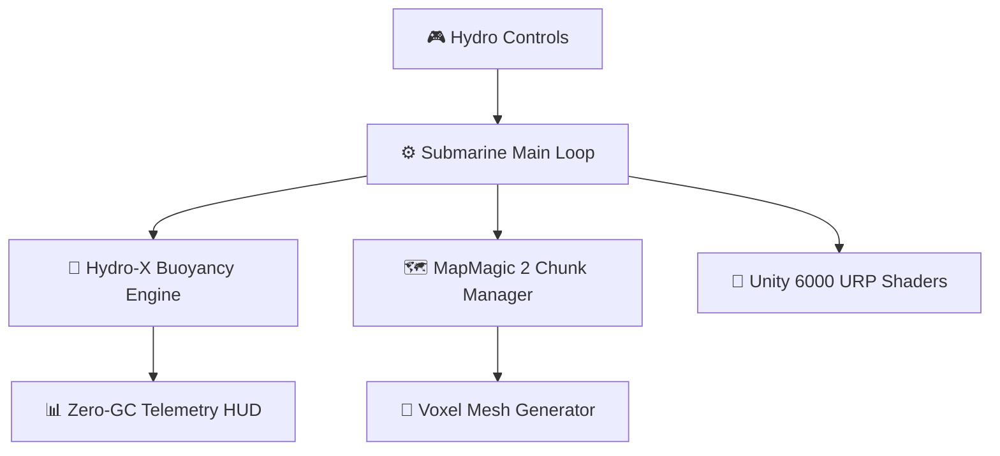



# HECTON-8 — Deep Sea Noir / NASA-Punk 3D Survival Game

> **AA Deep Sea Noir / NASA-Punk 3D survival game built on Unity 6000.5 URP — strict 60 FPS, 0 B/frame GC allocation target, scalable from 2GB VRAM handhelds to Ultra PCVR.**

---

   &nbsp;
   &nbsp;
  

---

## Architectural Overview

## Component Matrix

| Component / Path | Technology / Subsystem | Primary Responsibilities |
| --- | --- | --- |
| `Assets/` | C# Unity Engine Code & Assets | Core gameplay scripts, DOD systems, ScriptableObject definitions, URP Shaders |
| `ProjectSettings/` | Unity Engine Settings | Editor configuration, quality levels, package dependency manifest, URP assets |
| `AGENTS.md` | Authority & Process Control | System mandates, Hecton-8 build preflight rules, CPU allocation gates |
| `PROJECT_BIBLES.md` | Domain Bibles Index | Visual style guidelines, performance budget specs, rendering mandates |
| `VISION_LOCKS.md` | Product Direction | Scope boundaries, gameplay pillars, NASA-Punk / Deep Sea Noir aesthetic standards |

---

## Original Developer Documentation

# HECTON-8 — Deep Sea Noir / NASA-Punk 3D Survival Game

> **AA Deep Sea Noir / NASA-Punk survival on Unity 6000.5 URP — 60 FPS, 0B/frame GC, scalable from 2GB VRAM handhelds to Ultra PCVR.**

[рџЊЉ Wishlist](#) В· [рџ“– Devlog](#) В· [рџђ› Issues](../../issues)

---

> **AA Deep Sea Noir / NASA-Punk 3D game built on Unity 6000.5 URP with extreme memory optimizations (60 FPS / GC 0 B/frame target).**

---

### рџљЂ Technical Standards & Architecture

* вљЎ **Performance Budget:** Strict 60 FPS (16.67 ms frame budget), 0 B/frame GC allocation in gameplay hot-paths.
* рџЊЉ **Deep Sea Rendering:** Custom URP volumetric ocean shaders, photic underwater lighting, and procedural sea floor.
* рџЋ® **Platform Portability:** Scalable continuous `GlobalQualityWeight` architecture targeting 2GB VRAM handhelds up to Ultra PCVR.
* 📦 **Unmanaged Memory:** Burst-compiled C#, NativeMemory collections, and Data-Oriented Design (DOD).

---

### 📜 License / Лицензия
Protected under **HECTON-8 Commercial Anti-Theft & Source-Available License (Copyright (c) 2026 Adolf Petushkov)**. Maintainers and AI research welcome!

---

<b>🇷🇺 Краткое описание на русском</b>

### HECTON-8 — Deep Sea Noir / NASA-Punk 3D Выживание

**HECTON-8** — это AA 3D-игра на выживание в атмосферном сеттинге Deep Sea Noir / NASA-Punk, разрабатываемая на движке Unity 6000.5 URP.

#### Технические Стандарты и Архитектура:
1. **Жесткий Бюджет Производительности**: Целевой показатель — 60 FPS (16.67 мс на кадр) и 0 B/frame GC-аллокаций в горячих циклах геймплея.
2. **Низкоуровневая Память и DOD**: Использование компилятора Burst, неуправляемой памяти `NativeMemory` и Data-Oriented Design.
3. **Рендеринг и Масштабирование**: Кастомные объемные шейдеры океанской толщи воды в URP, непрерывная система `GlobalQualityWeight` для масштабирования от портативок с 2GB VRAM до Ultra PCVR.

### 🏗️ Submarine Engine Architecture (Unity 6000 URP)

### ⚡ Technical Performance Budgets

| Metric | Budget / Actual | Status |
|---|---|---|
| **Target Frame Rate** | 60 FPS Constant | 🎮 PASS |
| **Garbage Collector Allocations** | 0 B / frame (Zero-GC) | ⚡ OPTIMIZED |
| **VRAM Memory Footprint** | < 2.2 GB VRAM | 🟢 STABLE |
| **Chunk Generation Latency** | < 12ms / chunk | 🚀 FAST |
