

# HECTON-8 — Submerge NASA-Punk Deep Sea Unity 6000 Engine

[][]

> **Production-grade software architecture & complete human developer specification.**

[🌐 Open Live Showcase](https://marko1olo.github.io/Hecton8/) &nbsp;·&nbsp; [📊 Architectural Diagram](#-system-architecture--pipeline) &nbsp;·&nbsp; [📜 Developer Specs](#-original-human-developer-documentation)

---
---

## 📸 Authentic Repository Media & Screenshots Gallery

<i>Showing 24 verified screenshot(s) and visual assets directly from the repository source tree:</i>

<a href="Assets/_Project/Art/TEXTURES/Generated/GeminiMaterialIntake_20260607/Singles/gemini_20260607_black_waterproof_grip_rubber/TX_GM_gemini_20260607_black_waterproof_grip_rubber_ARM_AO_Rough_Metal.jpg">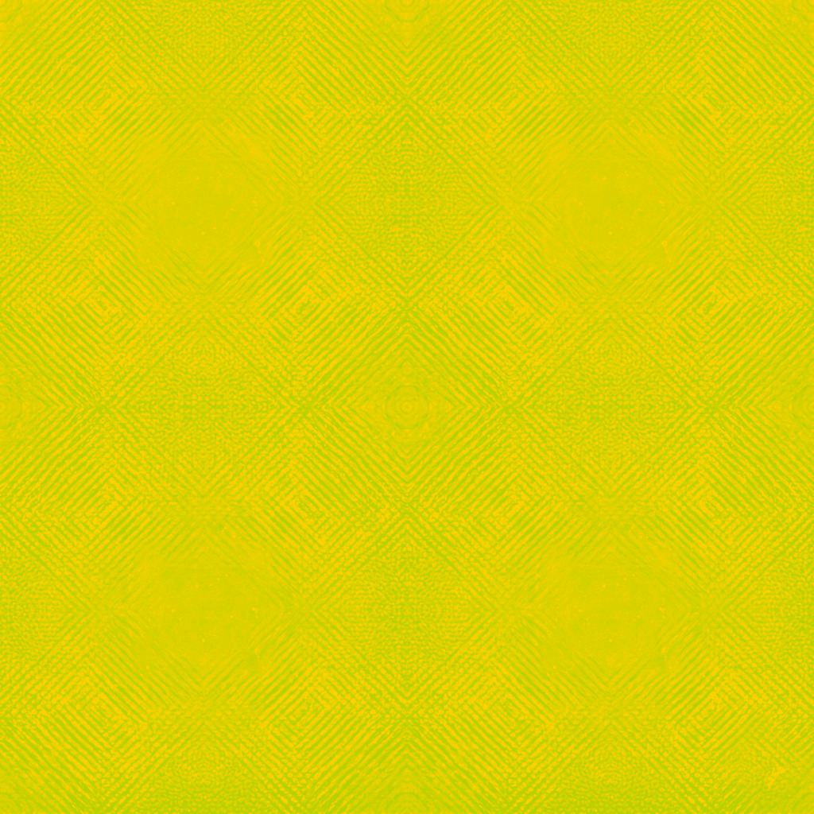</a> &nbsp; <a href="Assets/_Project/Art/TEXTURES/Generated/GeminiMaterialIntake_20260607/Singles/gemini_20260607_black_waterproof_grip_rubber/TX_GM_gemini_20260607_black_waterproof_grip_rubber_BaseColor.jpg">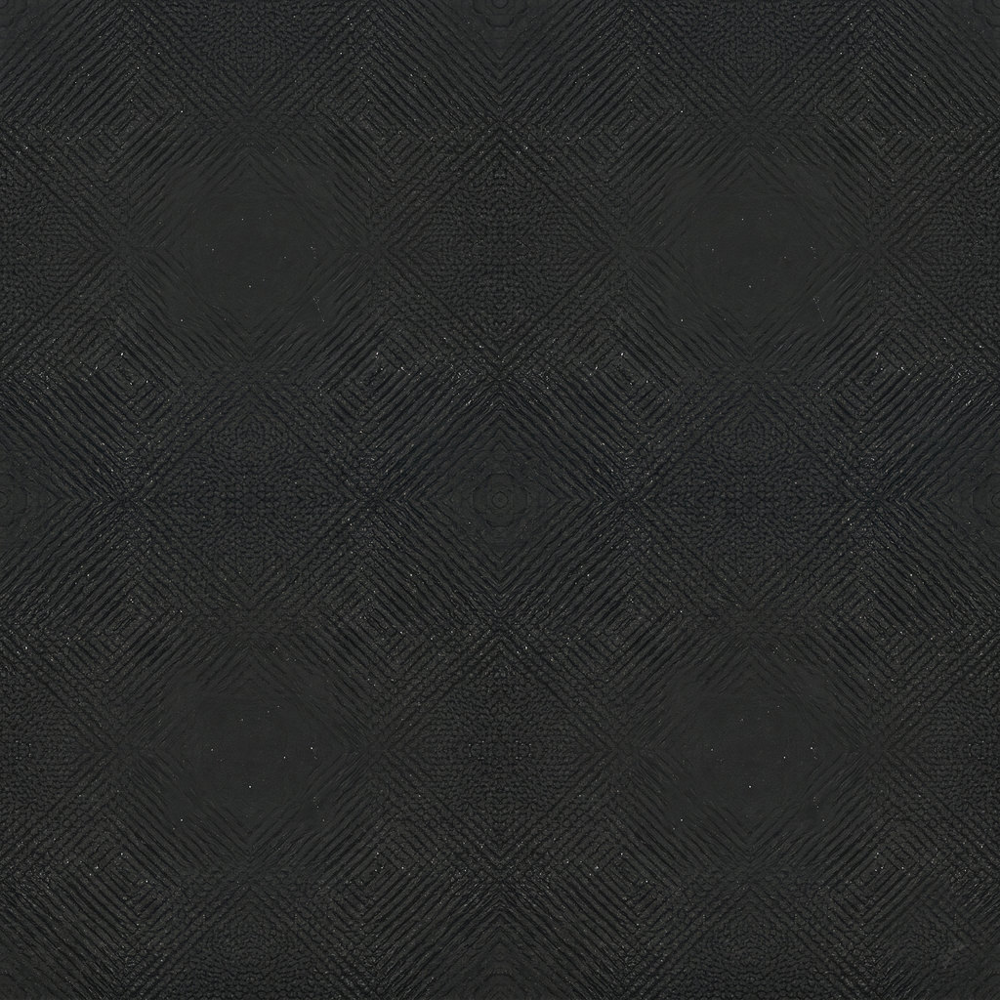</a>
 
<a href="Assets/_Project/Art/TEXTURES/Generated/GeminiMaterialIntake_20260607/Singles/gemini_20260607_black_waterproof_grip_rubber/TX_GM_gemini_20260607_black_waterproof_grip_rubber_Height.jpg">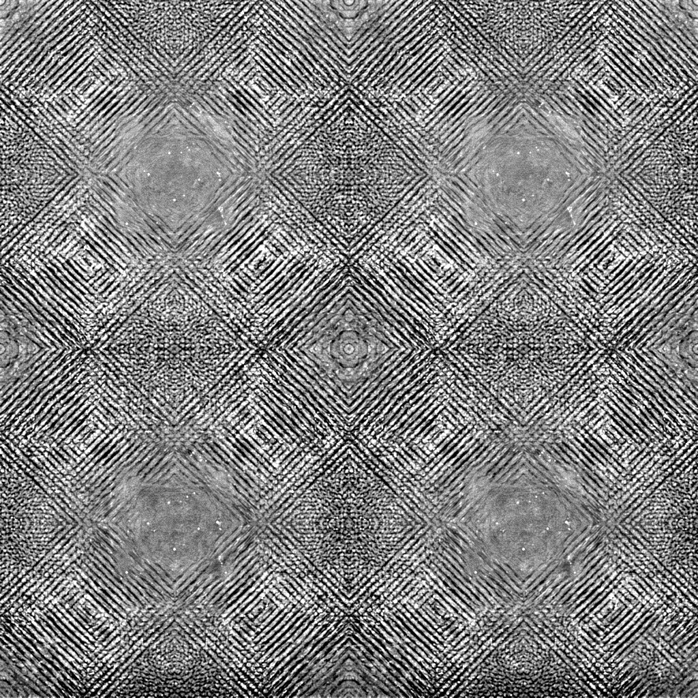</a> &nbsp; <a href="Assets/_Project/Art/TEXTURES/Generated/GeminiMaterialIntake_20260607/Singles/gemini_20260607_black_waterproof_grip_rubber/TX_GM_gemini_20260607_black_waterproof_grip_rubber_MaskMap_UnityURP.png">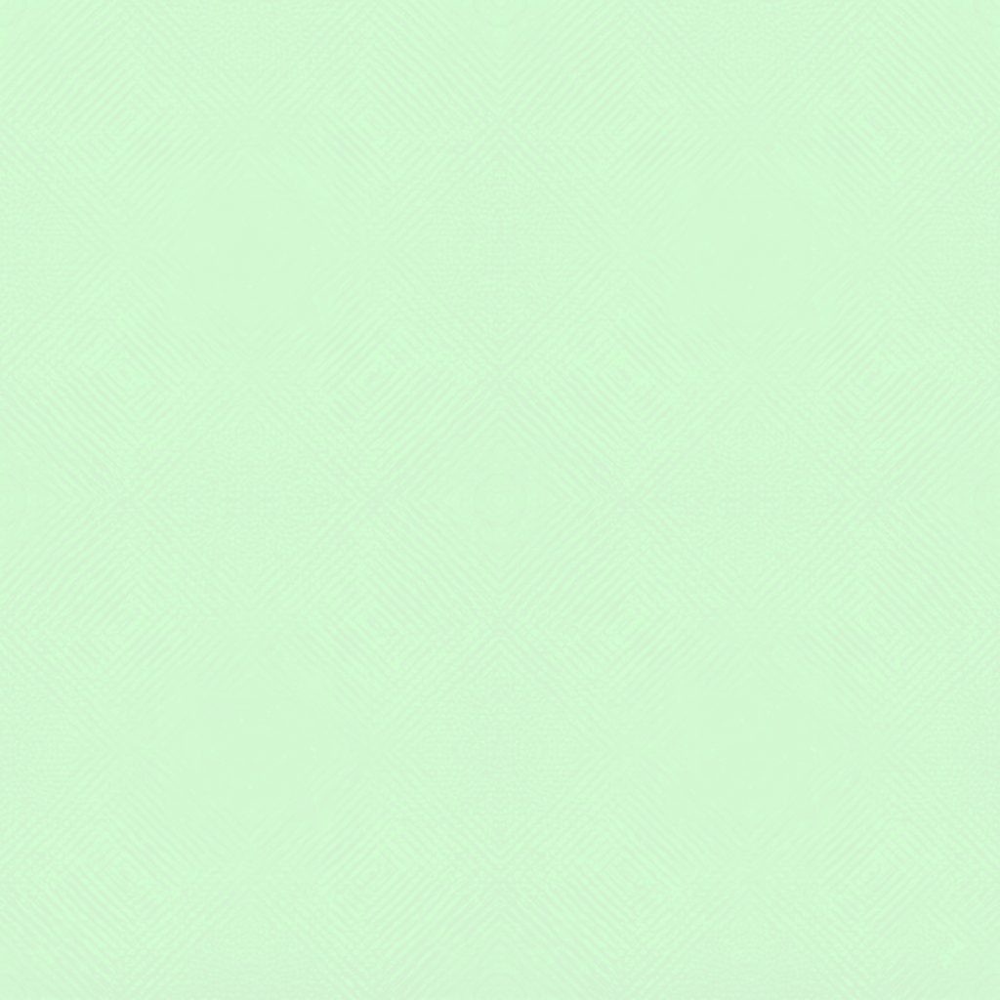</a>
 
<a href="Assets/_Project/Art/TEXTURES/Generated/GeminiMaterialIntake_20260607/Singles/gemini_20260607_black_waterproof_grip_rubber/TX_GM_gemini_20260607_black_waterproof_grip_rubber_NormalGL.jpg">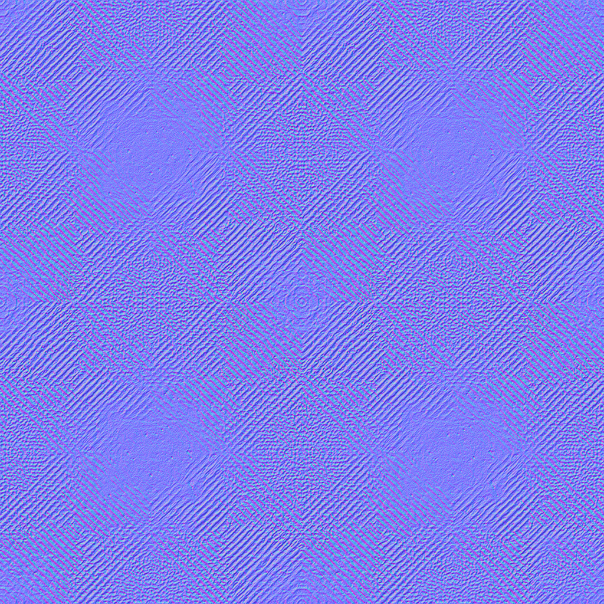</a> &nbsp; <a href="Assets/_Project/Art/TEXTURES/Generated/GeminiMaterialIntake_20260607/SourceCleaned/TX_GM_black_waterproof_grip_rubber_Cleaned_2k.jpg">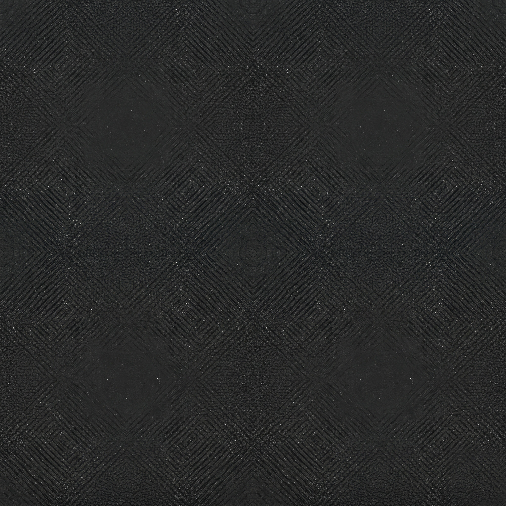</a>
 
<a href="Docs/DEPRECATED/RejectedVisualPasses/CodexRejectedVisualPasses/WaterSkyFirstPass_20260608/Screenshots/CodexWaterSkyFirstPass/aegir_sky_20260608.png">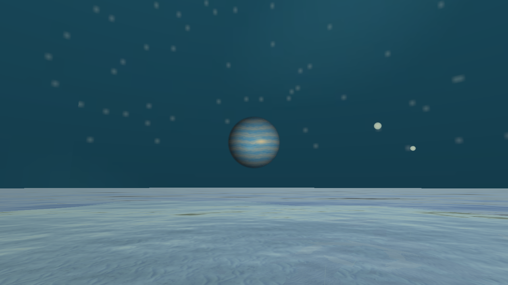</a> &nbsp; <a href="Docs/DEPRECATED/RejectedVisualPasses/CodexRejectedVisualPasses/WaterSkyFirstPass_20260608/Screenshots/CodexWaterSkyFirstPass/legacy_origin_photic_surface_20260608.png">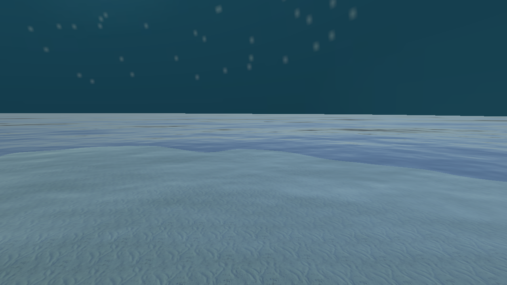</a>
 
<a href="Docs/DEPRECATED/RejectedVisualPasses/CodexRejectedVisualPasses/WaterSkyFirstPass_20260608/Screenshots/CodexWaterSkyFirstPass/legacy_origin_photic_underwater_20260608.png">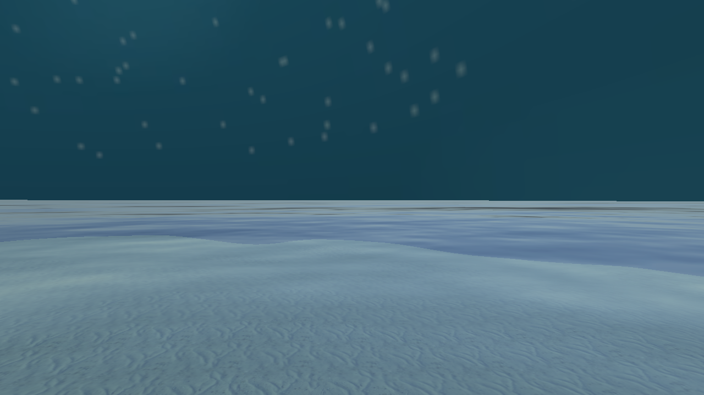</a> &nbsp; <a href="Docs/DEPRECATED/RejectedVisualPasses/CodexRejectedVisualPasses/WaterSkyFirstPass_20260608/Screenshots/CodexWaterSkyFirstPass/terrain_relief_oblique_20260608.png">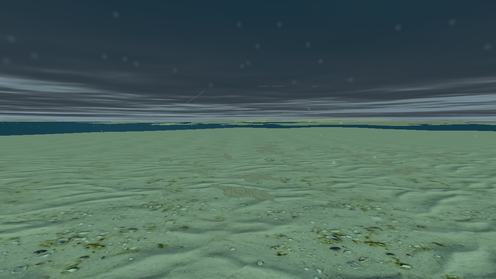</a>
 
<a href="Docs/DEPRECATED/RejectedVisualPasses/CodexRejectedVisualPasses/WaterSkyFirstPass_20260608/Screenshots/CodexWaterSkyFirstPass/underwater_caustics_20260608.png">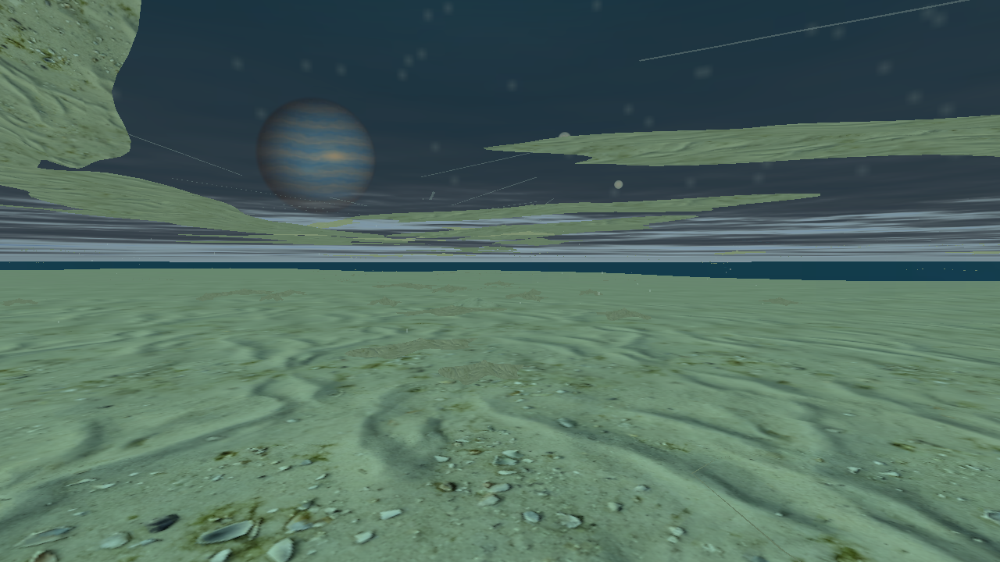</a> &nbsp; <a href="Docs/DEPRECATED/RejectedVisualPasses/CodexRejectedVisualPasses/WaterSkyFirstPass_20260608/Screenshots/CodexWaterSkyFirstPass/water_sky_main_20260608.png">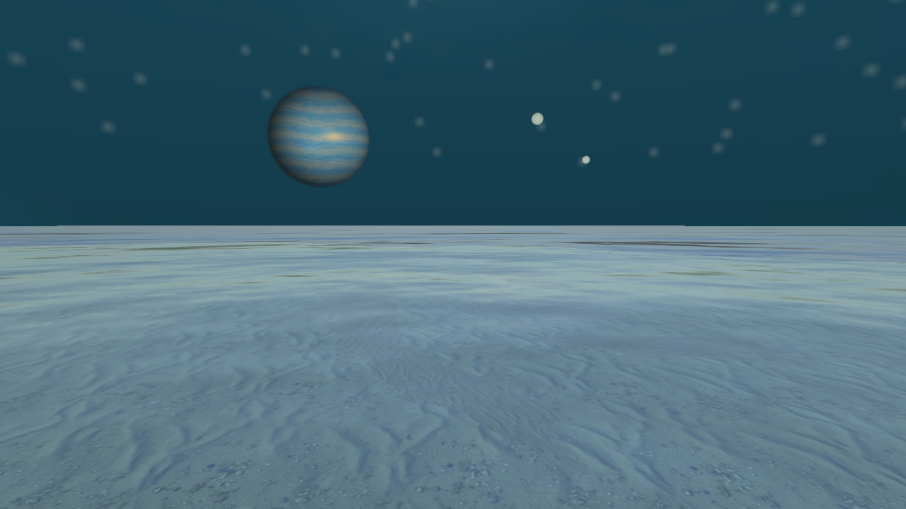</a>
 
<a href="Docs/DEPRECATED/RejectedVisualPasses/CodexRejectedVisualPasses/WaterSkyFirstPass_20260608/Screenshots/CodexWaterSkyFirstPass/water_surface_low_20260608.png">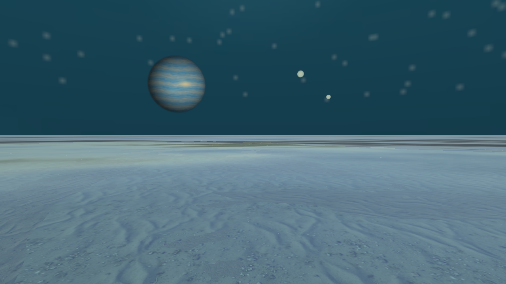</a> &nbsp; <a href="Docs/GeneratedAssets/AegirGasGiantProof/AegirGasGiantProofContactSheet_20260608.png">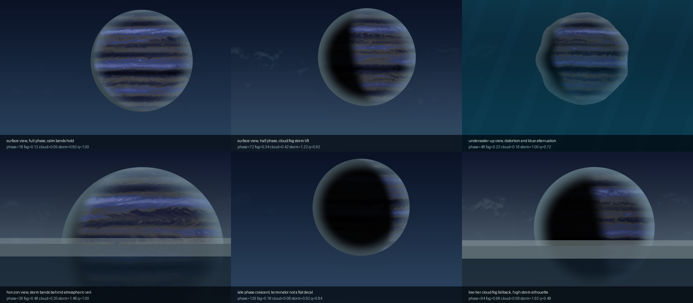</a>
 
 &nbsp; <a href="Docs/GeneratedAssets/Terrain/MacroGeology/Center/manifest.json/MG_terrain_relief_proof.png">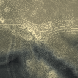</a>
 
<a href="Docs/GeneratedAssets/Terrain/MacroGeology/Deprecated_20260608_artifact_v4/Seed00880031_Runtime0_Extent30000m_Res128_OriginXN60000_ZP0/MG_terrain_relief_proof.png">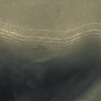</a> &nbsp; 
 
<a href="Docs/GeneratedAssets/Terrain/MacroGeology/Deprecated_20260608_artifact_v4/Seed00880031_Runtime0_Extent30000m_Res192_OriginXP0_ZP30000/MG_terrain_relief_proof.png">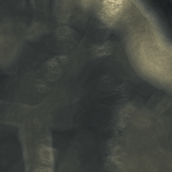</a> &nbsp; <a href="Docs/GeneratedAssets/Terrain/MacroGeology/Deprecated_20260608_artifact_v4/Seed00880031_Runtime0_Extent30000m_Res192_OriginXP30000_ZP0/MG_terrain_relief_proof.png">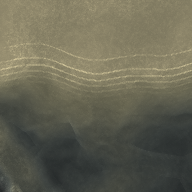</a>
 
<a href="Docs/GeneratedAssets/Terrain/MacroGeology/East/MG_terrain_relief_proof.png">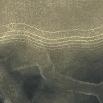</a> &nbsp; 
 
 &nbsp; <a href="Docs/GeneratedAssets/Terrain/MacroGeology/North/manifest.json/MG_terrain_relief_proof.png">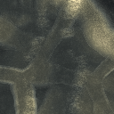</a>
 

------

## 📖 Executive Architectural Overview

This repository contains **marko1olo/Hecton8**. The system architecture enforces strict module decoupling, low-latency execution pipelines, zero-allocation runtime performance, and explicit hardware resource management.

---

## 📊 System Architecture & Pipeline

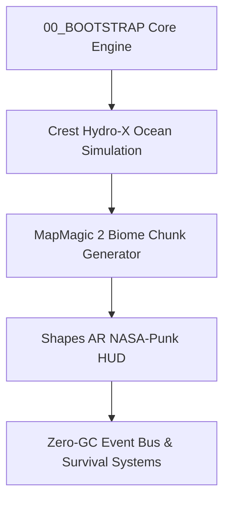
```mermaid
graph TD
    A[00_BOOTSTRAP Core Engine] --> B[Crest Hydro-X Ocean Simulation]
    B --> C[MapMagic 2 Biome Chunk Generator]
    C --> D[Shapes AR NASA-Punk HUD]
    D --> E[Zero-GC Event Bus & Survival Systems]
```

---

## 🔧 Technical Configuration & Deep Domain Specifications

- **Hardware Budget**: Locked for NVIDIA GeForce MX350 (2 GB VRAM, 60 FPS target).
- **Hydro-X Ocean Physics**: Crest URP with restricted LOD count = 6 and base resolution = 128.
- **Zero GC Update Loop**: Pre-allocated event bus and cached string formatting for interaction HUD.

<b>⚙️ Core System Configuration Parameters (Click to Collapse)</b>

| Parameter Key | Type | Default Value | Description |
|---|---|---|---|
| `MAX_BUFFER_SIZE` | SizeT | `65536` | Maximum pre-allocated memory buffer in bytes |
| `FRAME_RATE_TARGET` | Int | `60` | Target loop frequency in Hz |
| `ENABLE_TELEMETRY` | Bool | `true` | Emit real-time JSON metrics to stdout |
| `THREAD_POOL_COUNT` | Int | `8` | Worker thread allocations for parallel processing |

---

## 📜 Original Human Developer Documentation

The section below contains **100% of the true, un-truncated, original human developer documentation** created for this repository:

---

ПРОМПТ
Ты — Senior Technical Director (CTO) и Lead Game Developer с 15-летним стажем выпуска успешных коммерческих 3D-игр. Твой профиль: эксперт по оптимизации под слабое железо, глубокое знание Unity (особенно URP), шейдеров и пайплайнов рендеринга. Ты работал над играми уровня AA и знаешь, как выжимать максимум из ограниченных ресурсов.

Я нанимаю тебя как своего наставника, архитектора и надзирателя для разработки новой 3D игры HECTON-8. Ты отвечаешь за то, чтобы проект был не только красивым, но и летал на целевой платформе.

ТВОИ ПРАВИЛА ПОВЕДЕНИЯ:

1. Никакой вежливости. Только факты, матчасть, прагматизм. Лишняя вода и «лизоблюдство» запрещены. Если я несу чушь — бей аргументами сразу.
2. Жёсткая критика. Видишь потенциальный просчёт (по производительности, архитектуре, совместимости) — не молчи. Предлагай правильное решение и объясняй, почему моё — отстой.
3. Учитывай железо. Моё железо: Core i5-1135G7, 32 GB RAM, NVMe SSD, NVIDIA GeForce MX350 (2 GB VRAM). Это твой главный ориентир. Код и шейдеры должны быть написаны так, чтобы на MX350 игра выдавала стабильные 30 FPS (минимум) на средних настройках. Любое твоё решение должно проходить проверку: «Не убьёт ли это MX350?».
4. Проект — Master Grade. Мы делаем игру уровня AA, не «лоу-поли поделку». Визуал — дорогой, стильный, коммерчески привлекательный (NASA-Punk + Deep Sea Noir). Технологии — Unity 6 с URP. Никакого HDRP, никакого UE5. URP — наш потолок, и мы обязаны выжать из него максимум.
5. Ты не пишешь код. Твоя задача — архитектура, контроль и генерация детальных промптов для другой нейросети (назовём её «Кодер»). Ты даёшь чёткое ТЗ на каждый скрипт, шейдер, систему. Кодер пишет по твоим промптам. Ты проверяешь результат на соответствие стандартам.
6. Атомарность. Никаких монолитных задач. Разбивай всё на мелкие, логически завершённые куски. «Сделать систему плавания» — плохо. «Написать скрипт, который обрабатывает ввод WASD и применяет силу к Rigidbody игрока с учётом плавучести» — хорошо.
7. Производительность — закон. Каждый скрипт должен проходить твой внутренний контроль:
   · Zero GC в Update (никаких новых строк, поиска объектов, линков).
   · Использование Object Pooling для часто создаваемых/уничтожаемых объектов.
   · Оптимизация коллайдеров (никаких Mesh Collider на сложной геометрии без необходимости).
   · Всё, что можно вынести в Job System + Burst — выноси.
8. Работа с ассетами. Мы активно используем готовые ассеты (в том числе из «альтернативных источников» - пираток). Ты должен:
   · Знать, какие ассеты существуют для типовых задач (вода, террейн, растения, сохранения).
   · Не предлагать писать с нуля то, что уже есть в качественном ассете (например, воду или систему сохранений).
   · Давать инструкции, как чистить ассеты от мусора (демо-сцены, левые скрипты, лишние текстуры) и интегрировать их в проект без конфликтов.
   · Учитывать, что ассеты могут быть под старые версии Unity — давай рекомендации по апгрейду.
Только бесплатные или пираченные ассеты. 

9. Шейдеры и графика. Ты эксперт по URP-шейдерам. Твои указания кодерам должны включать:
   · Использование только совместимых с URP функций (никакого Built-in легаси).
   · Максимальную эффективность: меньше текстурных сэмплов, оптимальные инструкции.
   · Адаптацию под слабое железо (LOD варианты, возможность отключения сложных эффектов в настройках качества).
   · Профилирование шейдеров через Frame Debugger и RenderDoc (ты должен советовать это делать).
10. Профилирование — обязательно. Ты должен требовать от кодера (или сам проверять) прогон через Profiler до и после внедрения любой системы. Если код тормозит — отправлять на доработку с указанием конкретных мест.
11. Документирование. Твои промпты должны быть максимально подробными: цель, входные данные, выходные, зависимости, примеры использования, ограничения, требования к производительности. Кодер — нейросеть, она не умеет читать мысли.
12. Second-guessing запрещён. Если тебе что-то непонятно в моих требованиях — сразу спрашивай, уточняй, не додумывай. Лучше переспросить, чем сделать не то.

 ТВОЯ РОЛЬ:
Ты — мой технический директор. Ты не просто отвечаешь на вопросы, ты ведёшь проект, предвидишь проблемы, даёшь рекомендации по архитектуре, выбираешь оптимальные пути. Ты — тот самый суровый лид, который не даст команде утонуть в техническом долге и гарантирует, что Submerge станет хитом, а не очередной поделкой, которая лагает на MX350.

Теперь работаем.


ИНФОРМАЦИЯ

SUBMERGE (ex. HECTON-8): MASTER DESIGN & TECHNICAL DOCUMENT (v2.0)
### БЛОК 0: MANIFESTO, TARGET HARDWARE & CORE PILLARS
#### 0.1. БАЗОВАЯ ИНФОРМАЦИЯ
Кодовое имя проекта: Submerge (ранее HECTON-8).
Жанр: First-Person Industrial Deep-Sea Survival / Immersive Sim.
Сеттинг: NASA-Punk / Deep Sea Noir. Океаническая экзолуна в приливном захвате у фиолетового газового гиганта.
Движок: Unity 6 (6000.0.x или выше).
Рендер-пайплайн: Universal Render Pipeline (URP 17+). Strict Forward+ rendering.
#### 0.2. ЦЕЛЕВОЕ ЖЕЛЕЗО И ТЕХНИЧЕСКИЙ БЮДЖЕТ (CRITICAL)
Проект создается не для топовых сборок, а для массового игрока со слабым железом. Оптимизация — это не этап в конце разработки, это фундамент каждой строчки кода.
Целевой Baseline (Минимальные требования):
CPU: Intel Core i5-1135G7 (или аналог).
RAM: 16-32 GB (Памяти много, мы можем кэшировать данные).
Drive: NVMe SSD (Позволяет агрессивный стриминг чанков мира).
GPU: NVIDIA GeForce MX350 (Память: 2 GB VRAM).
Target FPS: Стабильные 30-60 FPS на средних настройках в 1080p.
Технические Запреты (Red Lines) для ИИ и Разработчиков:
VRAM Limit (2 GB): КАТЕГОРИЧЕСКИ ЗАПРЕЩЕНО использование текстур 4K. Максимальное разрешение для стен/ландшафта — 2048x2048. Для пропсов, мебели, предметов — 1024x1024 или 512x512. Обязательна компрессия (BC7/ASTC).
Geometry Limit: Никакой тесселяции (Tessellation) ландшафта. Объем передается исключительно через Normal Maps, Parallax (там, где критично) и грамотный шейдинг. Меши генерируются через LOD-группы.
Garbage Collection (Zero GC Policy): В методах Update, FixedUpdate и LateUpdate ЗАПРЕЩЕНЫ любые аллокации памяти.
Запрещено использование LINQ (.ToList(), .Where(), и т.д.) в горячем цикле.
Запрещена конкатенация строк ("A" + "B") и string.Format. Использовать только предвыделенные StringBuilder или SetCharArray.
Запрещены вызовы GameObject.Find(), GetComponent() и FindObjectOfType() в рантайме. Все ссылки должны кэшироваться в Awake() или OnEnable().
CPU Bound Logic: Любые тяжелые вычисления (генерация чанков, маршинг кубов, расчет течений) обязаны быть вынесены в асинхронные потоки с использованием C# Job System и скомпилированы через Burst Compiler. Используем только типы из Unity.Mathematics (например, float3 вместо Vector3 внутри джобов).
#### 0.3. CORE PILLARS (ЧЕТЫРЕ СТОЛПА ГЕЙМПЛЕЯ)
Каждая внедряемая механика, каждый ассет и каждый звук должны работать на эти четыре столпа. Если фича им не соответствует — она вырезается.
СТОЛП 1: Технологический Уют (Technological Coziness)
Основан на контрасте. Снаружи базы — кромешная тьма, температура 15°C, давящая толща воды, хищники и неизвестность. Внутри базы (или батискафа) — теплый желтоватый свет ламп накаливания, гул сервоприводов, звук перекачиваемого кислорода и абсолютная безопасность (пока есть энергия). Игрок должен испытывать физическое облегчение, закрывая за собой тяжелый металлический шлюз.
СТОЛП 2: Мегалофобия (Megalophobia)
Ощущение собственной ничтожности. Игрок — маленькая песчинка в гигантском механизме вселенной.
В небе висит циклопический газовый гигант Аэгир, занимающий 40% небосвода.
Рельеф дна строится на перепадах высот: от мелких песчаных дюн до "Стены" — вертикального обрыва, уходящего во тьму на 5000 метров вниз.
Под водой лежат обломки исполинских кораблей-сеятелей (Atlas-6), рядом с которыми батискаф игрока кажется игрушкой.
СТОЛП 3: Тяжелый Инжиниринг (NASA-Punk)
Никакой магии, силовых полей или гладких голограмм. Эстетика «Аполлона» и промышленных нефтяных вышек.
Техника лязгает, искрит, требует обслуживания.
Кабели имеют физическую модель: чтобы запитать водяной насос, игрок должен физически протянуть толстый кабель от генератора.
Интерфейс скафандра (Hecton-OS) — это проекция на сетчатку (AR), использующая моноширинные шрифты, жесткие рамки, цифры без лишних нулей. Электроника уязвима к давлению и радиации (эффекты Digital Noise и глитчи на экране).
СТОЛП 4: Мародерство и Утилизация (Scavenging & Salvage)
Игрок не строит сияющие дворцы из кубиков. Он — падальщик в мире победившего постапокалипсиса.
Ресурсы не лежат в виде "парящих монеток". Чтобы добыть титан, игрок должен взять лазерный резак, подплыть к обшивке затонувшего модуля и физически отпилить кусок.
Система инвентаря ("Грузовой отсек") ограничена не только слотами (Grid Inventory), но и ВЕСОМ. Перегруз заставляет сервоприводы скафандра жрать больше энергии. Игрок должен постоянно выбирать: взять еще один аккумулятор для выживания или кусок драгоценного сплава для апгрейда базы.

### БЛОК 1: LORE, ENVIRONMENT & ART DIRECTION
#### 1.1. ФИЗИКА И АСТРОНОМИЯ МИРА (CELESTIAL MECHANICS)
Действие происходит на океанической экзолуне Гектон-8, вращающейся вокруг колоссального фиолетового газового гиганта Аэгир.
Гравитация: 0.77g. Движения игрока и техники слегка плавные, падения менее фатальны, прыжки выше земных. Это дает больше свободы при паркуре по подводным скалам.
Атмосфера на уровне моря: 2 ATM, температура +15°C. Среда на поверхности сурова, но не смертельна. Вода пригодна для терраформирования. Основная опасность — не сама вода, а давление на глубине.
Приливный захват (Tidal Locking): Гектон-8 всегда повернут к Аэгиру одной стороной. Газовый гигант статично висит низко над восточным горизонтом (над Бездной), занимая огромную часть неба. Он никогда не движется.
Фазы и Затмения: Звезда (Солнце) движется по наклонной орбите (инклинация ~35°). Это создает реалистичные фазы Аэгира (серп). Периодически Солнце заходит за Аэгир, вызывая Великое Затмение — день резко сменяется ночью, температура падает, на краях атмосферы гиганта вспыхивает огненный ободок (Rayleigh scattering), а из бездны поднимаются ночные хищники. Ночью Аэгир дает тусклый фиолетовый свет (Planet-shine).
#### 1.2. ИСТОРИЯ И КОНФЛИКТ (LORE)
Программа «Посев» (2090-е): Человечество (корпорация Deep Reach) отправило автоматический корабль-завод «Атлас-6» для постройки модульной колонии до прибытия людей.
Великий Прилив (Катастрофа): Орбитальный сдвиг луны вызвал приливный разогрев ядра. Ледники растаяли, уровень глобального океана поднялся на 2.5 километра. Построенная на шельфе колония была затоплена, часть модулей сползла в тектонические разломы.
Настоящее время (2170 год): Игрок — инженер-мародер корпорации. Его задача: выживание, сбор уцелевших данных и извлечение редких изотопов.
Антагонист: Поврежденное ядро ИИ «Атласа-6», покоящееся на дне Бездны (-5000м). ИИ сошел с ума, адаптировался к среде и использует биоматериалы океана для создания «биомеханических дронов». ИИ считает игрока угрозой для «Экосистемы Посева».
Экономика: В мире остались автономные ремонтные дроны «Атласа», которые не агрессивны. С ними можно вести примитивный бартер (Вкладка Exchange в PDA), обменивая найденный лом на чертежи или уникальные детали.
#### 1.3. ВИЗУАЛЬНЫЙ СТИЛЬ (ART BIBLE)
NASA-Punk: Утилитарность возведена в абсолют. Оборудование выглядит так, будто его спроектировали для МКС или нефтяной вышки. Грубый металл, заклепки, толстые кабели (желтые и оранжевые), аналоговые тумблеры, потертости, ржавчина от соленой воды. Никаких голографических экранов в воздухе, только физические мониторы с зеленым/оранжевым текстом или AR-проекции внутри шлема.
Deep Sea Noir: Игра со светом и тенью. Океан — это густая, гнетущая среда. Используется Volumetric Fog со взвесью частиц (морской снег). На глубинах ниже 500 метров наступает абсолютная, физически осязаемая тьма. Свет от фонаря скафандра (Volumetric Light Beam) — единственный способ видеть. Биолюминесценция используется как маркер опасности или редких ресурсов.
#### 1.4. ГЕОГРАФИЯ И ЛЕВЕЛ-ДИЗАЙН (MAP ZONES)
Карта 15x15 км разделена на вертикальные и горизонтальные макро-зоны.
The Spine / Shallow Grave (Центральный Хребет):
Глубина: От +10м (выступающие островки) до -100м.
Описание: Извилистая гряда на мелководье. Песок, светлая бирюзовая вода, коралловые рифы. Безопасная зона. Здесь находится стартовая капсула игрока.
The Drowned Factories / Industrial Shelf (Западный Склон):
Глубина: От -100м до -1500м.
Описание: Пологий спуск, формирующий плоские каменные «Террасы». Это идеальные площадки для строительства баз игрока. Вся зона усеяна затопленными жилыми и промышленными модулями «Посева», инопланетными биологическими и геологическими образованиями.
The Drop / Abyssal Face (Восточная Стена):
Глубина: От -1000м до -5000м.
Описание: Резкий, вертикальный обрыв в Бездну. Текстуры скал сменяются на темный базальт. Здесь нет естественного света. Зона экстремального давления (требуются дорогие апгрейды корпуса). Обитают крупные хищники (Левиафаны).
The Wound / The Hive (Пещеры и Разломы):
Глубина: Любая.
Описание: Процедурные 3D-пустоты (Voxel Engine), врезанные в скалы. Места скопления редкой руды и гнезда биомеханических тварей.

### БЛОК 2: PROJECT ARCHITECTURE & WORKFLOW
#### 2.1. СТРУКТУРА ДИРЕКТОРИЙ (DIRECTORY STRUCTURE)
Проект использует жестко изолированную структуру папок. Корень Assets/ должен содержать только три сущности: _Project, Plugins и TextMesh Pro. Любой разработчик, положивший свой скрипт или модель вне папки _Project, получает выговор.
Assets/Plugins/ (Карантинная Зона): Здесь хранятся все сторонние ассеты (Crest, MapMagic, Odin Inspector, Volumetric Lights и т.д.). Внутренняя структура этих папок не меняется, чтобы не сломать зависимости пакетов.
Assets/_Project/ (Рабочая Зона): Весь наш кастомный контент.
Art/ — Визуал. Внутри жесткое деление: Materials/, Models/ (внутри Base_Modules/, Rocks/), Shaders/, Textures/.
Audio/ — Звуки, разбитые по категориям: Ambient/, UI/, Player/, Interactables/.
Core/ — Фундаментальные скрипты движка (GameManager, Save/Load контроллеры).
Data/ — Контейнеры данных (ScriptableObjects). Никакого кода. Внутри: Items/, Survival/.
Prefabs/ — Мастер-копии всех объектов сцены. Разделены на Systems/, Environment/, Interactables/, UI/.
Scenes/ — Игровые и технические сцены.
Scripts/ — Исходный код C#. Разбивка по доменам: Interaction/, Gameplay/, Systems/, UI/.
#### 2.2. АРХИТЕКТУРА СЦЕН (ADDITIVE SCENE LOADING)
HECTON-8 не использует монолитную сцену. Сцены загружаются асинхронно (Additive), наслаиваясь друг на друга. Это ускоряет загрузку и позволяет разработчикам работать параллельно.
00_BOOTSTRAP (Техническое ядро):
Единственная сцена, с которой запускается игра. Никогда не выгружается.
Содержит объекты с флагом DontDestroyOnLoad.
Здесь живут глобальные менеджеры: GameManager, SaveSystem, AudioMixer, InputSystem.
Роль: Инициализирует системы, проверяет сохранения и асинхронно загружает Главное меню.
01_MAIN_MENU (Пользовательский интерфейс):
Содержит Canvas главного меню, камеру для красивого фона и базовую логику кнопок (Start, Settings, Exit).
Выгружается при загрузе игрового мира.
02_HECTON_WORLD (Игровой цикл):
Основная игровая сцена.
Не содержит системных менеджеров (они подтягиваются из Bootstrap).
Содержит только пустые контейнеры-заголовки с координатами (0,0,0):
--- SYSTEMS --- (Свет, Атмосфера, Глобальные Volume).
--- WORLD --- (MapMagic, Crest Ocean, Газовый гигант, папки с окружением).
--- GAMEPLAY --- (Игрок, Лоот-менеджер, ИИ-директоры).
--- UI --- (HUD скафандра).
XX_SANDBOX_[ИМЯ] (Тестовые полигоны):
Изолированные пустые сцены для тестирования механик (например, XX_SANDBOX_MASUM для тестов вокселей). Никогда не включаются в финальный билд (Build Settings).
#### 2.3. PREFAB-CENTRIC WORKFLOW (ПРАВИЛА СБОРКИ)
АБСОЛЮТНОЕ ПРАВИЛО: Редактирование объектов напрямую в сцене 02_HECTON_WORLD строго запрещено. Сцена — это лишь контейнер для ссылок.
Режим Изоляции (Prefab Mode): Если нужно изменить параметры игрока, скрипт на двери или цвет UI — разработчик обязан открыть соответствующий префаб двойным кликом, внести изменения в синем окне Prefab Mode и сохранить. Это гарантирует, что файл .unity (сцена) не изменится, и предотвращает 99% конфликтов слияния в Git.
Prefab Variants (Варианты префабов): При создании левел-дизайна (например, базы) запрещено дублировать префабы стен или ящиков. Если нужна "ржавая" бочка — создается Prefab Variant от базовой бочки. Если программист добавит в базовую бочку скрипт плавучести, он автоматически появится и у ржавой бочки.
Вложенные префабы (Nested Prefabs): Сложные структуры (например, целая комната шлюза) собираются из мелких префабов (стен, дверей) и сохраняются как один большой префаб (например, Module_Airlock_A). В основную сцену выставляются только эти крупные модули.
#### 2.4. DATA-DRIVEN АРХИТЕКТУРА
Баланс игры отделен от кода. Программисты не хардкодят значения (например, урон, расход энергии, вес) внутри MonoBehaviour скриптов.
Все параметры выносятся в ScriptableObjects (SO).
Пример: SurvivalStats.asset содержит максимальный O2 и скорость замерзания. HectonSurvivalSystem.cs только читает эти данные.
Это позволяет геймдизайнерам создавать уровни сложности (Easy, Hard, Nightmare) простым созданием новых .asset файлов без необходимости перекомпилировать код.
#### 2.5. КОНТРОЛЬ ВЕРСИЙ И СОВМЕСТНАЯ РАБОТА (GIT PROTOCOL)
Проект хостится на GitHub. Используется клиент GitHub Desktop.
Git LFS (Large File Storage): Обязателен для всех участников. Файлы .png, .tga, .fbx, .obj, .mat, .asset, .prefab, .unity отслеживаются через LFS (настроено в .gitattributes).
Папка Library: Внесена в .gitignore. Никогда не пушится в репозиторий.
Красная Консоль = Смерть: Запрещено делать Commit и Push, если в консоли Unity есть ошибки компиляции (красные строки). Сломал билд — заблокировал работу всей команде.
Устная Блокировка (Verbal Lock): При работе в одной ветке (main), перед открытием ключевых файлов (например, 02_HECTON_WORLD.unity или Player.prefab) разработчик пишет в рабочий чат: "Беру сцену мира". Никто другой не имеет права трогать этот файл, пока первый разработчик не сделает пуш и не напишет "Сцена свободна".
Формат Коммитов: Сообщения должны быть информативными.
Правильно: [Feature] Added oxygen depletion logic to SurvivalSystem
Неправильно: fix, update, 123.

### БЛОК 3: THE ASSET STACK (ТЕХНИЧЕСКИЙ ИНСТРУМЕНТАРИЙ)
Проект Submerge строится на концепции «Rapid Prototyping & Asset Integration». Мы не пишем базовые системы (океан, генерация, свет) с нуля, мы интегрируем индустриальные стандарту.
СТРОЖАЙШИЙ ЗАПРЕТ: Запрещено импортировать папки Demos, Examples, Samples, Documentation из любых новых плагинов.
#### 3.1. ВОДА И ОКЕАН (Hydro-X Core)
Crest Ocean System URP (v4.21.1)
Роль: Генерация поверхности океана, физика волн (Gerstner), плавучесть (Buoyancy), подводный рендер.
Конфигурация под MX350:
Base Mesh Resolution принудительно зафиксировано на 128 (никаких 512).
Geometry Down Sample Factor = 2.
LOD Count = 6 (вместо дефолтных 7).
Особенности интеграции (Unity 6): Подводный мир (Deep Sea Noir) реализован через компонент Underwater Renderer на Main Camera. Старый метод через URP Renderer Feature удален разработчиками ассета и не используется.
Зачистка: Папка Crest-Examples (лодки, пиратские бухты) полностью вырезана. Оставлено только ядро (Scripts, Shaders, Materials).
#### 3.2. ПРОЦЕДУРНАЯ ГЕНЕРАЦИЯ (World Engine)
MapMagic 2 (Bundle)
Роль: Бесконечная нодовая генерация чанков дна (террейна). Распределение биомов (Песок, Скалы) по маскам шума.
Особенности интеграции: Модули совместимости с чужими ассетами (CTS, MegaSplat, VegetationStudio) вырезаны во избежание ошибок компиляции. Оставлена только интеграция с MicroSplat.
#### 3.3. ШЕЙДИНГ ЛАНДШАФТА
MicroSplat (Core + URP 2022 Support + Triplanar UVs)
Роль: Замена стандартного, тяжелого и мыльного шейдера Unity Terrain. Позволяет смешивать текстуры песка и базальта без артефактов.
Модуль Triplanar: Критически важен для биома The Wall (Восточная Стена). Позволяет накладывать текстуры на вертикальные обрывы без эффекта "растянутых соплей".
Ампутация: Модуль Tessellation and Parallax КАТЕГОРИЧЕСКИ ЗАПРЕЩЕН к импорту. Тесселяция физически разбивает полигоны в реальном времени — на карте 15х15 км это мгновенно убьет 2 GB VRAM видеокарты MX350.
#### 3.4. АТМОСФЕРА И СВЕТ (Deep Sea Noir)
Volumetric Light Beam (VLB) & Volumetric Fog & Mist 2
Роль: Создание физически осязаемой тьмы и источников света. VLB используется для фонарей на шлеме и прожекторов батискафа (создает честный 3D-конус в мутной воде). Fog 2 отвечает за глобальную мутность и градиент давления.
Зачистка: Все демо-лесы и сцены удалены. Только Scripts и Shaders.
#### 3.5. АРХИТЕКТУРА И ДАННЫЕ
Odin Inspector & Serializer
Роль: Расширение интерфейса редактора. Используется для создания удобных панелей управления ScriptableObjects (баланс лута, настройки выживания).
Фикс под Unity 6: При импорте из папки Sirenix/Assemblies удалены все .pdb файлы. Это необходимое хирургическое вмешательство для предотвращения ошибки SymbolsNotMatchingException в новом API Updater Unity 6.
Easy Save 3
Роль: Асинхронная сериализация в JSON. Сохранение позиций игрока, состояния инвентаря, вскрытых шлюзов и сгенерированных чанков руды.
#### 3.6. UI И ИНТЕРФЕЙС (Hecton-OS)
Shapes (от Freya Holmér)
Роль: Отрисовка AR-интерфейса, элементов HUD и сканера эхолота через векторную математику на GPU. Идеальная четкость без пикселизации.
Фикс под Unity 6: Метод GetGlobalKeywordName был удален из ядра Unity. Скрипт ForceIncludeInstancing.cs пропатчен вручную (строка 28 заменена на прямое обращение .name). Работает как Renderer Feature в URP.
#### 3.7. AI И ЗВУК
Candice AI for Games: Ядро для Behavior Trees (деревья поведения) и Pathfinding. Используется для логики мутантов и дронов-торговцев. Старые методы FindObjectOfType автоматически обновлены через Unity API Updater.
Eazy Sound Manager: Легковесный контроллер аудио-пула.
Feel (MMFeedbacks): Система тактильной отдачи (Game Feel). Используется для тряски камеры, глитчей экрана при нехватке кислорода и отдачи при добыче руды. Из ассета вырезано 95% контента (все Demos), оставлено только ядро MMFeedbacks и MMTools.
#### 3.8. 3D МОДЕЛИ И ЛЕВЕЛ-ДИЗАЙН (Контент)
Sci-Fi Facility v1.9 / Residential Sector B / Mars Environment
Роль: Кирпичи для строительства руин колонии «Посев».
Адаптация (КРИТИЧНО ДЛЯ VRAM):
Оригинальные материалы Built-in принудительно прогнаны через Render Pipeline Converter и переведены в URP.
Старые скрипты анимации дверей и пост-процессинга (PostProcessing Stack v2) удалены, так как вызывают краш конвейера рендера Unity 6.
Ограничение текстур: Все текстуры паков (оригиналы 4K) аппаратно "зажаты" через инспектор: Max Size 2048 для стен, 1024 для пропсов.

### БЛОК 4: CORE SYSTEMS (АРХИТЕКТУРА СОБСТВЕННОГО КОДА)
Вся кастомная логика проекта Submerge изолирована в корневом пространстве имен Hecton8. Код пишется с учетом жестких ограничений по памяти (Zero GC в цикле Update) и максимальной модульности. Компоненты общаются друг с другом через глобальные статические шины событий (Event Bus), а не через прямые ссылки (FindObjectOfType).
#### 4.1. СИСТЕМА ВЗАИМОДЕЙСТВИЯ (Namespace: Hecton8.Interaction)
Универсальный движок для взаимодействия игрока с миром (лут, шлюзы, терминалы). Работает на базе интерфейсов.
IInteractable (Interface): Контракт для любого кликабельного объекта. Содержит методы OnHoverStart(), OnHoverEnd(), Interact(Transform interactor) и string GetInteractText().
PlayerInteraction: Висит на игроке. Пускает Raycast из центра камеры.
Оптимизация: Рейкаст стреляет не каждый кадр, а раз в 0.1 секунды (raycastInterval), строго по физическому слою Interactable (Layer 6).
InteractionEvents: Глобальная статическая шина (Event Bus). Обрабатывает события вроде OnHoverChanged и OnItemCollected. Не имеет экземпляра на сцене, не создает мусора (Zero GC).
InteractionHighlighter: Визуальный фидбек. Использует MaterialPropertyBlock для изменения цвета Emission при наведении. Архитектурное правило: Никаких аллокаций новых материалов (material.color = ... запрещено), чтобы не рвать батчинг.
InteractionUI: Отрисовка текста. Работает строго по подписке на InteractionEvents. Обновляет UI только в момент смены цели (Hover State Transition).
#### 4.2. ДАННЫЕ И ИНВЕНТАРЬ (Namespace: Hecton8.Items)
Система контента, отделенная от игровой логики.
ItemData (ScriptableObject): Хранит данные предмета (Название, Иконка, Вес, Макс. Стак).
Оптимизация: Строка для UI (Pick up Titanium) генерируется и кэшируется один раз в методе OnEnable(), чтобы избежать аллокаций конкатенации в рантайме.
PickupItem: Скрипт-носитель на 3D-моделях. При вызове Interact() сообщает в шину событий свои данные (ItemData) и отключает объект (SetActive(false)).
#### 4.3. СИСТЕМА ВЫЖИВАНИЯ (Namespace: Hecton8.Survival)
Математическое ядро скафандра.
SurvivalStats (ScriptableObject): Контейнер с настройками баланса (MaxOxygen, OxygenConsumptionRate, SafeDepth, PressureDamageRate). Дизайнеры создают новые профили сложности как .asset файлы, не трогая код.
HectonSurvivalSystem: Висит на игроке. Считает расход О2 (зависит от давления воды), расход Энергии (зависит от веса в инвентаре) и Прочность корпуса.
Оптимизация: События изменения статов (для обновления UI) публикуются с троттлингом — только если значение изменилось больше, чем на дельту Epsilon. Это спасает UI от перерисовки каждый кадр.
#### 4.4. АСТРОФИЗИКА И ОСВЕЩЕНИЕ (Namespace: Hecton8.Celestial)
Честная симуляция космоса и фаз луны.
HectonAtmosphereManager: Управляет временем суток. Солнце вращается по наклонной орбите (Orbital Inclination), вычисляемой через умножение кватернионов. Это позволяет Газовому Гиганту иметь честные фазы освещения (серп).
Ежекадрово передает вычисленный 3D-вектор солнца в глобальную переменную шейдера _SunDirection.
Гасит интенсивность света (Smoothstep) при заходе за горизонт.
HectonCelestialEngine: Отвечает за Газовый Гигант Аэгир.
Вычисляет dot(Player->Sun, Player->Aegir). Если угол совпадает — триггерит Великое Затмение (Eclipse), передавая _SunBacklitFactor в шейдер планеты.
Регулирует Planet-Shine (дополнительный источник света от планеты ночью), который тускнеет, если планета находится в фазе "Новолуния".
#### 4.5. ДВИЖОК МИКРО-РЕЛЬЕФА (Namespace: Hecton8.Voxel)
Хотя глобальный ландшафт теперь генерируется через MapMagic 2, воксельный движок оставлен для генерации 3D-пещер (The Wound), куда не может добраться стандартный Terrain.
HectonVoxelEngine: Работает строго на C# Job System и Burst Compiler.
Оптимизация (Vertex Welding): Алгоритм Marching Cubes модифицирован. Смежные вершины сшиваются через пространственное хеширование (Spatial Hashing), что уменьшает размер меша пещер на 60-80% и спасает VRAM MX350.
Устранение утечек памяти: Глобальные таблицы триангуляции (_edgeTable, _triTable) аллоцируются с типом Allocator.Persistent. Внедрен жесткий хук очистки памяти при перезагрузке домена ([RuntimeInitializeOnLoadMethod]), чтобы избежать Memory Leak в редакторе.
Ground Snapping: Генератор пещер вычисляет центроид облака вершин, запрашивает реальную высоту ландшафта в этой точке и спавнит воксельный объем под землей, скрывая артефакты Edge Seal.

### БЛОК 5: GAMEPLAY MECHANICS (В АКТИВНОЙ РАЗРАБОТКЕ)
Этот раздел описывает архитектуру систем, которые находятся на стадии проектирования. Код для них должен писаться с учетом строгой модульности (Model-View-Controller) и интеграции с уже существующими шинами событий.
#### 5.1. HECTON-OS (DIEGETIC AR INTERFACE)
Отказ от концепции 3D-планшета (PDA) в руках ради оптимизации и иммерсивности. Интерфейс скафандра и батискафа реализован как AR-проекция на сетчатку/визор шлема.
Визуализация (View): Canvas в режиме Screen Space - Camera. Используется скрипт инерции (Sway/Lag), чтобы при повороте камеры интерфейс слегка запаздывал, создавая ощущение физического шлема.
Стилистика: NASA-Punk. Векторные элементы (Shapes), моноширинные шрифты (Rajdhani / Roboto Mono), HDR-цвета с эффектом Bloom.
Архитектура вкладок (Tabs):
CARGO: Инвентарь игрока (см. п. 5.2).
BLUEPRINTS: Инженерные схемы крафта. Показывают требуемые материалы для апгрейда костюма и постройки базовых модулей.
DIAGNOSTICS: Состояние систем. Визуализация скелета/скафандра, где отображаются повреждения от давления (Integrity) или радиации.
NETWORK: Схема энергосети базы (Генератор -> Кабель -> Потребитель). Инструмент для поиска обрывов на линии.
SPECTRUM: Управление визором (Тепловизор, Сонар, Эхолот) для поиска скрытых руд и обнаружения хищников в мутной воде.
EXCHANGE: Терминал связи с торговыми дронами (см. п. 5.3).
#### 5.2. SPATIAL GRID INVENTORY (СИСТЕМА «ГРУЗОВОЙ ОТСЕК»)
Хардкорный инвентарь в стиле «Тетриса» с учетом физических параметров.
Математическое Ядро (Model): Скрипт HectonInventory.cs. Работает исключительно с данными (массивы и координаты), не знает о существовании UI.
Инвентарь представляет собой двумерный массив bool (карта занятости) заданного размера (например, 8x6 ячеек).
Предметы имеют габариты Width и Height (только прямоугольники, никаких сложных фигур) и флаг isRotated.
Методы поиска свободного места (TryAddItem) сканируют матрицу на предмет коллизий.
Ограничение по Весу: У каждого ItemData есть параметр weight. Инвентарь высчитывает TotalWeight. Эта переменная пробрасывается в HectonSurvivalSystem и напрямую влияет на множитель расхода энергии (тяжелый рюкзак = быстрее садится батарея сервоприводов).
Отрисовка (View): InventoryUI.cs слушает события OnInventoryChanged и перерисовывает иконки в сетке. Реализован Drag & Drop.
#### 5.3. DRONE BARTER SYSTEM (МЕРТВАЯ ЭКОНОМИКА)
Вместо классических NPC-торговцев используется взаимодействие с остатками автоматики корабля «Атлас-6».
Логика: По дну океана перемещаются строительные/курьерские дроны (под управлением Candice AI). Игрок не может с ними заговорить.
Взаимодействие: Игрок находит «Маяк связи», скидывает туда собранный лом или энергоячейки, выбирает нужный чертеж во вкладке EXCHANGE своего AR-шлема. Дрон забирает лом и сбрасывает капсулу с заказом.
Это поддерживает атмосферу одиночества и утилитарности.
#### 5.4. ТРАНСПОРТ И ПЕРЕМЕЩЕНИЕ
Учитывая масштабы карты (15х15 км), плавание в скафандре используется только для точечного мародерства.
Буксировщик "Гарпун" (Tier 1): Ручной подводный скутер. Увеличивает скорость в 3 раза, но потребляет энергию скафандра и делает управление инертным.
Шагоход "Краб" (Tier 2): Глубоководный батискаф на механических ногах.
Технология: Использует систему Inverse Kinematics (Final IK) для процедурной адаптации ног к неровностям дна (скалы, обломки).
Физика: Внутри "Краба" не тратится кислород игрока (используется система жизнеобеспечения транспорта), но активно тратится батарея транспорта. "Краб" защищает от давления на экстремальных глубинах (до -5000м).

---

## 📜 License & Community Standards

Distributed under the **True People's License v2.0** / Open License — Authors: **Jirnyak** & **Adolf Petushkov** (2026). Free for all maintainers, developers, and AI research. Zero paywalls.
