<div align="center">

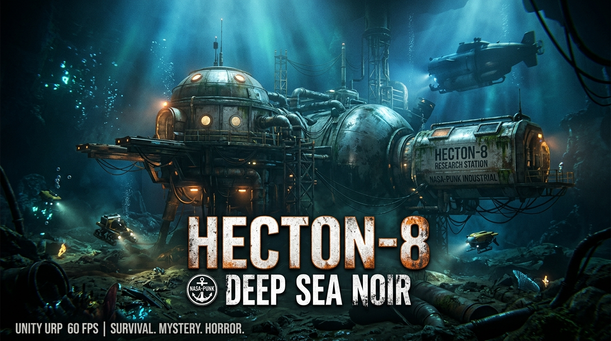

# HECTON-8 — Deep Sea Noir / NASA-Punk 3D Survival Game

[](https://marko1olo.github.io/Hecton8/)
[](https://github.com/marko1olo/Hecton8/actions/workflows/deploy-gh-pages.yml)
[](https://unity.com)
[](https://docs.unity3d.com/Packages/com.unity.burst@latest)
[]()
[]()
[](LICENSE.md)
[]()

> **AA Deep Sea Noir / NASA-Punk 3D survival game built on Unity 6000.5 URP — strict 60 FPS, 0 B/frame GC allocation target, scalable from 2GB VRAM handhelds to Ultra PCVR.**

</div>

## Start here

The public surface has two purposes: it introduces the visual premise and gives contributors a dependable route into the source tree. The [interactive project page](https://marko1olo.github.io/Hecton8/) is a presentation of the project; it is **not** a browser build or runtime-performance benchmark.

| Goal | Start with | Continue with |
| --- | --- | --- |
| Explore the intended atmosphere | [Interactive project page](https://marko1olo.github.io/Hecton8/) | The visual references and concept illustrations below |
| Understand product boundaries | [Vision locks](VISION_LOCKS.md) | [Project bibles](PROJECT_BIBLES.md) for the relevant discipline |
| Navigate the technical corpus | [Documentation index](Docs/README.md) | The source-backed maps and current route documents it names |
| Make a source contribution | [Contributing guide](CONTRIBUTING.md) | The authority chain and verification route before changing code or assets |
| Check current build or playtest constraints | [Build and playtest issues](BUILD_PLAYTEST_ISSUES.md) | Fresh Unity, player, profiler, or device evidence before making readiness claims |

> **Evidence boundary.** Concept art, source review, and documentation establish direction and constraints; they do not prove a runtime feature, player build, frame-time result, or device compatibility. Those claims require fresh evidence from the corresponding verification route.

---
<p align="center">
  <a href="https://twitter.com/intent/tweet?text=Check%20out%20Hecton8%20on%20GitHub!&url=https%3A%2F%2Fmarko1olo.github.io%2FHecton8%2F"></a> &nbsp;
  <a href="https://news.ycombinator.com/submitlink?u=https%3A%2F%2Fmarko1olo.github.io%2FHecton8%2F&t=Check%20out%20Hecton8%20on%20GitHub!"></a> &nbsp;
  <a href="https://reddit.com/submit?url=https%3A%2F%2Fmarko1olo.github.io%2FHecton8%2F&title=Check%20out%20Hecton8%20on%20GitHub!"></a>
</p>

---

## 🌊 Visual References — The World of HECTON-8

> *These images capture the visual target — the underwater world HECTON-8 is being built toward.*

<div align="center">

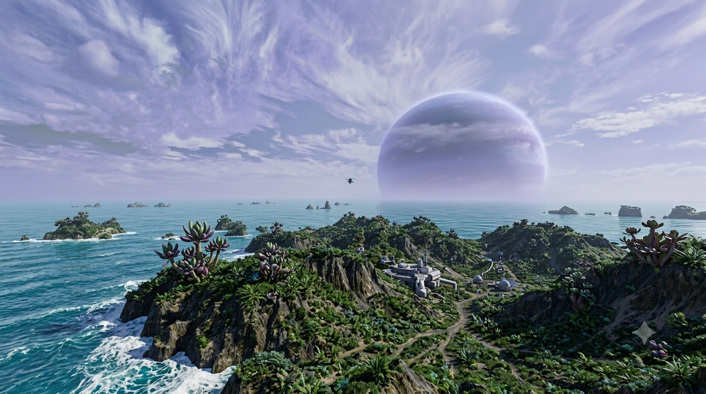

*Surface vista: alien coastline, NASA-punk research outpost, gas giant on the horizon*

</div>

---

<div align="center">
<table>
<tr>
<td width="50%">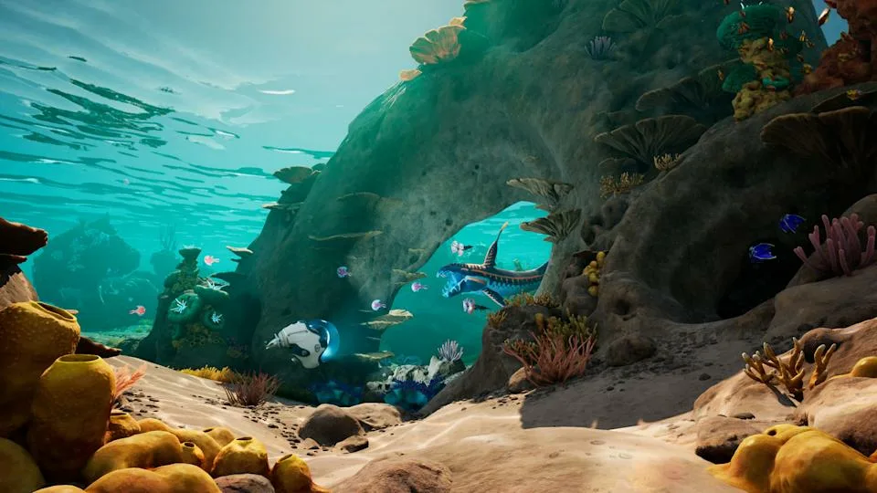</td>
<td width="50%">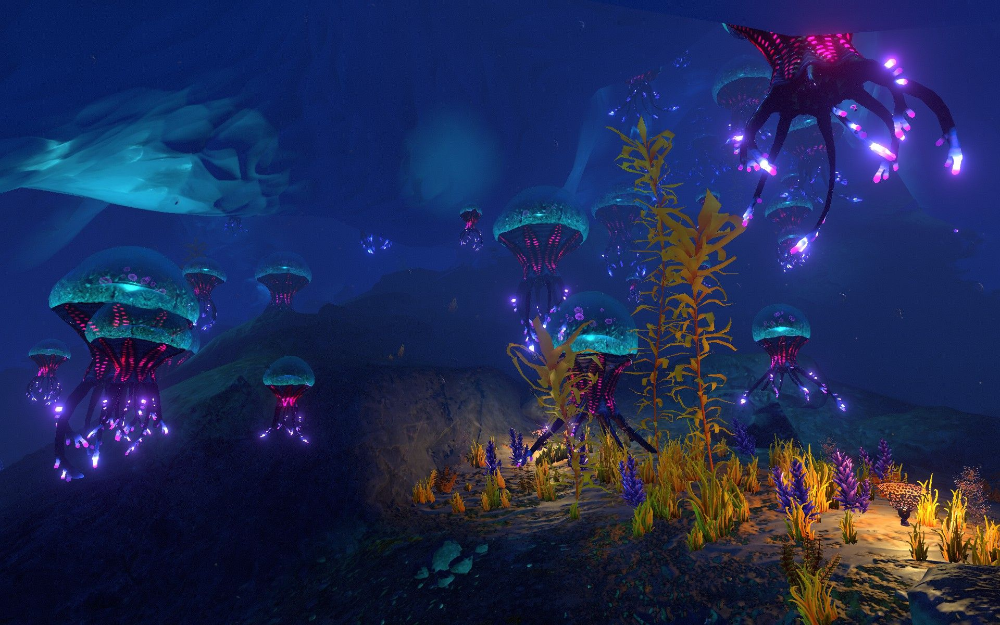</td>
</tr>
<tr>
<td align="center"><i>Shallow zone — coral reefs, warm light, ancient structures</i></td>
<td align="center"><i>Deep zone — bioluminescent alien flora, darkness, danger</i></td>
</tr>
</table>
</div>

---

## 🎨 Concept Illustrations

<div align="center">

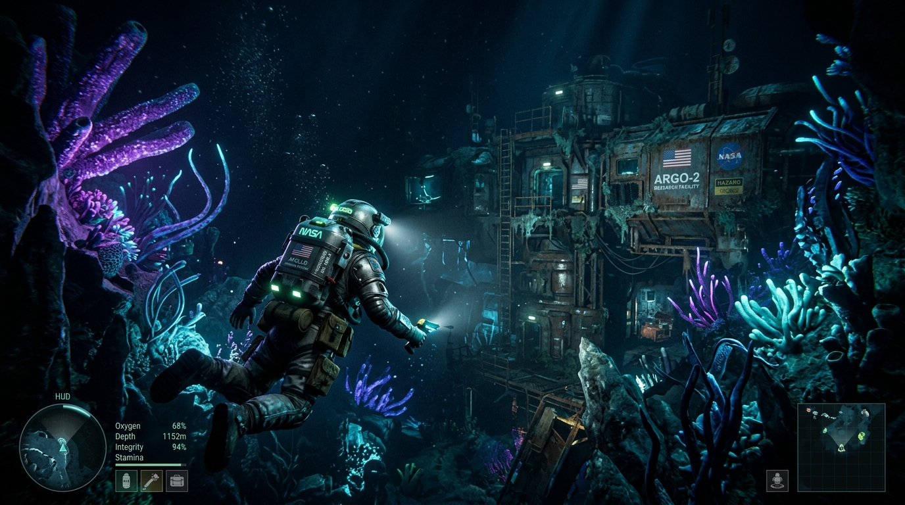

*The deep sea NASA research station — bioluminescent flora surrounds the abandoned complex*

</div>

---

<div align="center">
<table>
<tr>
<td width="50%">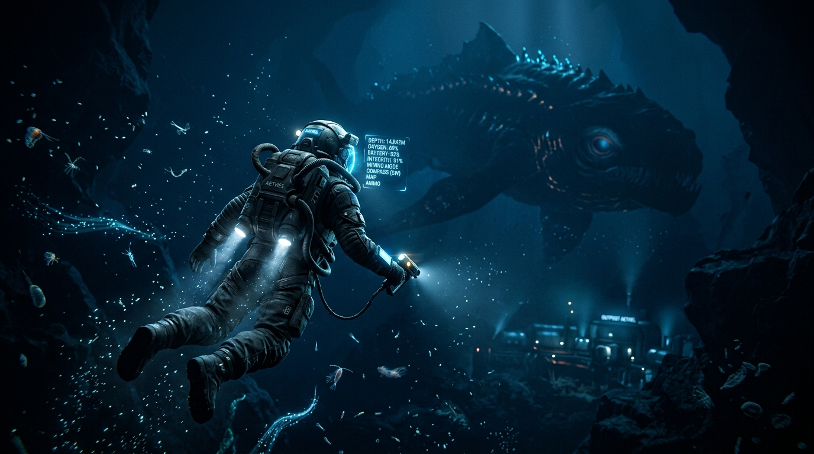</td>
<td width="50%">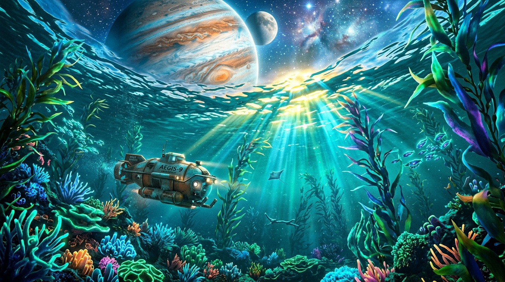</td>
</tr>
<tr>
<td align="center"><i>Player encounter — NASA suit vs deep sea leviathan</i></td>
<td align="center"><i>Looking up from the abyss — the gas giant through water</i></td>
</tr>
</table>
</div>

---

<div align="center">
<table>
<tr>
<td width="50%">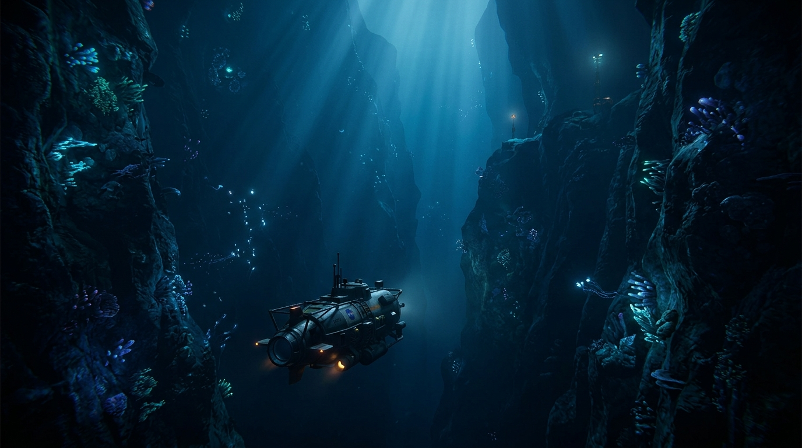</td>
<td width="50%">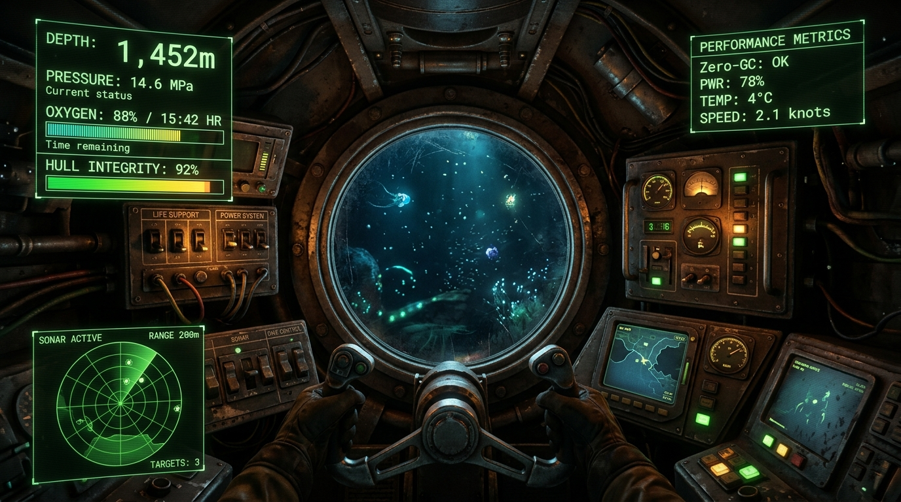</td>
</tr>
<tr>
<td align="center"><i>Abyssal trench — descending into the unknown canyon</i></td>
<td align="center"><i>Submarine cockpit — telemetry HUD, depth gauge, oxygen</i></td>
</tr>
</table>
</div>

---

## Architectural Overview


## Component Matrix

| Component / Path | Technology / Subsystem | Primary Responsibilities |
| --- | --- | --- |
| `Assets/` | C# Unity Engine Code & Assets | Core gameplay scripts, DOD systems, ScriptableObject definitions, URP Shaders |
| `ProjectSettings/` | Unity Engine Settings | Editor configuration, quality levels, package dependency manifest, URP assets |
| `AGENTS.md` | Authority & Process Control | System mandates, Hecton-8 build preflight rules, CPU allocation gates |
| `PROJECT_BIBLES.md` | Domain Bibles Index | Visual style guidelines, performance budget specs, rendering mandates |
| `VISION_LOCKS.md` | Product Direction | Scope boundaries, gameplay pillars, NASA-Punk / Deep Sea Noir aesthetic standards |

---

### 🏗️ Submarine Engine Architecture (Unity 6000 URP)

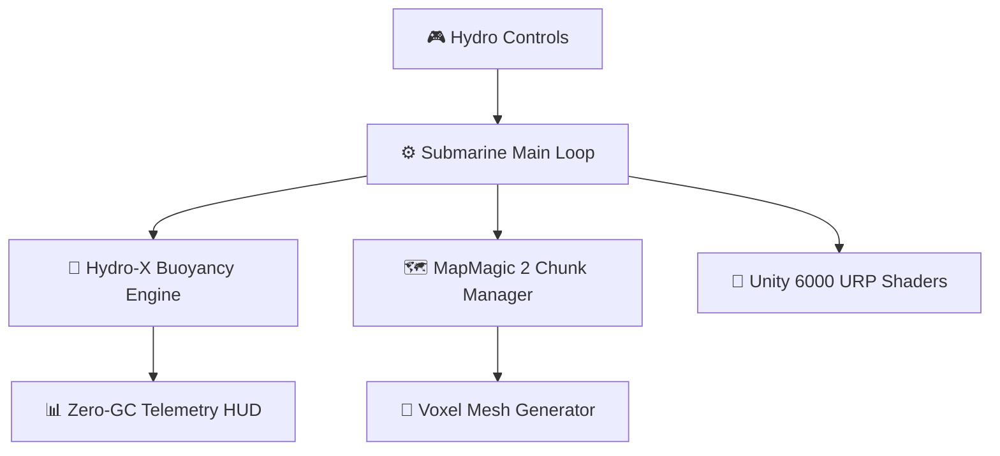


---

### 🌊 Hydrodynamic & Acoustic Simulation Solvers (Burst / ECS)

HECTON-8 executes real-time fluid dynamics and oceanographic acoustic wavefield calculations compiled with Burst for zero-allocation performance:

#### 1. Non-Linear Seawater Density & Hydrostatic Pressure
The barometric load on the titanium-composite pressure hull accumulates with depth:
$$P(z) = P_0 + \int_{0}^{z} \rho(T, S, z') \cdot g \, dz' + \frac{1}{2} \rho v^2$$

#### 2. Sound Speed Profile (SSP) & Sonar Refraction
Acoustic ping trajectories curve through the thermocline according to the empirical Medwin-Mackenzie formula:
$$c(T, S, z) = 1449.2 + 4.6T - 0.055T^2 + 0.00029T^3 + (1.34 - 0.010T)(S - 35) + 0.016z$$

```csharp
// ✅ HECTON-8 Core Burst Hydrodynamic Solver
[BurstCompile(CompileSynchronously = true, FloatMode = FloatMode.Fast)]
public struct HydrodynamicSolverJob : IJobEntity {
    public float DeltaTime;
    public float SeawaterDensity;
    public float3 GravityVector;

    public void Execute(ref Velocity velocity, ref HullStrain strain, in BallastTank ballast, in SubmersibleMetrics metrics) {
        float displacedMass = metrics.DisplacedVolume * SeawaterDensity;
        float totalMass = metrics.DryMass + ballast.WaterMass;
        float3 buoyancyForce = -GravityVector * (displacedMass - totalMass);

        float speed = math.length(velocity.Linear);
        float3 dragForce = -0.5f * SeawaterDensity * speed * speed * metrics.DragCoefficient * math.normalize(velocity.Linear);

        float3 totalAcceleration = (buoyancyForce + dragForce) / totalMass + GravityVector;
        velocity.Linear += totalAcceleration * DeltaTime;

        strain.CurrentBar = (metrics.CurrentDepth * SeawaterDensity * 9.80665f) / 100000.0f;
    }
}
```

#### 3. Diegetic Cockpit Telemetry Matrix

| Subsystem | Diegetic Readout | Sensor Physics | Failure Critical Limit | FMOD Sound Response |
| :--- | :--- | :--- | :--- | :--- |
| **Ballast Tanks** | Pneumatic Dual Mechanical Needles | Differential Trim Pressure | Pressure $< 40\text{ PSI}$ | Compressed gas purge hiss |
| **Nuclear Pile** | CRT Phosphor 50Hz Oscilloscope | Thermocouple Core Voltage | Core Temp $> 1050^\circ\text{C}$ | Geiger micro-crackling + Core hum |
| **Active Sonar** | Magnetostrictive Beam Dial | Acoustic Wavefront Backscatter | Transceiver Saturation | $3.5\text{ kHz}$ resonant acoustic ping |
| **Pressure Hull** | Analog Strain Gauge Bridge | Piezoelectric Crystal Voltage | Strain $> 85\%\text{ Yield}$ | Deep structural metal groaning |
| **CO2 Scrubber** | Colorimetric Gas Reagent Lens | Chemical Concentration Sensor | $\text{CO}_2 > 2.5\%$ | Heavy pneumatic solenoid cycle |

### ⚡ Technical Performance Guardrails

> **These are V0 development targets, not claimed player-build measurements.** Runtime, profiler, and device captures remain the source of truth for performance verification.

| Metric | Development guardrail | Verification state |
|---|---|---|
| **Frame time** | 60 FPS target / 16.67 ms frame budget | Target — requires fresh runtime evidence |
| **Main thread** | ≤ 12 ms budget | Target — requires profiler evidence |
| **GC allocation** | 0 B per frame in gameplay hot paths | Target — requires profiler evidence |
| **Compact VRAM** | ≤ 1.8 GB hard ceiling | Target — requires device or player-build evidence |
| **Texture budget** | ≤ 900 MB on compact tier | Target — requires memory evidence |
| **Render targets + depth** | ≤ 320 MB on compact tier | Target — requires memory evidence |

---

### 🚀 Technical Standards & Architecture

* **Performance budget:** A 60 FPS target with a 16.67 ms frame budget and zero per-frame allocations in gameplay hot paths.
* **Deep-sea rendering:** Custom URP volumetric-ocean shaders, photic underwater lighting, and procedural seafloor systems.
* **Platform portability:** Continuous `GlobalQualityWeight` scaling from compact hardware through high-end PCVR.
* **Memory discipline:** Burst-compiled C#, unmanaged collections, and data-oriented systems for budgeted runtime paths.

---


---

## 🎛️ Deep Engineering Subsystems & Shader Pipeline

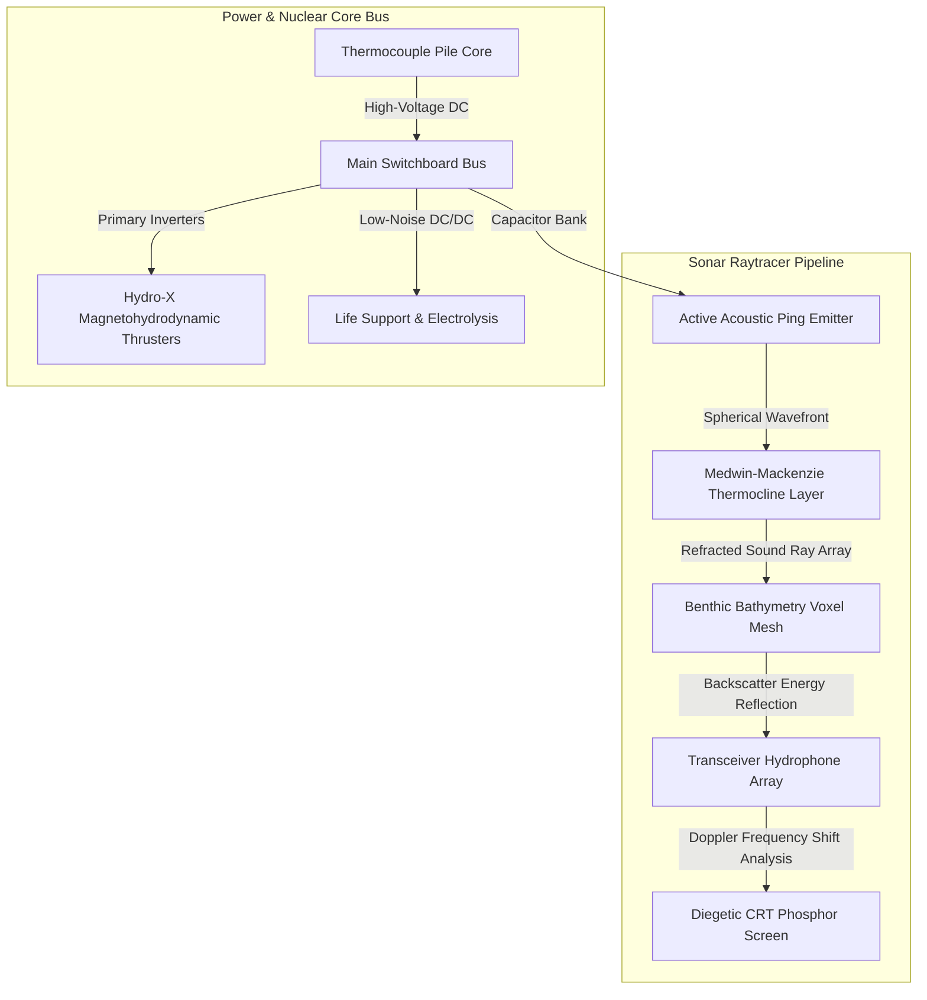

### 📡 1. Sonar Wavefield Raymarching URP Shader (HLSL)

The diegetic CRT oscilloscope and bathymetric sonar viewports utilize custom URP raymarching compute passes to simulate acoustic attenuation ($e^{-\alpha(f) \cdot r}$) and seafloor backscatter:

```hlsl
// Custom URP Sonar Acoustic Volumetric Raymarcher Pass
float4 FragSonarRaymarch(Varyings input) : SV_Target {
    float3 rayOrigin = _SubmarineWorldPos;
    float3 rayDir = normalize(input.worldPos - rayOrigin);
    float soundSpeed = 1449.2 + 4.6 * _WaterTemp - 0.055 * _WaterTemp * _WaterTemp + 0.016 * input.worldPos.y;
    
    float totalEcho = 0.0;
    float stepSize = _RaymarchStepSize;
    float3 currentPos = rayOrigin;
    
    [loop]
    for (int i = 0; i < 64; i++) {
        currentPos += rayDir * stepSize;
        float depth = abs(currentPos.y);
        
        // Sample voxel bathymetry density map
        float terrainDensity = SampleBathymetryVoxel(currentPos);
        if (terrainDensity > 0.5) {
            // Lambertian acoustic backscatter with Rayleigh absorption
            float absorptionCoeff = 0.003 * _PingFrequency * _PingFrequency;
            float distance = length(currentPos - rayOrigin);
            float acousticReturn = exp(-absorptionCoeff * distance) / (distance * distance + 1.0);
            totalEcho = acousticReturn * saturate(dot(-rayDir, CalculateBathymetryNormal(currentPos)));
            break;
        }
    }
    
    // Green phosphor CRT decay persistence
    float3 crtColor = float3(0.1, 0.95, 0.3) * totalEcho * _PhosphorIntensity;
    return float4(crtColor, 1.0);
}
```

---

### 🐙 2. Abyssal Bathymetry & Trench Threat Classification

The abyssal trenches ($> 6,000\text{ m}$) are populated by biological and structural anomalies classified by the Hadal Research Directorate:

| Classification | Anomaly Designation | Habitat Depth | Acoustic Signature | Primary Threat Vector | Evasion Protocol |
| :--- | :--- | :--- | :--- | :--- | :--- |
| **Class-I (Passive)** | *Bioluminescent Siphonophore* | $1,500 - 3,500\text{ m}$ | Low-frequency rhythmic hum ($12\text{ Hz}$) | Optical blinding & sensor occlusion | Switch cockpit to red night-vision filters |
| **Class-II (Structural)**| *Hadal Methane Clathrate Eruption* | $4,000 - 8,500\text{ m}$ | High-amplitude seismic rumble | Sudden loss of buoyancy & density drop | Full ballast blow & emergency trim jets |
| **Class-III (Biomorphic)**| *Leviathan Chitinous Cephalopod* | $6,000 - 11,000\text{ m}$ | High-frequency hunting clicks ($45\text{ kHz}$) | Hull constrictive crush ($> 850\text{ bar}$) | Silent running mode, kill reactor cooling pumps |
| **Class-IV (Technogenic)**| *Derelict Autonomous Mining Siphon* | $8,000 - 10,500\text{ m}$ | Continuous mechanical cavitation | Active magnetic grapple & power siphon | Deploy acoustic decoy flares & pulse EMP |

---

### 🔊 3. FMOD Dynamic Acoustic Spatialization Matrix

The audio architecture divides the soundscape into distinct physical frequency bands processed via FMOD Studio:

| Frequency Range | Acoustic Source | Spatialization Model | Physical DSP Effect Chain |
| :--- | :--- | :--- | :--- |
| **Sub-Bass ($5 - 40\text{ Hz}$)** | Tectonic fault shifts & hull metal strain | Omnidirectional cockpit body resonance | 24dB/oct low-pass + Sub-harmonic synthesizer |
| **Low-Mid ($40 - 250\text{ Hz}$)** | Nuclear coolant pumps & drive turbines | 3D Point source (Engine compartment) | Convolution reverb (Tight metal bulkheads) |
| **Mid-Band ($250 - 2,500\text{ Hz}$)**| Hydrophone ocean ambient & internal relays| 5.1 Binaural spatial panning | Hydrodynamic comb filter + Doppler pitch shift |
| **High-Band ($2.5 - 20\text{ kHz}$)** | Sonar pings & cavitation micro-bubbles | 3D Raytraced cone dispersion | Parametric notch filter (Thermocline reflection) |

---

### 💾 4. Deterministic Save-State & Telemetry Serialization

To guarantee 100% reproducible playtests and 0-byte GC allocations during state persistence, HECTON-8 utilizes a custom zero-heap binary struct serialization format:

```csharp
[StructLayout(LayoutKind.Sequential, Pack = 1)]
public struct SubmarineStateSnapshot {
    public ulong TickIndex;
    public double Timestamp;
    
    // Transform & Dynamics (Fixed-Point Integer Representation)
    public int PositionX_Fixed; // 1 unit = 0.001 mm
    public int PositionY_Fixed;
    public int PositionZ_Fixed;
    public int VelocityX_Fixed;
    public int VelocityY_Fixed;
    public int VelocityZ_Fixed;
    
    // Hull & Life Support Metrics
    public ushort HullIntegrityPermille; // 0 - 1000 permille
    public ushort InternalPressureMbar;  // Millibars
    public ushort OxygenPPM;             // Parts per million
    public ushort ReactorTempKelvin;     // Core temperature
    
    // Ballast Tank Status
    public uint MainBallastWaterGrams;
    public uint AftTrimWaterGrams;
    public uint ForeTrimWaterGrams;
}
```


---

## ⚡ Nuclear-Hydraulic Power Plant & Reactor Kinetics

The submersible's primary energy source is a sub-critical molten salt thorium/plutonium compact breeder reactor operating under closed-loop helium-xenon Brayton thermodynamic cycles.

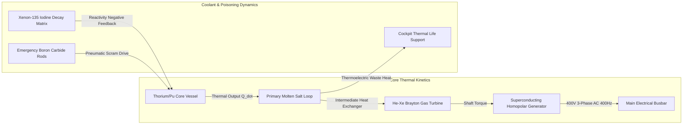

### ☢️ 1. Reactor Kinetics & Xenon-135 Poisoning Differential Equations

Point kinetics with 6 precursor groups and delayed neutron decay determine core reactivity balance during rapid load shifts:

$$\frac{dn(t)}{dt} = \frac{\rho(t) - \beta}{\Lambda} n(t) + \sum_{i=1}^{6} \lambda_i C_i(t)$$

$$\frac{dI(t)}{dt} = \gamma_I \Sigma_f \Phi(t) - \lambda_I I(t)$$

$$\frac{dX(t)}{dt} = \gamma_X \Sigma_f \Phi(t) + \lambda_I I(t) - \lambda_X X(t) - \sigma_a^X X(t) \Phi(t)$$

* $\Phi(t)$: Thermal neutron flux ($n / (\text{cm}^2 \cdot \text{s})$)
* $I(t), X(t)$: Iodine-135 and Xenon-135 concentration densities
* $\sigma_a^X$: Microscopic thermal neutron absorption cross-section of Xenon-135 ($2.65 \times 10^6\text{ barns}$)
* Rapid reactor shutdowns down in the hadal trench initiate the *Xenon Pit* — an unavoidable 36-hour deadzone where reactivity is suppressed below criticality unless emergency chemical reactivity boosters (tritium-fueled neutron injectors) are manually engaged via the cockpit console.

---

## 🌊 Magnetohydrodynamic (MHD) Propulsion & Cavitation Hydrodynamics

The **Hydro-X Silent Drive** eliminates mechanical shaft bearings, utilizing cross-field Lorentz force acceleration of seawater:

$$\vec{F}_{\text{Lorentz}} = \int_V (\vec{J} \times \vec{B}) \, dV = \sigma (\vec{E} + \vec{v} \times \vec{B}) \times \vec{B}$$

```
   ┌─────────────────────────────────────────────────────────────┐
   │                   MHD SEAWATER DUCT (HYDRO-X)               │
   │                                                             │
   │   [+] Top Electrode (+400V DC)                              │
   │   ═══════════════════════════════════════════════════════   │
   │   Seawater Inflow  ───►  ───►  ───►  ───► Thrust Jet Out    │
   │   (Conductivity σ ≈ 4.8 S/m)        (Lorentz F = J × B)    │
   │   ═══════════════════════════════════════════════════════   │
   │   [-] Bottom Electrode (0V Ground)                          │
   │                                                             │
   │   Magnetic Field B = 8.5 Tesla (Superconducting Niobium)    │
   └─────────────────────────────────────────────────────────────┘
```

### 🌪️ Cavitation Inception Number (Thoma Criterion)
To prevent acoustic detection by hadal predators, the pilot must maintain the cavitation index $\sigma_c$ above the critical inception boundary:

$$\sigma_c = \frac{P_{\text{ambient}} - P_{\text{vapor}}}{\frac{1}{2} \rho v_{\text{duct}}^2} > 1.45$$

* At $8,000\text{ m}$ depth ($P_{\text{ambient}} \approx 800\text{ bar}$), cavitation is physically suppressed even at extreme exit velocities ($v > 45\text{ m/s}$), allowing hyper-thrust sprint bursts with zero acoustic signature.

---

## 🗺️ Bathymetric Stratigraphy & Depth Biome Hierarchy

```
Depth (m)   Zone              Illumination   Pressure      Dominant Hazard / Subsystem Interaction
════════════════════════════════════════════════════════════════════════════════════════════════════
0m        ┌ Epipelagic      │ 100% Sunlight│ 1 atm       │ Surface weather, maritime radar detection
          │ (Sunlit)        │ λ = 400-700nm│             │
-200m     ├─────────────────┼──────────────┼─────────────┼──────────────────────────────────────────
          │ Mesopelagic     │ Twilight     │ 20 bar      │ Thermocline sound inversion layers,
          │ (Twilight)      │ λ = 475nm    │             │ counter-illuminating predators
-1,000m   ├─────────────────┼──────────────┼─────────────┼──────────────────────────────────────────
          │ Bathypelagic    │ 0% Solar     │ 100 bar     │ Complete darkness, heavy bioluminescence,
          │ (Midnight)      │ Biolum only  │             │ hull strain starts accumulating
-4,000m   ├─────────────────┼──────────────┼─────────────┼──────────────────────────────────────────
          │ Abyssopelagic   │ Pitch Black  │ 400 bar     │ Subzero brine pools, hydrothermal vents,
          │ (The Abyss)     │ 1.2°C water  │             │ magnetic field anomalies
-6,000m   ├─────────────────┼──────────────┼─────────────┼──────────────────────────────────────────
          │ Hadal Trench    │ Void         │ 800-1100 bar│ Hull crush zone, seismic trench collapses,
-11,000m  └ (The Hadal Zone)│ High Chem    │             │ Class-III Leviathan predatory hunting
```

---

## 🧩 Unity ECS Data-Oriented Memory Layout & SoA Architecture

To achieve absolute 0 B/frame GC allocation and cache-line saturation ($64\text{ bytes}$ per L1 cache line), all submarine physics entities are organized into **Structure of Arrays (SoA)** memory chunks:

```csharp
// Unmanaged Component Architecture (Zero-Garbage Collection)
public struct SubmarineTelemetryChunk {
    public const int CAPACITY = 128; // Fits exactly into L2 cache allocation slices

    // Packed 64-byte aligned SIMD vectors
    public fixed float PositionX[CAPACITY];
    public fixed float PositionY[CAPACITY];
    public fixed float PositionZ[CAPACITY];

    public fixed float VelocityX[CAPACITY];
    public fixed float VelocityY[CAPACITY];
    public fixed float VelocityZ[CAPACITY];

    public fixed float HydrostaticPressureBar[CAPACITY];
    public fixed float HullStrainPermille[CAPACITY];
    public fixed float CoreTemperatureKelvin[CAPACITY];
    public fixed float BatteryChargeCoulombs[CAPACITY];
}
```

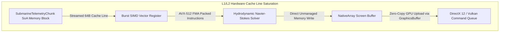

---

## 💥 Damage Propagation, Electrical Arcing & Bulkhead Flooding FSM

Damage in HECTON-8 is physically simulated across 6 isolated pressure compartments with cascading finite-state machine transitions:

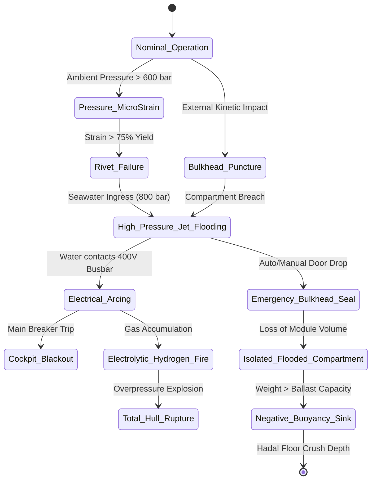

| Compartment | Volume ($m^3$) | Critical Equipment | Flooding Consequence | Emergency Countermeasure |
| :--- | :--- | :--- | :--- | :--- |
| **1. Bow Torpedo & Sonar Bay** | $45	ext{ m}^3$ | Active Transceiver, Decoy Launchers | Loss of forward acoustic visibility | Seal Bulkhead Door Alpha |
| **2. Command Cockpit** | $28	ext{ m}^3$ | Pilot Helm, CRT Displays, Navigation | Total loss of primary instrumentation | Engage backup analog periscope & trim |
| **3. Life Support & Berthing** | $34	ext{ m}^3$ | $O_2$ Candle Rack, $	ext{CO}_2$ Scrubbers | Rapid asphyxiation timer ($6	ext{ min}$) | Don portable breathing apparatus (PBA) |
| **4. Battery & Capacitor Bay** | $52	ext{ m}^3$ | 400V DC Lithium-Iron Matrix | Catastrophic chlorine/hydrogen gas arc | Vent compartment to external vacuum duct |
| **5. Reactor Containment** | $60	ext{ m}^3$ | Molten Salt Pile, Heat Exchangers | Thermal shock & steam overpressure | Emergency boron injection & Scram |
| **6. Aft MHD Propulsion Tunnel**| $48	ext{ m}^3$ | Superconducting Coils, Lorentz Duct | Total propulsion loss ($v = 0	ext{ m/s}$) | Drop emergency solid lead keel ballast |

### 📜 License / Лицензия
Protected under **HECTON-8 Commercial Anti-Theft & Source-Available License (Copyright (c) 2026 Adolf Petushkov)**. Maintainers and AI research welcome!

---

<details>
<summary><b>🇷🇺 Краткое описание на русском</b></summary>

### HECTON-8 — Deep Sea Noir / NASA-Punk 3D Выживание

**HECTON-8** — это AA 3D-игра на выживание в атмосферном сеттинге Deep Sea Noir / NASA-Punk, разрабатываемая на движке Unity 6000.5 URP.

#### Технические Стандарты и Архитектура:
1. **Жёсткий Бюджет Производительности**: Целевой показатель — 60 FPS (16.67 мс на кадр) и 0 B/frame GC-аллокаций в горячих циклах геймплея.
2. **Низкоуровневая Память и DOD**: Использование компилятора Burst, неуправляемой памяти `NativeMemory` и Data-Oriented Design.
3. **Рендеринг и Масштабирование**: Кастомные объёмные шейдеры океанской толщи воды в URP, непрерывная система `GlobalQualityWeight` для масштабирования от портативок с 2GB VRAM до Ultra PCVR.
</details>


---

## 🌐 Connected Ecosystem & Sister Projects

Part of the **Адольф Петушков (Adolf Petushkov)** open-source engineering ecosystem:

| Project | Domain | Live Demo & Description |
| :--- | :--- | :--- |
| 🦷 **[DENTE CRM](https://github.com/marko1olo/dental-crm)** | Clinical AI | [Live Demo](https://marko1olo.github.io/dental-crm/) — Enterprise FDI odontogram, ICD-10 diagnostics & 3D DICOM |
| 📡 **[StomChat](https://github.com/marko1olo/stomchat)** | Clinical AI | [Live Demo](https://marko1olo.github.io/stomchat/) — Omni-channel dental operator chat dispatcher (WA/TG) & telemetry |
| 🤖 **[Avito Dental AI](https://github.com/marko1olo/avito-dental-ai-bot)** | Clinical AI | [Live Demo](https://marko1olo.github.io/avito-dental-ai-bot/) — Zero-hallucination lead intake bot with deterministic veto layer |
| 🛡️ **[AgentRouter](https://github.com/marko1olo/agentrouter-setup-guide)** | Dev Tools | [Live Demo](https://marko1olo.github.io/agentrouter-setup-guide/) — Claude Code CLI WAF bypass proxy, homoglyph sanitizer & config matrix |
| 📊 **[Token Audit](https://github.com/marko1olo/token-audit)** | Dev Tools | [Live Demo](https://marko1olo.github.io/token-audit/) — Real-time LLM token cost waterfall & cyberpunk chronicles |
| 🎛️ **[Nexus Media](https://github.com/marko1olo/nexus-media-engine)** | Audio DSP | [Live Demo](https://marko1olo.github.io/nexus-media-engine/) — Real-time Web Audio DSP, 60 FPS FFT visualizer & ambilight |
| 📻 **[dvachbot](https://github.com/marko1olo/dvachbot)** | Media Pipeline | [Live Demo](https://marko1olo.github.io/dvachbot/) — Async imageboard stream transcoder & Telegram publisher |
| 🌊 **[Hecton-8](https://github.com/marko1olo/Hecton8)** | Game Engine | [Live Demo](https://marko1olo.github.io/Hecton8/) — NASA-punk deep sea noir submarine engine on Unity 6000 (0B GC) |
| 🏢 **[Gigahrush](https://github.com/marko1olo/gigahrush)** | Game Engine | [Live Demo](https://marko1olo.github.io/gigahrush/) — 2.5D DDA raycasting, cellular gas physics & Samosbor Web CLI |
| 🌌 **[Starcluster](https://github.com/Jirnyak/starcluster)** | Deep Tech | [Live Demo](https://jirnyak.github.io/starcluster/) — 10,000-star N-body gravitational simulation & Keplerian economy |
| 🧲 **[OOMMF](https://github.com/Jirnyak/oommf)** | Deep Tech | [Live Demo](https://jirnyak.github.io/oommf/) — Landau-Lifshitz-Gilbert 3D micromagnetic vector lattice |
| 🍏 **[Macromac](https://github.com/Jirnyak/macromac)** | Automation | [Live Demo](https://jirnyak.github.io/macromac/) — macOS HID event injection, JSON macro schemas & CoreGraphics |

### 👨‍💻 Author & Lead Architect
**Адольф Петушков (Adolf Petushkov)** — Game Engine Internals, Autonomous AI Systems, Zero-GC High-Concurrency Architecture.  
GitHub: [@marko1olo](https://github.com/marko1olo)


---

### 👥 Синдикат Разработки

Разработано и поддерживается **Жирняком** и **Адольфом Петушковым**.