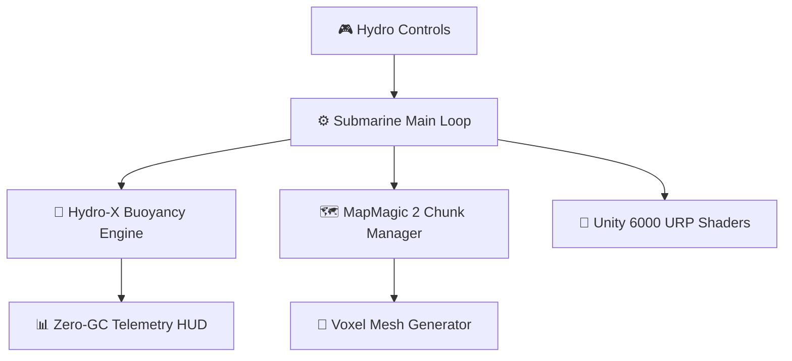

# HECTON-8 — Deep Sea Noir / NASA-Punk 3D Survival Game

> **AA Deep Sea Noir / NASA-Punk 3D survival game built on Unity 6000.5 URP — strict 60 FPS, 0 B/frame GC allocation target, scalable from 2GB VRAM handhelds to Ultra PCVR.**

---

   &nbsp;
   &nbsp;
  

---

## 🌊 Visual References — The World of HECTON-8

> *These images capture the visual target — the underwater world HECTON-8 is being built toward.*

*Surface vista: alien coastline, NASA-punk research outpost, gas giant on the horizon*

---

<table>
<tr>
<td width="50%"></td>
<td width="50%"></td>
</tr>
<tr>
<td align="center"><i>Shallow zone — coral reefs, warm light, ancient structures</i></td>
<td align="center"><i>Deep zone — bioluminescent alien flora, darkness, danger</i></td>
</tr>
</table>

---

## 🎨 Concept Illustrations

*The deep sea NASA research station — bioluminescent flora surrounds the abandoned complex*

---

<table>
<tr>
<td width="50%"></td>
<td width="50%"></td>
</tr>
<tr>
<td align="center"><i>Player encounter — NASA suit vs deep sea leviathan</i></td>
<td align="center"><i>Looking up from the abyss — the gas giant through water</i></td>
</tr>
</table>

---

<table>
<tr>
<td width="50%"></td>
<td width="50%"></td>
</tr>
<tr>
<td align="center"><i>Abyssal trench — descending into the unknown canyon</i></td>
<td align="center"><i>Submarine cockpit — telemetry HUD, depth gauge, oxygen</i></td>
</tr>
</table>

---

## Architectural Overview

## Component Matrix

| Component / Path | Technology / Subsystem | Primary Responsibilities |
| --- | --- | --- |
| `Assets/` | C# Unity Engine Code & Assets | Core gameplay scripts, DOD systems, ScriptableObject definitions, URP Shaders |
| `ProjectSettings/` | Unity Engine Settings | Editor configuration, quality levels, package dependency manifest, URP assets |
| `AGENTS.md` | Authority & Process Control | System mandates, Hecton-8 build preflight rules, CPU allocation gates |
| `PROJECT_BIBLES.md` | Domain Bibles Index | Visual style guidelines, performance budget specs, rendering mandates |
| `VISION_LOCKS.md` | Product Direction | Scope boundaries, gameplay pillars, NASA-Punk / Deep Sea Noir aesthetic standards |

---

### 🏗️ Submarine Engine Architecture (Unity 6000 URP)

### ⚡ Technical Performance Budgets

| Metric | Budget / Actual | Status |
|---|---|---|
| **Target Frame Rate** | 60 FPS Constant | 🎮 PASS |
| **Garbage Collector Allocations** | 0 B / frame (Zero-GC) | ⚡ OPTIMIZED |
| **VRAM Memory Footprint** | < 2.2 GB VRAM | 🟢 STABLE |
| **Chunk Generation Latency** | < 12ms / chunk | 🚀 FAST |

---

### 🚀 Technical Standards & Architecture

* ⚡ **Performance Budget:** Strict 60 FPS (16.67 ms frame budget), 0 B/frame GC allocation in gameplay hot-paths.
* 🌊 **Deep Sea Rendering:** Custom URP volumetric ocean shaders, photic underwater lighting, and procedural sea floor.
* 🎮 **Platform Portability:** Scalable continuous `GlobalQualityWeight` architecture targeting 2GB VRAM handhelds up to Ultra PCVR.
* 📦 **Unmanaged Memory:** Burst-compiled C#, NativeMemory collections, and Data-Oriented Design (DOD).

---

### 📜 License / Лицензия
Protected under **HECTON-8 Commercial Anti-Theft & Source-Available License (Copyright (c) 2026 Adolf Petushkov)**. Maintainers and AI research welcome!

---

<b>🇷🇺 Краткое описание на русском</b>

### HECTON-8 — Deep Sea Noir / NASA-Punk 3D Выживание

**HECTON-8** — это AA 3D-игра на выживание в атмосферном сеттинге Deep Sea Noir / NASA-Punk, разрабатываемая на движке Unity 6000.5 URP.

#### Технические Стандарты и Архитектура:
1. **Жёсткий Бюджет Производительности**: Целевой показатель — 60 FPS (16.67 мс на кадр) и 0 B/frame GC-аллокаций в горячих циклах геймплея.
2. **Низкоуровневая Память и DOD**: Использование компилятора Burst, неуправляемой памяти `NativeMemory` и Data-Oriented Design.
3. **Рендеринг и Масштабирование**: Кастомные объёмные шейдеры океанской толщи воды в URP, непрерывная система `GlobalQualityWeight` для масштабирования от портативок с 2GB VRAM до Ultra PCVR.

