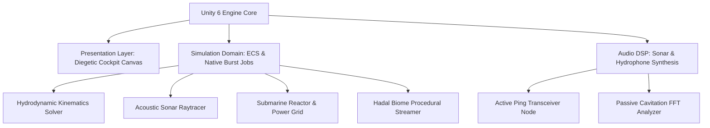

# 🌊 HECTON-8 — NASA-Punk Deep Sea Noir 3D Submarine Simulation

**A high-fidelity immersive submarine simulation exploring the hadal abyssal trenches of Europa. Built with bespoke hydrodynamic physics, acoustic sonar raytracing, and diegetic analog instrumentation.**

---

## 🎮 Vision & Gameplay Pillars

1. **Diegetic NASA-Punk Cockpit:** Every gauge, cathode-ray tube display, toggle switch, and circuit breaker exists physically in the 3D cockpit. Zero floating 2D UI fluff.
2. **True Hydrodynamic Simulation:** Six-degrees-of-freedom submarine kinematics with ballast tank buoyancy physics, ocean thermal stratification, and hull compression stress.
3. **Acoustic Raytracing Sonar:** Active and passive bathymetric sonar simulating acoustic wave propagation, Doppler shifts, thermocline refraction, and benthic reverberation.
4. **Benthic Ecosystem & Pressure Hazards:** Dynamic hydrothermal vent fauna, bioluminescent abyssal predators, and crushing 1,100-atmosphere depths.

---

## 🏗️ System Architecture

---

### 👥 Engineering Syndicate
Developed and maintained by **Жирняк** & **Адольф Петушков**.
