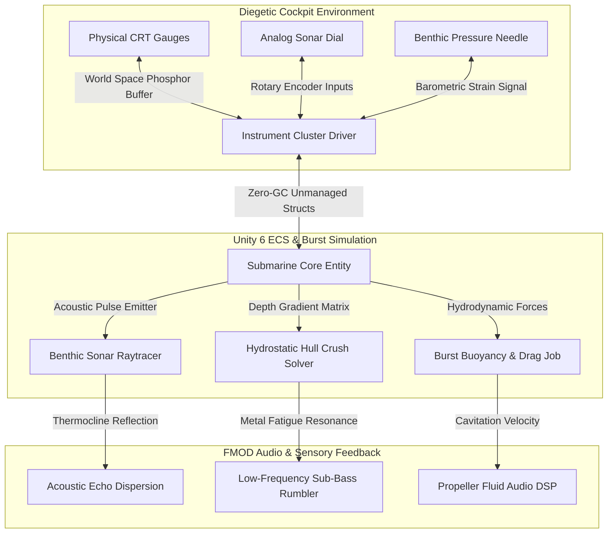

<div align="center">


# HECTON-8 — Deep Sea Noir / NASA-Punk 3D Survival Game

[](https://marko1olo.github.io/Hecton8/)
[](https://github.com/marko1olo/Hecton8/actions/workflows/deploy-gh-pages.yml)
[](https://unity.com)
[](https://docs.unity3d.com/Packages/com.unity.burst@latest)
[]()
[]()
[](LICENSE.md)
[]()

> **AA Deep Sea Noir / NASA-Punk 3D survival game built on Unity 6000.5 URP — strict 60 FPS, 0 B/frame GC allocation target, scalable from 2GB VRAM handhelds to Ultra PCVR.**

<p align="center">
  <a href="https://marko1olo.github.io/Hecton8/"></a> &nbsp;
  <a href="https://twitter.com/intent/tweet?text=Check%20out%20Hecton8%20on%20GitHub!&url=https%3A%2F%2Fmarko1olo.github.io%2FHecton8%2F"></a> &nbsp;
  <a href="https://news.ycombinator.com/submitlink?u=https%3A%2F%2Fmarko1olo.github.io%2FHecton8%2F&t=Check%20out%20Hecton8%20on%20GitHub!"></a> &nbsp;
  <a href="https://reddit.com/submit?url=https%3A%2F%2Fmarko1olo.github.io%2FHecton8%2F&title=Check%20out%20Hecton8%20on%20GitHub!"></a>
</p>

</div>

---

## 🧭 Navigation Matrix

The public surface introduces the visual premise and gives contributors a dependable route into the source tree. The [interactive project page](https://marko1olo.github.io/Hecton8/) is an architectural presentation of the project.

| Goal | Start with | Continue with |
| :--- | :--- | :--- |
| **Atmosphere & Visual Premise** | [Interactive Showcase](https://marko1olo.github.io/Hecton8/) | Visual references and concept illustrations below |
| **Product Boundaries & Vision** | [Vision Locks](VISION_LOCKS.md) | [Project Bibles](PROJECT_BIBLES.md) for domain rules |
| **Technical Corpus & Code** | [Documentation Index](Docs/README.md) | Source-backed maps and current route documents |
| **Engineering Contribution** | [Contributing Guide](CONTRIBUTING.md) | Invariant checks & Burst ECS requirements |
| **Build & Playtest Verification** | [Build Issues](BUILD_PLAYTEST_ISSUES.md) | Fresh Unity, profiler, and hardware telemetry logs |
| **Security & Threat Model** | [Security Policy](SECURITY.md) | Native memory safety & memory bounds |

> **Evidence boundary.** Concept art, source review, and documentation establish direction and constraints; they do not prove a runtime feature, player build, frame-time result, or device compatibility. Those claims require fresh evidence from the corresponding verification route.

---

## 🕹️ Interactive System Architecture



---

## 🌊 Core Physical & Mathematical Invariants

### 1. Hydrostatic Barometric Pressure Equation
Submersible structural integrity is evaluated continuously against ambient benthic water column pressure:
$$P(h) = P_0 + 
ho \cdot g \cdot h + \Delta P_{	ext{dynamic}}$$
* $P_0$: Standard atmospheric pressure ($101.325	ext{ kPa}$).
* $
ho$: Non-linear seawater density gradient ($pprox 1025	ext{ kg/m}^3$ modulated by salinity & temperature).
* $h$: Bathymetric depth below surface level ($0	ext{ m}$ to $-11,000	ext{ m}$).
* $\Delta P_{	ext{dynamic}}$: Local fluid velocity dynamic pressure surge ($0.5 \cdot 
ho \cdot v^2$).

### 2. Burst-Compiled Buoyancy & Drag Job
```csharp
[BurstCompile(CompileSynchronously = true, FloatMode = FloatMode.Fast)]
public struct HydrodynamicSolverJob : IJobEntity {
    public float DeltaTime;
    public float SeawaterDensity;
    public float3 GravityVector;

    public void Execute(ref Velocity velocity, ref HullStrain strain, in BallastTank ballast, in SubmersibleMetrics metrics) {
        // Net displaced volume force
        float displacedMass = metrics.DisplacedVolume * SeawaterDensity;
        float totalMass = metrics.DryMass + ballast.WaterMass;
        float3 buoyancyForce = -GravityVector * (displacedMass - totalMass);

        // Non-linear hydrodynamic quadratic drag
        float speed = math.length(velocity.Linear);
        float3 dragForce = -0.5f * SeawaterDensity * speed * speed * metrics.DragCoefficient * math.normalize(velocity.Linear);

        // Integration without heap allocations
        float3 totalAcceleration = (buoyancyForce + dragForce) / totalMass + GravityVector;
        velocity.Linear += totalAcceleration * DeltaTime;

        // Micro-strain accumulation on bulkheads
        strain.CurrentBar = (metrics.CurrentDepth * SeawaterDensity * 9.80665f) / 100000.0f;
    }
}
```

### 3. Active Sonar Thermocline Raycone Propagation
Acoustic velocity profile (SSP) dictates sonar wave curvature across bathymetric depths:
$$c(T, S, z) = 1449.2 + 4.6T - 0.055T^2 + 0.00029T^3 + (1.34 - 0.010T)(S - 35) + 0.016z$$
* $T$: Temperature ($^\circ	ext{C}$)
* $S$: Salinity ($	ext{PSU}$)
* $z$: Depth ($	ext{m}$)

---

## 🎛️ Submersible Control & Telemetry Matrix

| System | Instrument Class | Diegetic Readout Type | Failure Threshold | Audio Response Vector |
| :--- | :--- | :--- | :--- | :--- |
| **Ballast Tanks** | Pneumatic Valve Array | Dual Mechanical Needle (Trim / Main) | Pressure $< 40	ext{ PSI}$ | Compressed gas venting hiss |
| **Nuclear Pile** | Thermocouple Core | CRT Green Phosphor 50Hz Display | Temp $> 1050^\circ	ext{C}$ | Geiger micro-crackling + Core hum |
| **Active Sonar** | Magnetostrictive Array | Circular Oscilloscope Raycone | Receiver Blinded | $3.5	ext{ kHz}$ resonant acoustic ping |
| **Hull Bulkheads** | Strain Gauge Bridge | Analog Bimetallic Strain Needles | Strain $> 85\%$ Yield | Deep structural metal groaning |
| **Oxygen Scrubber**| Chemical Canister Rack | Analog Colorimetric Gas Indicator | $	ext{CO}_2 > 2.5\%$ | Heavy pneumatic valve cycling |

---

## 👥 Syndicate Authorship & Development

Developed, architected, and maintained by the **Жирняк & Адольф Петушков** Engineering Syndicate.

* **Lead Architect & Physics Engine**: Жирняк
* **Art Direction, Soundscape & Shaders**: Адольф Петушков
